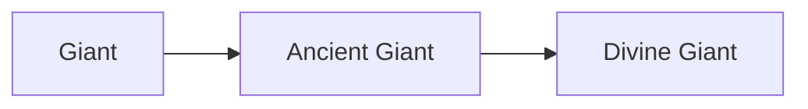

# Ancient Giant

<small>[Tensura: Reincarnated](../index.md) &rsaquo; [Races](index.md)</small>

| | |
|---|---|
| **ID** | `tensura:ancient_giant` |
| **Difficulty** | Easy |
| **Alignment** | Majin |
| **Aura** | 150,000 - 150,000 |
| **Magicule** | 150,000 - 150,000 |
| **Health bonus** | 480 |
| **Spiritual health bonus** | 640 |
| **Attack damage bonus** | 7 |
| **Movement speed bonus** | 0.03 |
| **EP to evolve into** | 300,000 |

> Ancient form of Giants with even more incredible physical capabilities and abilities.

## Evolution

- **Evolves from:** [Giant](giant.md)
- **Evolves into:** [Divine Giant](divine-giant.md)
- **Default evolution:** [Divine Giant](divine-giant.md)
- **On awakening (True Demon Lord / True Hero):** [Divine Giant](divine-giant.md)

### Requirements to evolve into Ancient Giant

Each requirement adds its weight to the evolution progress bar; you can evolve at 100%.

| Requirement | Weight |
|---|---|
| Reach Existence Points of 300,000 | 50% |
| Carrying 20 of ANCIENT_DEBRIS | 50% |

### Evolution tree

## Intrinsic skills

Granted automatically when you become this race.

-  [Giantification](../abilities/intrinsic-skills/giantification.md)
-  [Steel Strength](../abilities/extra-skills/steel-strength.md)
-  [Strengthen Body](../abilities/extra-skills/strengthen-body.md)
-  [Magic Resistance](../abilities/resistance-skills/magic-resistance.md)

## Attribute modifiers

| Attribute | Amount | Operation |
|---|---|---|
| Scale | 0.5 | add |
| Max Health | 480 | add |
| Max Spiritual Health | 640 | add |
| Attack Damage | 7 | add |
| Attack Speed | -0.25 | add |
| Knockback Resistance | 0.8 | add |
| Movement Speed | 0.03 | add |
| Swim Speed Multiplier | 0.3 | add |

## Stats (config defaults)

Set in [`config/tensura/race/giant_config.toml`](../configs/config-tensura-race-giant-config.md).

| Option | Default | Description |
|---|---|---|
| `AncientGiant.epRequirement` | 300,000 | EP requirement to evolve into Ancient Giant. |
| `AncientGiant.debrisRequirement` | 20 | The number of Ancient Debris needed to evolve into Ancient Giant. |
| `AncientGiant.minAura` | 150,000 | Minimal aura. |
| `AncientGiant.maxAura` | 150,000 | Maximum aura. |
| `AncientGiant.minMagicule` | 150,000 | Minimal magicule. |
| `AncientGiant.maxMagicule` | 150,000 | Maximum magicule. |
| `AncientGiant.size` | 0.5 | Bonus Size. |
| `AncientGiant.maxHealth` | 480 | Bonus Max Health. |
| `AncientGiant.maxSpiritualHealth` | 640 | Bonus Max Spiritual Health. |
| `AncientGiant.attack` | 7 | Bonus Attack Damage. |
| `AncientGiant.attackSpeed` | -0.25 | Bonus Attack Speed. |
| `AncientGiant.knockbackResistance` | 0.8 | Bonus Knockback Resistance. |
| `AncientGiant.movementSpeed` | 0.03 | Bonus Movement Speed. |
| `AncientGiant.swimSpeed` | 0.3 | Bonus Swimming Speed Multiplier. |
| `AncientGiant.armorDurability` | 0.25 | How much of the attack damage that Giant will inflict on targets' armor durability. |
| `Giant.minAura` | 4,000 | Minimal aura. |
| `Giant.maxAura` | 6,000 | Maximum aura. |
| `Giant.minMagicule` | 6,000 | Minimal magicule. |
| `Giant.maxMagicule` | 8,000 | Maximum magicule. |
| `Giant.size` | 0.5 | Bonus Size. |
| `Giant.maxHealth` | 30 | Bonus Max Health. |
| `Giant.maxSpiritualHealth` | 140 | Bonus Max Spiritual Health. |
| `Giant.attack` | 5 | Bonus Attack Damage. |
| `Giant.attackSpeed` | -0.5 | Bonus Attack Speed. |
| `Giant.knockbackResistance` | 0.4 | Bonus Knockback Resistance. |
| `Giant.movementSpeed` | 0 | Bonus Movement Speed. |
| `Giant.swimSpeed` | 0 | Bonus Swimming Speed Multiplier. |
