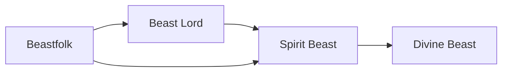

# Beastfolk

<small>[Tensura: Reincarnated](../index.md) &rsaquo; [Races](index.md)</small>

| | |
|---|---|
| **ID** | `tensura:beastfolk` |
| **Difficulty** | Easy |
| **Alignment** | Default |
| **Aura** | 1,500 - 2,500 |
| **Magicule** | 300 - 600 |
| **Health bonus** | 2 |
| **Spiritual health bonus** | 10 |
| **Attack damage bonus** | 0 |
| **Movement speed bonus** | 0.05 |

> A race that can freely change between their true animal form and a more a human form. They possess immense physical prowess and regenerative capabilities that let them fight without rest.

## Evolution

- **Evolves into:** [Beast Lord](beast-lord.md)
- **Default evolution:** [Beast Lord](beast-lord.md)
- **On awakening (True Demon Lord / True Hero):** [Spirit Beast](spirit-beast.md)
- **During the Harvest Festival:** [Beast Lord](beast-lord.md)

### Evolution tree

## Traits

- Beastfolk
- Human-like

## Attribute modifiers

| Attribute | Amount | Operation |
|---|---|---|
| Scale | 0 | add |
| Max Health | 2 | add |
| Max Spiritual Health | 10 | add |
| Attack Damage | 0 | add |
| Attack Speed | 0.1 | add |
| Knockback Resistance | 0 | add |
| Movement Speed | 0.05 | add |
| Swim Speed Multiplier | 0.5 | add |

## Stats (config defaults)

Set in [`config/tensura/race/beastfolk_config.toml`](../configs/config-tensura-race-beastfolk-config.md).

| Option | Default | Description |
|---|---|---|
| `Beastfolk.minAura` | 1,500 | Minimal aura. |
| `Beastfolk.maxAura` | 2,500 | Maximum aura. |
| `Beastfolk.minMagicule` | 300 | Minimal magicule. |
| `Beastfolk.maxMagicule` | 600 | Maximum magicule. |
| `Beastfolk.size` | 0 | Bonus Size. |
| `Beastfolk.maxHealth` | 2 | Bonus Max Health. |
| `Beastfolk.maxSpiritualHealth` | 10 | Bonus Max Spiritual Health. |
| `Beastfolk.attack` | 0 | Bonus Attack Damage. |
| `Beastfolk.attackSpeed` | 0.1 | Bonus Attack Speed. |
| `Beastfolk.knockbackResistance` | 0 | Bonus Knockback Resistance. |
| `Beastfolk.movementSpeed` | 0.05 | Bonus Movement Speed. |
| `Beastfolk.swimSpeed` | 0.5 | Bonus Swimming Speed Multiplier. |

## Tags

`tensura:races/beastfolk`, `tensura:races/human_like`
