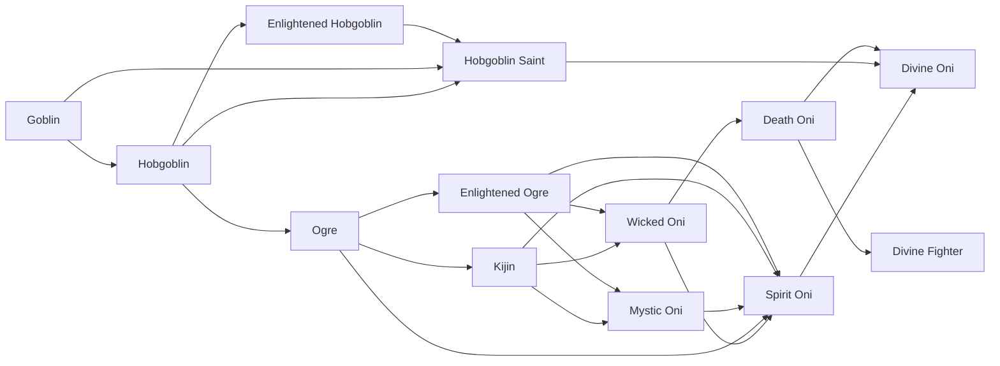

# Death Oni

<small>[Tensura: Reincarnated](../index.md) &rsaquo; [Races](index.md)</small>

| | |
|---|---|
| **ID** | `tensura:death_oni` |
| **Difficulty** | Easy |
| **Alignment** | Majin |
| **Aura** | 400,000 - 400,000 |
| **Magicule** | 400,000 - 400,000 |
| **Health bonus** | 400 |
| **Spiritual health bonus** | 3,040 |
| **Attack damage bonus** | 4.5 |
| **Movement speed bonus** | 0.05 |
| **EP to evolve into** | 400,000 |

> Wicked Oni that has "evolved the correct way" and became a Spiritual Lifeform.

## Evolution

- **Evolves from:** [Wicked Oni](wicked-oni.md)
- **Evolves into:** [Divine Oni](divine-oni.md), [Divine Fighter](divine-fighter.md)
- **Default evolution:** [Divine Fighter](divine-fighter.md)
- **On awakening (True Demon Lord / True Hero):** [Divine Fighter](divine-fighter.md)

### Requirements to evolve into Death Oni

Each requirement adds its weight to the evolution progress bar; you can evolve at 100%.

| Requirement | Weight |
|---|---|
| Reach Existence Points of 400,000 | 100% |

### Evolution tree

## Intrinsic skills

Granted automatically when you become this race.

-  [Strength](../abilities/common-skills/strength.md)
-  [Ultraspeed Regeneration](../abilities/extra-skills/ultraspeed-regeneration.md)

## Traits

- Spiritual lifeform

## Attribute modifiers

| Attribute | Amount | Operation |
|---|---|---|
| Scale | 0 | add |
| Max Health | 400 | add |
| Max Spiritual Health | 3,040 | add |
| Attack Damage | 4.5 | add |
| Attack Speed | 0.5 | add |
| Knockback Resistance | 0.3 | add |
| Movement Speed | 0.05 | add |
| Swim Speed Multiplier | 0.5 | add |

## Stats (config defaults)

Set in [`config/tensura/race/ogre_config.toml`](../configs/config-tensura-race-ogre-config.md).

| Option | Default | Description |
|---|---|---|
| `DeathOni.epRequirement` | 400,000 | EP requirement to evolve into Ogre Saint. |
| `DeathOni.minAura` | 400,000 | Minimal aura. |
| `DeathOni.maxAura` | 400,000 | Maximum aura. |
| `DeathOni.minMagicule` | 400,000 | Minimal magicule. |
| `DeathOni.maxMagicule` | 400,000 | Maximum magicule. |
| `DeathOni.size` | 0 | Bonus Size. |
| `DeathOni.maxHealth` | 400 | Bonus Max Health. |
| `DeathOni.maxSpiritualHealth` | 3,040 | Bonus Max Spiritual Health. |
| `DeathOni.attack` | 4.5 | Bonus Attack Damage. |
| `DeathOni.attackSpeed` | 0.5 | Bonus Attack Speed. |
| `DeathOni.knockbackResistance` | 0.3 | Bonus Knockback Resistance. |
| `DeathOni.movementSpeed` | 0.05 | Bonus Movement Speed. |
| `DeathOni.swimSpeed` | 0.5 | Bonus Swimming Speed Multiplier. |
| `WickedOni.essenceRequirement` | 10 | The number of Demon Essences consumed to evolve into Wicked Oni. |
| `WickedOni.minAura` | 40,000 | Minimal aura. |
| `WickedOni.maxAura` | 100,000 | Maximum aura. |
| `WickedOni.minMagicule` | 40,000 | Minimal magicule. |
| `WickedOni.maxMagicule` | 100,000 | Maximum magicule. |
| `WickedOni.size` | 0 | Bonus Size. |
| `WickedOni.maxHealth` | 110 | Bonus Max Health. |
| `WickedOni.maxSpiritualHealth` | 460 | Bonus Max Spiritual Health. |
| `WickedOni.attack` | 3.5 | Bonus Attack Damage. |
| `WickedOni.attackSpeed` | 0.4 | Bonus Attack Speed. |
| `WickedOni.knockbackResistance` | 0.2 | Bonus Knockback Resistance. |
| `WickedOni.movementSpeed` | 0.03 | Bonus Movement Speed. |
| `WickedOni.swimSpeed` | 0.3 | Bonus Swimming Speed Multiplier. |
| `Kijin.spiritRequirement` | 1 | The number of Spirits obtained to evolve into Kijin. |
| `Kijin.minAura` | 5,000 | Minimal aura. |
| `Kijin.maxAura` | 5,000 | Maximum aura. |
| `Kijin.minMagicule` | 5,000 | Minimal magicule. |
| `Kijin.maxMagicule` | 5,000 | Maximum magicule. |
| `Kijin.size` | 0 | Bonus Size. |
| `Kijin.maxHealth` | 10 | Bonus Max Health. |
| `Kijin.maxSpiritualHealth` | 100 | Bonus Max Spiritual Health. |
| `Kijin.attack` | 3 | Bonus Attack Damage. |
| `Kijin.attackSpeed` | 0.2 | Bonus Attack Speed. |
| `Kijin.knockbackResistance` | 0.2 | Bonus Knockback Resistance. |
| `Kijin.movementSpeed` | 0.02 | Bonus Movement Speed. |
| `Kijin.swimSpeed` | 0.2 | Bonus Swimming Speed Multiplier. |
| `Ogre.minAura` | 1,500 | Minimal aura. |
| `Ogre.maxAura` | 2,500 | Maximum aura. |
| `Ogre.minMagicule` | 300 | Minimal magicule. |
| `Ogre.maxMagicule` | 600 | Maximum magicule. |
| `Ogre.size` | 0 | Bonus Size. |
| `Ogre.maxHealth` | 6 | Bonus Max Health. |
| `Ogre.maxSpiritualHealth` | 15 | Bonus Max Spiritual Health. |
| `Ogre.attack` | 1 | Bonus Attack Damage. |
| `Ogre.attackSpeed` | 0.1 | Bonus Attack Speed. |
| `Ogre.knockbackResistance` | 0.1 | Bonus Knockback Resistance. |
| `Ogre.movementSpeed` | 0.01 | Bonus Movement Speed. |
| `Ogre.swimSpeed` | 0.1 | Bonus Swimming Speed Multiplier. |

## Tags

`tensura:races/spiritual`
