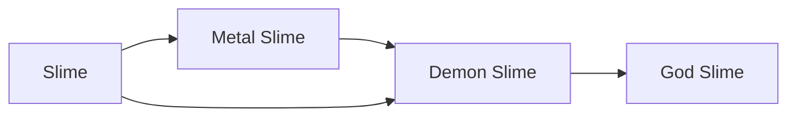

# Demon Slime

<small>[Tensura: Reincarnated](../index.md) &rsaquo; [Races](index.md)</small>

| | |
|---|---|
| **ID** | `tensura:demon_slime` |
| **Difficulty** | Easy |
| **Alignment** | Majin |
| **Aura** | 400,000 - 400,000 |
| **Magicule** | 400,000 - 400,000 |
| **Health bonus** | 500 |
| **Spiritual health bonus** | 3,100 |
| **Attack damage bonus** | 2 |
| **Movement speed bonus** | 0.03 |

> The ultimate stage of evolution of Slimes. They evolve to this stage by awakening as a True Demon Lord during the Harvest Festival.

## Evolution

- **Evolves from:** [Slime](slime.md), [Metal Slime](metal-slime.md)
- **Evolves into:** [God Slime](god-slime.md)
- **Default evolution:** [God Slime](god-slime.md)

### Requirements to evolve into Demon Slime

Each requirement adds its weight to the evolution progress bar; you can evolve at 100%.

| Requirement | Weight |
|---|---|
| Awaken [True Demon Lord./True Hero.] | 100% |

### Evolution tree

## Intrinsic skills

Granted automatically when you become this race.

-  [Possession](../abilities/intrinsic-skills/possession.md)
-  [Infinite Regeneration](../abilities/extra-skills/infinite-regeneration.md)
-  [Universal Perception](../abilities/extra-skills/universal-perception.md)
-  [Physical Attack Nullification](../abilities/resistance-skills/physical-attack-nullification.md)
-  [Magic Resistance](../abilities/resistance-skills/magic-resistance.md)
-  [Spiritual Attack Resistance](../abilities/resistance-skills/spiritual-attack-resistance.md)
-  [Cold Resistance](../abilities/resistance-skills/cold-resistance.md)
-  [Corrosion Resistance](../abilities/resistance-skills/corrosion-resistance.md)
-  [Darkness Attack Resistance](../abilities/resistance-skills/darkness-attack-resistance.md)
-  [Earth Attack Resistance](../abilities/resistance-skills/earth-attack-resistance.md)
-  [Electricity Resistance](../abilities/resistance-skills/electricity-resistance.md)
-  [Gravity Attack Resistance](../abilities/resistance-skills/gravity-attack-resistance.md)
-  [Heat Resistance](../abilities/resistance-skills/heat-resistance.md)
-  [Light Attack Resistance](../abilities/resistance-skills/light-attack-resistance.md)
-  [Spatial Attack Resistance](../abilities/resistance-skills/spatial-attack-resistance.md)
-  [Water Attack Resistance](../abilities/resistance-skills/water-attack-resistance.md)
-  [Wind Attack Resistance](../abilities/resistance-skills/wind-attack-resistance.md)
-  [Absorb &amp; Dissolve](../abilities/intrinsic-skills/absorb-and-dissolve.md)

## Traits

- Slime
- Spiritual lifeform

## Attribute modifiers

| Attribute | Amount | Operation |
|---|---|---|
| Jump Strength | 0.6 | add |
| Safe Fall Distance | 1.2 | add x base |
| Fall Damage Multiplier | -0.75 | add |
| Width Multiplier | 3 | add |
| Jump Strength | 0.4 | add |
| Safe Fall Distance | 0.8 | add x base |
| Fall Damage Multiplier | -0.5 | add |
| Scale | -0.675 | add |
| Max Health | 500 | add |
| Max Spiritual Health | 3,100 | add |
| Attack Damage | 2 | add |
| Attack Speed | 0.5 | add |
| Knockback Resistance | 0.5 | add |
| Movement Speed | 0.03 | add |
| Swim Speed Multiplier | 0.3 | add |

## Stats (config defaults)

Set in [`config/tensura/race/slime_config.toml`](../configs/config-tensura-race-slime-config.md).

| Option | Default | Description |
|---|---|---|
| `DemonSlime.minAura` | 400,000 | Minimal aura. |
| `DemonSlime.maxAura` | 400,000 | Maximum aura. |
| `DemonSlime.minMagicule` | 400,000 | Minimal magicule. |
| `DemonSlime.maxMagicule` | 400,000 | Maximum magicule. |
| `DemonSlime.size` | -0.675 | Bonus Size. |
| `DemonSlime.maxHealth` | 500 | Bonus Max Health. |
| `DemonSlime.maxSpiritualHealth` | 3,100 | Bonus Max Spiritual Health. |
| `DemonSlime.attack` | 2 | Bonus Attack Damage. |
| `DemonSlime.attackSpeed` | 0.5 | Bonus Attack Speed. |
| `DemonSlime.knockbackResistance` | 0.5 | Bonus Knockback Resistance. |
| `DemonSlime.movementSpeed` | 0.03 | Bonus Movement Speed. |
| `DemonSlime.swimSpeed` | 0.3 | Bonus Swimming Speed Multiplier. |
| `DemonSlime.jumpStrength` | 0.6 | Bonus Jump Strength. |
| `DemonSlime.fallDamage` | -0.75 | Fall Damage Multiplier. |
| `DemonSlime.maxChargeTick` | 60 | Get Max Jump Charge tick. |
| `DemonSlime.width` | 4 | Hitbox width multiplier. |
| `Slime.minAura` | 200 | Minimal aura. |
| `Slime.maxAura` | 500 | Maximum aura. |
| `Slime.minMagicule` | 200 | Minimal magicule. |
| `Slime.maxMagicule` | 500 | Maximum magicule. |
| `Slime.size` | -0.75 | Bonus Size. |
| `Slime.maxHealth` | -10 | Bonus Max Health. |
| `Slime.maxSpiritualHealth` | 15 | Bonus Max Spiritual Health. |
| `Slime.attack` | -0.7 | Bonus Attack Damage. |
| `Slime.attackSpeed` | 0 | Bonus Attack Speed. |
| `Slime.knockbackResistance` | 0 | Bonus Knockback Resistance. |
| `Slime.movementSpeed` | -0.03 | Bonus Movement Speed. |
| `Slime.swimSpeed` | -0.3 | Bonus Swimming Speed Multiplier. |
| `Slime.jumpStrength` | 0.4 | Bonus Jump Strength. |
| `Slime.fallDamage` | -0.5 | Fall Damage Multiplier. |
| `Slime.maxChargeTick` | 40 | Get Max Jump Charge tick. |
| `Slime.width` | 4 | Hitbox width multiplier. |
| `physicalInput` | 0.5 | The physical damage input multiplier taken by this race. |

## Tags

`tensura:races/slime`, `tensura:races/spiritual`
