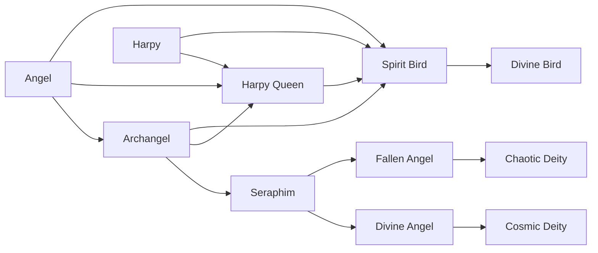

# Divine Bird

<small>[Tensura: Reincarnated](../index.md) &rsaquo; [Races](index.md)</small>

| | |
|---|---|
| **ID** | `tensura:divine_bird` |
| **Stage** | Final |
| **Difficulty** | Easy |
| **Alignment** | Majin |
| **Aura** | 1,000,000 - 1,000,000 |
| **Magicule** | 1,000,000 - 1,000,000 |
| **Health bonus** | 980 |
| **Spiritual health bonus** | 7,140 |
| **Attack damage bonus** | 3 |
| **Movement speed bonus** | 0.09 |
| **EP to evolve into** | 2,000,000 |

> Harpy that achieved divinity, possessing an immortal physical body that will never age.

## Evolution

- **Evolves from:** [Spirit Bird](spirit-bird.md)

### Requirements to evolve into Divine Bird

Each requirement adds its weight to the evolution progress bar; you can evolve at 100%.

| Requirement | Weight |
|---|---|
| Reach Existence Points of 2,000,000 | 100% |

### Evolution tree

## Intrinsic skills

Granted automatically when you become this race.

-  [Divine Ki Release](../abilities/intrinsic-skills/divine-ki-release.md)
-  [Magic Jamming](../abilities/extra-skills/magic-jamming.md)

## Traits

- Can glide
- Divine

## Attribute modifiers

| Attribute | Amount | Operation |
|---|---|---|
| Safe Fall Distance | 9 | add |
| Safe Fall Distance | 7 | add |
| Safe Fall Distance | 5 | add |
| Safe Fall Distance | 3 | add |
| Scale | 0 | add |
| Max Health | 980 | add |
| Max Spiritual Health | 7,140 | add |
| Attack Damage | 3 | add |
| Attack Speed | 0.8 | add |
| Knockback Resistance | 0.3 | add |
| Movement Speed | 0.09 | add |
| Swim Speed Multiplier | 0.9 | add |

## Stats (config defaults)

Set in [`config/tensura/race/harpy_config.toml`](../configs/config-tensura-race-harpy-config.md).

| Option | Default | Description |
|---|---|---|
| `DivineBird.safeFalling` | 9 | Bonus Safe Falling distance. |
| `DivineBird.epRequirement` | 2,000,000 | EP requirement to evolve into Divine Bird. |
| `DivineBird.minAura` | 1,000,000 | Minimal aura. |
| `DivineBird.maxAura` | 1,000,000 | Maximum aura. |
| `DivineBird.minMagicule` | 1,000,000 | Minimal magicule. |
| `DivineBird.maxMagicule` | 1,000,000 | Maximum magicule. |
| `DivineBird.size` | 0 | Bonus Size. |
| `DivineBird.maxHealth` | 980 | Bonus Max Health. |
| `DivineBird.maxSpiritualHealth` | 7,140 | Bonus Max Spiritual Health. |
| `DivineBird.attack` | 3 | Bonus Attack Damage. |
| `DivineBird.attackSpeed` | 0.8 | Bonus Attack Speed. |
| `DivineBird.knockbackResistance` | 0.3 | Bonus Knockback Resistance. |
| `DivineBird.movementSpeed` | 0.09 | Bonus Movement Speed. |
| `DivineBird.swimSpeed` | 0.9 | Bonus Swimming Speed Multiplier. |
| `DivineBird.safeFalling` | 9 | Bonus Safe Falling distance. |
| `DivineBird.flightBoost` | 1.05 | Flight Upward Boost Power. |
| `DivineBird.flightCooldown` | 3 | Flight Boost Cooldown. |
| `SpiritBird.safeFalling` | 7 | Bonus Safe Falling distance. |
| `SpiritBird.epRequirement` | 800,000 | EP requirement to evolve into Spirit Bird. |
| `SpiritBird.minAura` | 400,000 | Minimal aura. |
| `SpiritBird.maxAura` | 400,000 | Maximum aura. |
| `SpiritBird.minMagicule` | 400,000 | Minimal magicule. |
| `SpiritBird.maxMagicule` | 400,000 | Maximum magicule. |
| `SpiritBird.size` | 0 | Bonus Size. |
| `SpiritBird.maxHealth` | 580 | Bonus Max Health. |
| `SpiritBird.maxSpiritualHealth` | 4,540 | Bonus Max Spiritual Health. |
| `SpiritBird.attack` | 2 | Bonus Attack Damage. |
| `SpiritBird.attackSpeed` | 0.5 | Bonus Attack Speed. |
| `SpiritBird.knockbackResistance` | 0.2 | Bonus Knockback Resistance. |
| `SpiritBird.movementSpeed` | 0.05 | Bonus Movement Speed. |
| `SpiritBird.swimSpeed` | 0.5 | Bonus Swimming Speed Multiplier. |
| `SpiritBird.safeFalling` | 7 | Bonus Safe Falling distance. |
| `SpiritBird.flightBoost` | 0.95 | Flight Upward Boost Power. |
| `SpiritBird.flightCooldown` | 3 | Flight Boost Cooldown. |
| `HarpyQueen.safeFalling` | 5 | Bonus Safe Falling distance. |
| `HarpyQueen.epRequirement` | 200,000 | EP requirement to evolve into Harpy Queen. |
| `HarpyQueen.minAura` | 150,000 | Minimal aura. |
| `HarpyQueen.maxAura` | 150,000 | Maximum aura. |
| `HarpyQueen.minMagicule` | 150,000 | Minimal magicule. |
| `HarpyQueen.maxMagicule` | 150,000 | Maximum magicule. |
| `HarpyQueen.size` | 0 | Bonus Size. |
| `HarpyQueen.maxHealth` | 120 | Bonus Max Health. |
| `HarpyQueen.maxSpiritualHealth` | 290 | Bonus Max Spiritual Health. |
| `HarpyQueen.attack` | 1 | Bonus Attack Damage. |
| `HarpyQueen.attackSpeed` | 0.2 | Bonus Attack Speed. |
| `HarpyQueen.knockbackResistance` | 0.1 | Bonus Knockback Resistance. |
| `HarpyQueen.movementSpeed` | 0.03 | Bonus Movement Speed. |
| `HarpyQueen.swimSpeed` | 0.3 | Bonus Swimming Speed Multiplier. |
| `HarpyQueen.safeFalling` | 5 | Bonus Safe Falling distance. |
| `HarpyQueen.flightBoost` | 0.85 | Flight Upward Boost Power. |
| `HarpyQueen.flightCooldown` | 3 | Flight Boost Cooldown. |
| `Harpy.safeFalling` | 3 | Bonus Safe Falling distance. |
| `Harpy.minAura` | 300 | Minimal aura. |
| `Harpy.maxAura` | 600 | Maximum aura. |
| `Harpy.minMagicule` | 1,500 | Minimal magicule. |
| `Harpy.maxMagicule` | 2,500 | Maximum magicule. |
| `Harpy.size` | 0 | Bonus Size. |
| `Harpy.maxHealth` | 10 | Bonus Max Health. |
| `Harpy.maxSpiritualHealth` | 5 | Bonus Max Spiritual Health. |
| `Harpy.attack` | 0 | Bonus Attack Damage. |
| `Harpy.attackSpeed` | 0 | Bonus Attack Speed. |
| `Harpy.knockbackResistance` | 0 | Bonus Knockback Resistance. |
| `Harpy.movementSpeed` | 0 | Bonus Movement Speed. |
| `Harpy.swimSpeed` | 0 | Bonus Swimming Speed Multiplier. |
| `Harpy.safeFalling` | 3 | Bonus Safe Falling distance. |
| `Harpy.flightBoost` | 0.75 | Flight Upward Boost Power. |
| `Harpy.flightCooldown` | 3 | Flight Boost Cooldown. |

## Tags

`tensura:races/can_glide`, `tensura:races/divine`
