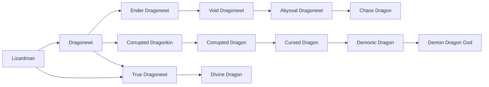

# Divine Dragon

<small>[Tensura: Reincarnated](../index.md) &rsaquo; [Races](index.md)</small>

| | |
|---|---|
| **ID** | `tensura:divine_dragon` |
| **Stage** | Final |
| **Difficulty** | Easy |
| **Alignment** | Holy |
| **Aura** | 1,000,000 - 1,000,000 |
| **Magicule** | 1,000,000 - 1,000,000 |
| **Health bonus** | 960 |
| **Spiritual health bonus** | 6,100 |
| **Attack damage bonus** | 5 |
| **Movement speed bonus** | 0.1 |
| **EP to evolve into** | 2,000,000 |

> Dragonewt that achieved divinity, possessing an immortal physical body that will never age.

## Evolution

- **Evolves from:** [True Dragonewt](true-dragonewt.md)

### Requirements to evolve into Divine Dragon

Each requirement adds its weight to the evolution progress bar; you can evolve at 100%.

| Requirement | Weight |
|---|---|
| Reach Existence Points of 2,000,000 | 100% |

### Evolution tree

## Intrinsic skills

Granted automatically when you become this race.

-  [Divine Ki Release](../abilities/intrinsic-skills/divine-ki-release.md)
-  [Dragon Skin](../abilities/intrinsic-skills/dragon-skin.md)
-  [Flame Breath](../abilities/intrinsic-skills/flame-breath.md)
-  [Ice Breath](../abilities/intrinsic-skills/ice-breath.md)
-  [Thunder Breath](../abilities/intrinsic-skills/thunder-breath.md)
-  [Dragon Eye](../abilities/intrinsic-skills/dragon-eye.md)
-  [Dragon Ear](../abilities/intrinsic-skills/dragon-ear.md)
-  [Magic Resistance](../abilities/resistance-skills/magic-resistance.md)
-  [Scale Armor](../abilities/intrinsic-skills/scale-armor.md)

## Traits

- Can glide
- Divine

## Attribute modifiers

| Attribute | Amount | Operation |
|---|---|---|
| Scale | 0 | add |
| Max Health | 960 | add |
| Max Spiritual Health | 6,100 | add |
| Attack Damage | 5 | add |
| Attack Speed | 0.7 | add |
| Knockback Resistance | 0.5 | add |
| Movement Speed | 0.1 | add |
| Swim Speed Multiplier | 1 | add |

## Stats (config defaults)

Set in [`config/tensura/race/lizardman_config.toml`](../configs/config-tensura-race-lizardman-config.md).

| Option | Default | Description |
|---|---|---|
| `DivineDragon.epRequirement` | 2,000,000 | EP requirement to evolve into Divine Dragon. |
| `DivineDragon.minAura` | 1,000,000 | Minimal aura. |
| `DivineDragon.maxAura` | 1,000,000 | Maximum aura. |
| `DivineDragon.minMagicule` | 1,000,000 | Minimal magicule. |
| `DivineDragon.maxMagicule` | 1,000,000 | Maximum magicule. |
| `DivineDragon.size` | 0 | Bonus Size. |
| `DivineDragon.maxHealth` | 960 | Bonus Max Health. |
| `DivineDragon.maxSpiritualHealth` | 6,100 | Bonus Max Spiritual Health. |
| `DivineDragon.attack` | 5 | Bonus Attack Damage. |
| `DivineDragon.attackSpeed` | 0.7 | Bonus Attack Speed. |
| `DivineDragon.knockbackResistance` | 0.5 | Bonus Knockback Resistance. |
| `DivineDragon.movementSpeed` | 0.1 | Bonus Movement Speed. |
| `DivineDragon.swimSpeed` | 1 | Bonus Swimming Speed Multiplier. |
| `DivineDragon.flightBoost` | 0.5 | Flight Boost Power. |
| `DivineDragon.flightCooldown` | 3 | Flight Boost Cooldown. |
| `TrueDragonewt.epRequirement` | 800,000 | EP requirement to evolve into True Dragonewt. |
| `TrueDragonewt.minAura` | 600,000 | Minimal aura. |
| `TrueDragonewt.maxAura` | 600,000 | Maximum aura. |
| `TrueDragonewt.minMagicule` | 200,000 | Minimal magicule. |
| `TrueDragonewt.maxMagicule` | 200,000 | Maximum magicule. |
| `TrueDragonewt.size` | 0 | Bonus Size. |
| `TrueDragonewt.maxHealth` | 460 | Bonus Max Health. |
| `TrueDragonewt.maxSpiritualHealth` | 3,240 | Bonus Max Spiritual Health. |
| `TrueDragonewt.attack` | 3 | Bonus Attack Damage. |
| `TrueDragonewt.attackSpeed` | 0.5 | Bonus Attack Speed. |
| `TrueDragonewt.knockbackResistance` | 0.4 | Bonus Knockback Resistance. |
| `TrueDragonewt.movementSpeed` | 0.05 | Bonus Movement Speed. |
| `TrueDragonewt.swimSpeed` | 0.5 | Bonus Swimming Speed Multiplier. |
| `TrueDragonewt.flightBoost` | 0.25 | Flight Boost Power. |
| `TrueDragonewt.flightCooldown` | 3 | Flight Boost Cooldown. |
| `Dragonewt.essenceRequirement` | 10 | The number of Dragon Essence consumed to evolve into Dragonewt. |
| `Dragonewt.minAura` | 6,000 | Minimal aura. |
| `Dragonewt.maxAura` | 6,000 | Maximum aura. |
| `Dragonewt.minMagicule` | 4,000 | Minimal magicule. |
| `Dragonewt.maxMagicule` | 4,000 | Maximum magicule. |
| `Dragonewt.size` | 0 | Bonus Size. |
| `Dragonewt.maxHealth` | 34 | Bonus Max Health. |
| `Dragonewt.maxSpiritualHealth` | 150 | Bonus Max Spiritual Health. |
| `Dragonewt.attack` | 1 | Bonus Attack Damage. |
| `Dragonewt.attackSpeed` | 0.3 | Bonus Attack Speed. |
| `Dragonewt.knockbackResistance` | 0.2 | Bonus Knockback Resistance. |
| `Dragonewt.movementSpeed` | 0.03 | Bonus Movement Speed. |
| `Dragonewt.swimSpeed` | 0.3 | Bonus Swimming Speed Multiplier. |
| `Dragonewt.flightBoost` | 0.1 | Flight Boost Power. |
| `Dragonewt.flightCooldown` | 3 | Flight Boost Cooldown. |
| `Lizardman.minAura` | 600 | Minimal aura. |
| `Lizardman.maxAura` | 800 | Maximum aura. |
| `Lizardman.minMagicule` | 100 | Minimal magicule. |
| `Lizardman.maxMagicule` | 200 | Maximum magicule. |
| `Lizardman.size` | 0 | Bonus Size. |
| `Lizardman.maxHealth` | 4 | Bonus Max Health. |
| `Lizardman.maxSpiritualHealth` | 8 | Bonus Max Spiritual Health. |
| `Lizardman.attack` | 0.5 | Bonus Attack Damage. |
| `Lizardman.attackSpeed` | 0.1 | Bonus Attack Speed. |
| `Lizardman.knockbackResistance` | 0 | Bonus Knockback Resistance. |
| `Lizardman.movementSpeed` | 0.01 | Bonus Movement Speed. |
| `Lizardman.swimSpeed` | 0.1 | Bonus Swimming Speed Multiplier. |

## Tags

`tensura:races/can_glide`, `tensura:races/divine`
