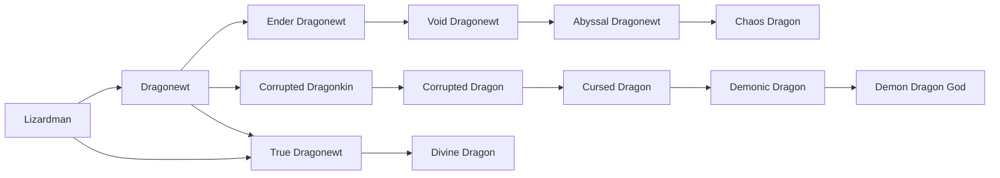

# Dragonewt

<small>[Tensura: Reincarnated](../index.md) &rsaquo; [Races](index.md)</small>

| | |
|---|---|
| **ID** | `tensura:dragonewt` |
| **Difficulty** | Easy |
| **Alignment** | Default |
| **Aura** | 6,000 - 6,000 |
| **Magicule** | 4,000 - 4,000 |
| **Health bonus** | 34 |
| **Spiritual health bonus** | 150 |
| **Attack damage bonus** | 1 |
| **Movement speed bonus** | 0.03 |

> The evolved form of Lizardmen and descendants of dragons. They have an average lifespan of about two hundred years.

## Evolution

- **Evolves from:** [Lizardman](lizardman.md)
- **Evolves into:** [True Dragonewt](true-dragonewt.md)
- **Default evolution:** [True Dragonewt](true-dragonewt.md)
- **On awakening (True Demon Lord / True Hero):** [True Dragonewt](true-dragonewt.md)

### Requirements to evolve into Dragonewt

Each requirement adds its weight to the evolution progress bar; you can evolve at 100%.

| Requirement | Weight |
|---|---|
| Consume 10 of [Dragon Essence](../items/materials/dragon-essence.md) | 100% |

### Evolution tree

## Intrinsic skills

Granted automatically when you become this race.

-  [Dragon Eye](../abilities/intrinsic-skills/dragon-eye.md)
-  [Dragon Ear](../abilities/intrinsic-skills/dragon-ear.md)
-  [Flame Breath](../abilities/intrinsic-skills/flame-breath.md)
-  [Ice Breath](../abilities/intrinsic-skills/ice-breath.md)
-  [Thunder Breath](../abilities/intrinsic-skills/thunder-breath.md)
-  [Magic Resistance](../abilities/resistance-skills/magic-resistance.md)
-  [Scale Armor](../abilities/intrinsic-skills/scale-armor.md)

## Traits

- Can glide
- Cold-blooded

## Attribute modifiers

| Attribute | Amount | Operation |
|---|---|---|
| Scale | 0 | add |
| Max Health | 34 | add |
| Max Spiritual Health | 150 | add |
| Attack Damage | 1 | add |
| Attack Speed | 0.3 | add |
| Knockback Resistance | 0.2 | add |
| Movement Speed | 0.03 | add |
| Swim Speed Multiplier | 0.3 | add |

## Stats (config defaults)

Set in [`config/tensura/race/lizardman_config.toml`](../configs/config-tensura-race-lizardman-config.md).

| Option | Default | Description |
|---|---|---|
| `Dragonewt.essenceRequirement` | 10 | The number of Dragon Essence consumed to evolve into Dragonewt. |
| `Dragonewt.minAura` | 6,000 | Minimal aura. |
| `Dragonewt.maxAura` | 6,000 | Maximum aura. |
| `Dragonewt.minMagicule` | 4,000 | Minimal magicule. |
| `Dragonewt.maxMagicule` | 4,000 | Maximum magicule. |
| `Dragonewt.size` | 0 | Bonus Size. |
| `Dragonewt.maxHealth` | 34 | Bonus Max Health. |
| `Dragonewt.maxSpiritualHealth` | 150 | Bonus Max Spiritual Health. |
| `Dragonewt.attack` | 1 | Bonus Attack Damage. |
| `Dragonewt.attackSpeed` | 0.3 | Bonus Attack Speed. |
| `Dragonewt.knockbackResistance` | 0.2 | Bonus Knockback Resistance. |
| `Dragonewt.movementSpeed` | 0.03 | Bonus Movement Speed. |
| `Dragonewt.swimSpeed` | 0.3 | Bonus Swimming Speed Multiplier. |
| `Dragonewt.flightBoost` | 0.1 | Flight Boost Power. |
| `Dragonewt.flightCooldown` | 3 | Flight Boost Cooldown. |
| `Lizardman.minAura` | 600 | Minimal aura. |
| `Lizardman.maxAura` | 800 | Maximum aura. |
| `Lizardman.minMagicule` | 100 | Minimal magicule. |
| `Lizardman.maxMagicule` | 200 | Maximum magicule. |
| `Lizardman.size` | 0 | Bonus Size. |
| `Lizardman.maxHealth` | 4 | Bonus Max Health. |
| `Lizardman.maxSpiritualHealth` | 8 | Bonus Max Spiritual Health. |
| `Lizardman.attack` | 0.5 | Bonus Attack Damage. |
| `Lizardman.attackSpeed` | 0.1 | Bonus Attack Speed. |
| `Lizardman.knockbackResistance` | 0 | Bonus Knockback Resistance. |
| `Lizardman.movementSpeed` | 0.01 | Bonus Movement Speed. |
| `Lizardman.swimSpeed` | 0.1 | Bonus Swimming Speed Multiplier. |

## Tags

`tensura:races/can_glide`, `tensura:races/cold_blooded`
