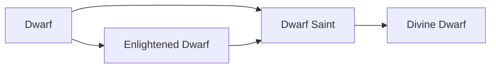

# Dwarf

<small>[Tensura: Reincarnated](../index.md) &rsaquo; [Races](index.md)</small>

| | |
|---|---|
| **ID** | `tensura:dwarf` |
| **Stage** | Starting |
| **Difficulty** | Hard |
| **Alignment** | Default |
| **Aura** | 720 - 1,080 |
| **Magicule** | 80 - 120 |
| **Health bonus** | 4 |
| **Spiritual health bonus** | 10 |
| **Attack damage bonus** | 0.5 |
| **Movement speed bonus** | -0.01 |

> A sprite race descended from earth elementals. They possess an immense will and make for fierce albeit rather short soldiers.

## Evolution

- **Evolves into:** [Enlightened Dwarf](enlightened-dwarf.md)
- **Default evolution:** [Enlightened Dwarf](enlightened-dwarf.md)
- **On awakening (True Demon Lord / True Hero):** [Dwarf Saint](dwarf-saint.md)
- **During the Harvest Festival:** [Enlightened Dwarf](enlightened-dwarf.md)

### Evolution tree

## Traits

- Human-like

## Attribute modifiers

| Attribute | Amount | Operation |
|---|---|---|
| Scale | -0.375 | add |
| Max Health | 4 | add |
| Max Spiritual Health | 10 | add |
| Attack Damage | 0.5 | add |
| Attack Speed | -0.1 | add |
| Knockback Resistance | 0.02 | add |
| Movement Speed | -0.01 | add |
| Swim Speed Multiplier | -0.1 | add |

## Stats (config defaults)

Set in [`config/tensura/race/dwarf_config.toml`](../configs/config-tensura-race-dwarf-config.md).

| Option | Default | Description |
|---|---|---|
| `Dwarf.minAura` | 720 | Minimal aura. |
| `Dwarf.maxAura` | 1,080 | Maximum aura. |
| `Dwarf.minMagicule` | 80 | Minimal magicule. |
| `Dwarf.maxMagicule` | 120 | Maximum magicule. |
| `Dwarf.size` | -0.375 | Bonus Size. |
| `Dwarf.maxHealth` | 4 | Bonus Max Health. |
| `Dwarf.maxSpiritualHealth` | 10 | Bonus Max Spiritual Health. |
| `Dwarf.attack` | 0.5 | Bonus Attack Damage. |
| `Dwarf.attackSpeed` | -0.1 | Bonus Attack Speed. |
| `Dwarf.knockbackResistance` | 0.02 | Bonus Knockback Resistance. |
| `Dwarf.movementSpeed` | -0.01 | Bonus Movement Speed. |
| `Dwarf.swimSpeed` | -0.1 | Bonus Swimming Speed Multiplier. |

## Tags

`tensura:races/human_like`
