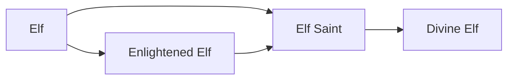

# Elf

<small>[Tensura: Reincarnated](../index.md) &rsaquo; [Races](index.md)</small>

| | |
|---|---|
| **ID** | `tensura:elf` |
| **Difficulty** | Hard |
| **Alignment** | Default |
| **Aura** | 320 - 600 |
| **Magicule** | 600 - 800 |
| **Health bonus** | 0 |
| **Spiritual health bonus** | 0 |
| **Attack damage bonus** | 0 |
| **Movement speed bonus** | 0.01 |

> A sprite race descended from wind elementals. They possess a fierce talent for elemental magic and are more in tune with nature than most.

## Evolution

- **Evolves into:** [Enlightened Elf](enlightened-elf.md)
- **Default evolution:** [Enlightened Elf](enlightened-elf.md)
- **On awakening (True Demon Lord / True Hero):** [Elf Saint](elf-saint.md)
- **During the Harvest Festival:** [Enlightened Elf](enlightened-elf.md)

### Evolution tree

## Traits

- Human-like

## Attribute modifiers

| Attribute | Amount | Operation |
|---|---|---|
| Scale | 0 | add |
| Max Health | 0 | add |
| Max Spiritual Health | 0 | add |
| Attack Damage | 0 | add |
| Attack Speed | 0.1 | add |
| Knockback Resistance | 0 | add |
| Movement Speed | 0.01 | add |
| Swim Speed Multiplier | 0.1 | add |

## Stats (config defaults)

Set in [`config/tensura/race/elf_config.toml`](../configs/config-tensura-race-elf-config.md).

| Option | Default | Description |
|---|---|---|
| `Elf.minAura` | 320 | Minimal aura. |
| `Elf.maxAura` | 600 | Maximum aura. |
| `Elf.minMagicule` | 600 | Minimal magicule. |
| `Elf.maxMagicule` | 800 | Maximum magicule. |
| `Elf.size` | 0 | Bonus Size. |
| `Elf.maxHealth` | 0 | Bonus Max Health. |
| `Elf.maxSpiritualHealth` | 0 | Bonus Max Spiritual Health. |
| `Elf.attack` | 0 | Bonus Attack Damage. |
| `Elf.attackSpeed` | 0.1 | Bonus Attack Speed. |
| `Elf.knockbackResistance` | 0 | Bonus Knockback Resistance. |
| `Elf.movementSpeed` | 0.01 | Bonus Movement Speed. |
| `Elf.swimSpeed` | 0.1 | Bonus Swimming Speed Multiplier. |

## Tags

`tensura:races/human_like`
