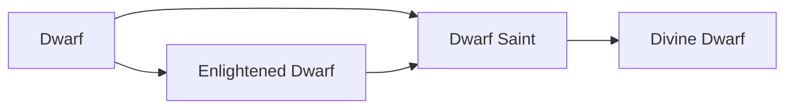

# Enlightened Dwarf

<small>[Tensura: Reincarnated](../index.md) &rsaquo; [Races](index.md)</small>

| | |
|---|---|
| **ID** | `tensura:enlightened_dwarf` |
| **Difficulty** | Easy |
| **Alignment** | Default |
| **Aura** | 140,000 - 140,000 |
| **Magicule** | 60,000 - 60,000 |
| **Health bonus** | 90 |
| **Spiritual health bonus** | 320 |
| **Attack damage bonus** | 1.5 |
| **Movement speed bonus** | 0 |
| **EP to evolve into** | 100,000 |

> Dwarf that has "evolved the correct way" and became a Demi-Spiritual Lifeform.

## Evolution

- **Evolves from:** [Dwarf](dwarf.md)
- **Evolves into:** [Dwarf Saint](dwarf-saint.md)
- **Default evolution:** [Dwarf Saint](dwarf-saint.md)
- **On awakening (True Demon Lord / True Hero):** [Dwarf Saint](dwarf-saint.md)

### Requirements to evolve into Enlightened Dwarf

Each requirement adds its weight to the evolution progress bar; you can evolve at 100%.

| Requirement | Weight |
|---|---|
| Reach Existence Points of 100,000 | 100% |

### Evolution tree

## Attribute modifiers

| Attribute | Amount | Operation |
|---|---|---|
| Scale | -0.25 | add |
| Max Health | 90 | add |
| Max Spiritual Health | 320 | add |
| Attack Damage | 1.5 | add |
| Attack Speed | 0.1 | add |
| Knockback Resistance | 0.2 | add |
| Movement Speed | 0 | add |
| Swim Speed Multiplier | 0 | add |

## Stats (config defaults)

Set in [`config/tensura/race/dwarf_config.toml`](../configs/config-tensura-race-dwarf-config.md).

| Option | Default | Description |
|---|---|---|
| `EnlightenedDwarf.epRequirement` | 100,000 | EP requirement to evolve into Enlightened Dwarf. |
| `EnlightenedDwarf.minAura` | 140,000 | Minimal aura. |
| `EnlightenedDwarf.maxAura` | 140,000 | Maximum aura. |
| `EnlightenedDwarf.minMagicule` | 60,000 | Minimal magicule. |
| `EnlightenedDwarf.maxMagicule` | 60,000 | Maximum magicule. |
| `EnlightenedDwarf.size` | -0.25 | Bonus Size. |
| `EnlightenedDwarf.maxHealth` | 90 | Bonus Max Health. |
| `EnlightenedDwarf.maxSpiritualHealth` | 320 | Bonus Max Spiritual Health. |
| `EnlightenedDwarf.attack` | 1.5 | Bonus Attack Damage. |
| `EnlightenedDwarf.attackSpeed` | 0.1 | Bonus Attack Speed. |
| `EnlightenedDwarf.knockbackResistance` | 0.2 | Bonus Knockback Resistance. |
| `EnlightenedDwarf.movementSpeed` | 0 | Bonus Movement Speed. |
| `EnlightenedDwarf.swimSpeed` | 0 | Bonus Swimming Speed Multiplier. |
| `Dwarf.minAura` | 720 | Minimal aura. |
| `Dwarf.maxAura` | 1,080 | Maximum aura. |
| `Dwarf.minMagicule` | 80 | Minimal magicule. |
| `Dwarf.maxMagicule` | 120 | Maximum magicule. |
| `Dwarf.size` | -0.375 | Bonus Size. |
| `Dwarf.maxHealth` | 4 | Bonus Max Health. |
| `Dwarf.maxSpiritualHealth` | 10 | Bonus Max Spiritual Health. |
| `Dwarf.attack` | 0.5 | Bonus Attack Damage. |
| `Dwarf.attackSpeed` | -0.1 | Bonus Attack Speed. |
| `Dwarf.knockbackResistance` | 0.02 | Bonus Knockback Resistance. |
| `Dwarf.movementSpeed` | -0.01 | Bonus Movement Speed. |
| `Dwarf.swimSpeed` | -0.1 | Bonus Swimming Speed Multiplier. |
