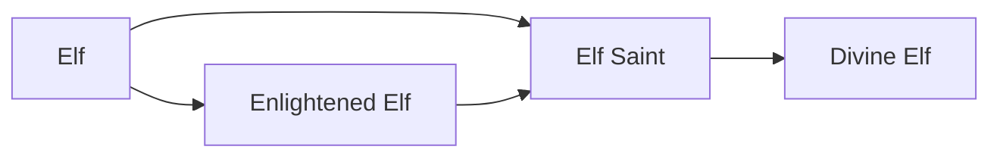

# Enlightened Elf

<small>[Tensura: Reincarnated](../index.md) &rsaquo; [Races](index.md)</small>

| | |
|---|---|
| **ID** | `tensura:enlightened_elf` |
| **Difficulty** | Easy |
| **Alignment** | Default |
| **Aura** | 140,000 - 140,000 |
| **Magicule** | 60,000 - 60,000 |
| **Health bonus** | 80 |
| **Spiritual health bonus** | 300 |
| **Attack damage bonus** | 1 |
| **Movement speed bonus** | 0.03 |
| **EP to evolve into** | 100,000 |

> Elf that has "evolved the correct way" and became a Demi-Spiritual Lifeform.

## Evolution

- **Evolves from:** [Elf](elf.md)
- **Evolves into:** [Elf Saint](elf-saint.md)
- **Default evolution:** [Elf Saint](elf-saint.md)
- **On awakening (True Demon Lord / True Hero):** [Elf Saint](elf-saint.md)

### Requirements to evolve into Enlightened Elf

Each requirement adds its weight to the evolution progress bar; you can evolve at 100%.

| Requirement | Weight |
|---|---|
| Reach Existence Points of 100,000 | 100% |

### Evolution tree

## Attribute modifiers

| Attribute | Amount | Operation |
|---|---|---|
| Scale | 0 | add |
| Max Health | 80 | add |
| Max Spiritual Health | 300 | add |
| Attack Damage | 1 | add |
| Attack Speed | 0.3 | add |
| Knockback Resistance | 0.1 | add |
| Movement Speed | 0.03 | add |
| Swim Speed Multiplier | 0.3 | add |

## Stats (config defaults)

Set in [`config/tensura/race/elf_config.toml`](../configs/config-tensura-race-elf-config.md).

| Option | Default | Description |
|---|---|---|
| `EnlightenedElf.epRequirement` | 100,000 | EP requirement to evolve into Enlightened Elf. |
| `EnlightenedElf.minAura` | 140,000 | Minimal aura. |
| `EnlightenedElf.maxAura` | 140,000 | Maximum aura. |
| `EnlightenedElf.minMagicule` | 60,000 | Minimal magicule. |
| `EnlightenedElf.maxMagicule` | 60,000 | Maximum magicule. |
| `EnlightenedElf.size` | 0 | Bonus Size. |
| `EnlightenedElf.maxHealth` | 80 | Bonus Max Health. |
| `EnlightenedElf.maxSpiritualHealth` | 300 | Bonus Max Spiritual Health. |
| `EnlightenedElf.attack` | 1 | Bonus Attack Damage. |
| `EnlightenedElf.attackSpeed` | 0.3 | Bonus Attack Speed. |
| `EnlightenedElf.knockbackResistance` | 0.1 | Bonus Knockback Resistance. |
| `EnlightenedElf.movementSpeed` | 0.03 | Bonus Movement Speed. |
| `EnlightenedElf.swimSpeed` | 0.3 | Bonus Swimming Speed Multiplier. |
| `Elf.minAura` | 320 | Minimal aura. |
| `Elf.maxAura` | 600 | Maximum aura. |
| `Elf.minMagicule` | 600 | Minimal magicule. |
| `Elf.maxMagicule` | 800 | Maximum magicule. |
| `Elf.size` | 0 | Bonus Size. |
| `Elf.maxHealth` | 0 | Bonus Max Health. |
| `Elf.maxSpiritualHealth` | 0 | Bonus Max Spiritual Health. |
| `Elf.attack` | 0 | Bonus Attack Damage. |
| `Elf.attackSpeed` | 0.1 | Bonus Attack Speed. |
| `Elf.knockbackResistance` | 0 | Bonus Knockback Resistance. |
| `Elf.movementSpeed` | 0.01 | Bonus Movement Speed. |
| `Elf.swimSpeed` | 0.1 | Bonus Swimming Speed Multiplier. |
