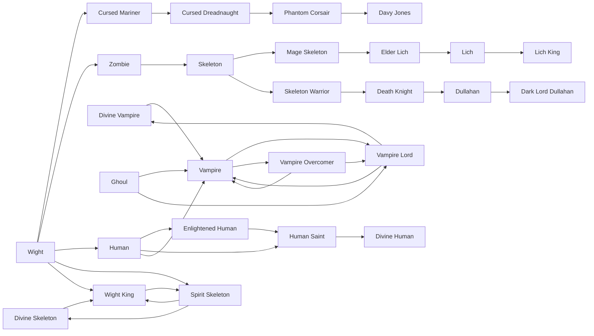

# Enlightened Human

<small>[Tensura: Reincarnated](../index.md) &rsaquo; [Races](index.md)</small>

| | |
|---|---|
| **ID** | `tensura:enlightened_human` |
| **Difficulty** | Easy |
| **Alignment** | Default |
| **Aura** | 140,000 - 140,000 |
| **Magicule** | 60,000 - 60,000 |
| **Health bonus** | 80 |
| **Spiritual health bonus** | 300 |
| **Attack damage bonus** | 1 |
| **Movement speed bonus** | 0.01 |
| **EP to evolve into** | 100,000 |

> Human that has "evolved the correct way" and became a Demi-Spiritual Lifeform.

## Evolution

- **Evolves from:** [Human](human.md)
- **Evolves into:** [Human Saint](human-saint.md)
- **Default evolution:** [Human Saint](human-saint.md)
- **On awakening (True Demon Lord / True Hero):** [Human Saint](human-saint.md)

### Requirements to evolve into Enlightened Human

Each requirement adds its weight to the evolution progress bar; you can evolve at 100%.

| Requirement | Weight |
|---|---|
| Reach Existence Points of 100,000 | 100% |

### Evolution tree

## Attribute modifiers

| Attribute | Amount | Operation |
|---|---|---|
| Scale | 0 | add |
| Max Health | 80 | add |
| Max Spiritual Health | 300 | add |
| Attack Damage | 1 | add |
| Attack Speed | 0.2 | add |
| Knockback Resistance | 0.1 | add |
| Movement Speed | 0.01 | add |
| Swim Speed Multiplier | 0.1 | add |

## Stats (config defaults)

Set in [`config/tensura/race/human_config.toml`](../configs/config-tensura-race-human-config.md).

| Option | Default | Description |
|---|---|---|
| `EnlightenedHuman.epRequirement` | 100,000 | EP requirement to evolve into Enlightened Human. |
| `EnlightenedHuman.minAura` | 140,000 | Minimal aura. |
| `EnlightenedHuman.maxAura` | 140,000 | Maximum aura. |
| `EnlightenedHuman.minMagicule` | 60,000 | Minimal magicule. |
| `EnlightenedHuman.maxMagicule` | 60,000 | Maximum magicule. |
| `EnlightenedHuman.size` | 0 | Bonus Size. |
| `EnlightenedHuman.maxHealth` | 80 | Bonus Max Health. |
| `EnlightenedHuman.maxSpiritualHealth` | 300 | Bonus Max Spiritual Health. |
| `EnlightenedHuman.attack` | 1 | Bonus Attack Damage. |
| `EnlightenedHuman.attackSpeed` | 0.2 | Bonus Attack Speed. |
| `EnlightenedHuman.knockbackResistance` | 0.1 | Bonus Knockback Resistance. |
| `EnlightenedHuman.movementSpeed` | 0.01 | Bonus Movement Speed. |
| `EnlightenedHuman.swimSpeed` | 0.1 | Bonus Swimming Speed Multiplier. |
| `Human.minAura` | 760 | Minimal aura. |
| `Human.maxAura` | 1,140 | Maximum aura. |
| `Human.minMagicule` | 50 | Minimal magicule. |
| `Human.maxMagicule` | 70 | Maximum magicule. |
| `Human.size` | 0 | Bonus Size. |
| `Human.maxHealth` | 0 | Bonus Max Health. |
| `Human.maxSpiritualHealth` | 0 | Bonus Max Spiritual Health. |
| `Human.attack` | 0 | Bonus Attack Damage. |
| `Human.attackSpeed` | 0 | Bonus Attack Speed. |
| `Human.knockbackResistance` | 0 | Bonus Knockback Resistance. |
| `Human.movementSpeed` | 0 | Bonus Movement Speed. |
| `Human.swimSpeed` | 0 | Bonus Swimming Speed Multiplier. |
