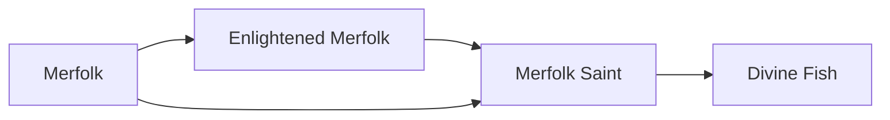

# Enlightened Merfolk

<small>[Tensura: Reincarnated](../index.md) &rsaquo; [Races](index.md)</small>

| | |
|---|---|
| **ID** | `tensura:enlightened_merfolk` |
| **Stage** | In-between |
| **Difficulty** | Easy |
| **Alignment** | Default |
| **Aura** | 140,000 - 140,000 |
| **Magicule** | 60,000 - 60,000 |
| **Health bonus** | 100 |
| **Spiritual health bonus** | 320 |
| **Attack damage bonus** | 1 |
| **Movement speed bonus** | 0.01 |
| **EP to evolve into** | 100,000 |

> Merfolk that has "evolved the correct way" and became a Demi-Spiritual Lifeform.

## Evolution

- **Evolves from:** [Merfolk](merfolk.md)
- **Evolves into:** [Merfolk Saint](merfolk-saint.md)
- **Default evolution:** [Merfolk Saint](merfolk-saint.md)
- **On awakening (True Demon Lord / True Hero):** [Merfolk Saint](merfolk-saint.md)

### Requirements to evolve into Enlightened Merfolk

Each requirement adds its weight to the evolution progress bar; you can evolve at 100%.

| Requirement | Weight |
|---|---|
| Reach Existence Points of 100,000 | 100% |

### Evolution tree

## Intrinsic skills

Granted automatically when you become this race.

-  [Water Breathing](../abilities/intrinsic-skills/water-breathing.md)
-  [Hydraulic Propulsion](../abilities/common-skills/hydraulic-propulsion.md)

## Traits

- Can breathe underwater
- Needs moisture

## Attribute modifiers

| Attribute | Amount | Operation |
|---|---|---|
| Submerged Mining Speed | 0.6 | add |
| Submerged Mining Speed | 0.4 | add |
| Scale | 0 | add |
| Max Health | 100 | add |
| Max Spiritual Health | 320 | add |
| Attack Damage | 1 | add |
| Attack Speed | 0.2 | add |
| Knockback Resistance | 0.05 | add |
| Movement Speed | 0.01 | add |
| Swim Speed Multiplier | 0.7 | add |

## Stats (config defaults)

Set in [`config/tensura/race/merfolk_config.toml`](../configs/config-tensura-race-merfolk-config.md).

| Option | Default | Description |
|---|---|---|
| `EnlightenedMerfolk.submergedMiningSpeed` | 0.6 | Bonus Submerged Mining Speed. |
| `EnlightenedMerfolk.epRequirement` | 100,000 | EP requirement to evolve into Enlightened Merfolk. |
| `EnlightenedMerfolk.minAura` | 140,000 | Minimal aura. |
| `EnlightenedMerfolk.maxAura` | 140,000 | Maximum aura. |
| `EnlightenedMerfolk.minMagicule` | 60,000 | Minimal magicule. |
| `EnlightenedMerfolk.maxMagicule` | 60,000 | Maximum magicule. |
| `EnlightenedMerfolk.size` | 0 | Bonus Size. |
| `EnlightenedMerfolk.maxHealth` | 100 | Bonus Max Health. |
| `EnlightenedMerfolk.maxSpiritualHealth` | 320 | Bonus Max Spiritual Health. |
| `EnlightenedMerfolk.attack` | 1 | Bonus Attack Damage. |
| `EnlightenedMerfolk.attackSpeed` | 0.2 | Bonus Attack Speed. |
| `EnlightenedMerfolk.knockbackResistance` | 0.05 | Bonus Knockback Resistance. |
| `EnlightenedMerfolk.movementSpeed` | 0.01 | Bonus Movement Speed. |
| `EnlightenedMerfolk.swimSpeed` | 0.7 | Bonus Swimming Speed Multiplier. |
| `EnlightenedMerfolk.submergedMiningSpeed` | 0.6 | Bonus Submerged Mining Speed. |
| `Merfolk.submergedMiningSpeed` | 0.4 | Bonus Submerged Mining Speed. |
| `Merfolk.minAura` | 400 | Minimal aura. |
| `Merfolk.maxAura` | 600 | Maximum aura. |
| `Merfolk.minMagicule` | 500 | Minimal magicule. |
| `Merfolk.maxMagicule` | 600 | Maximum magicule. |
| `Merfolk.size` | 0 | Bonus Size. |
| `Merfolk.maxHealth` | 4 | Bonus Max Health. |
| `Merfolk.maxSpiritualHealth` | 20 | Bonus Max Spiritual Health. |
| `Merfolk.attack` | 0 | Bonus Attack Damage. |
| `Merfolk.attackSpeed` | 0 | Bonus Attack Speed. |
| `Merfolk.knockbackResistance` | 0 | Bonus Knockback Resistance. |
| `Merfolk.movementSpeed` | -0.01 | Bonus Movement Speed. |
| `Merfolk.swimSpeed` | 0.5 | Bonus Swimming Speed Multiplier. |
| `Merfolk.submergedMiningSpeed` | 0.4 | Bonus Submerged Mining Speed. |

## Tags

`tensura:races/can_breath_water`, `tensura:races/need_moist`
