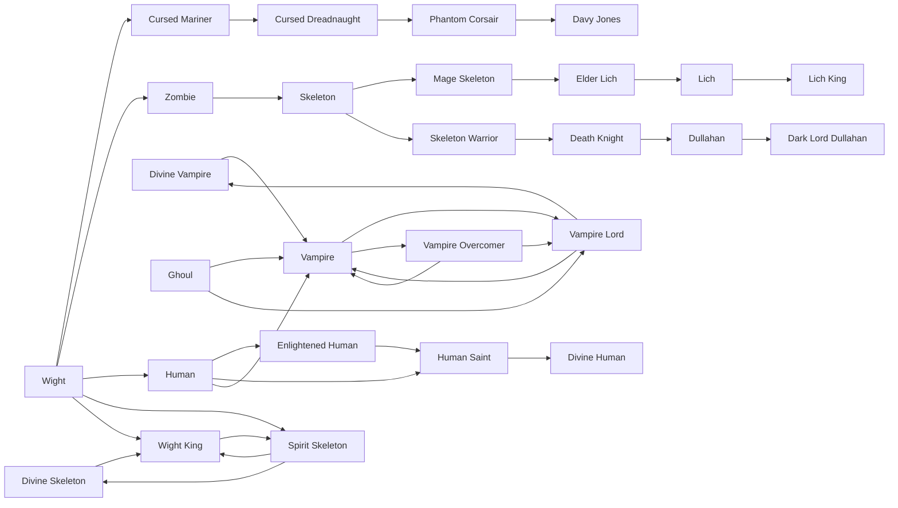

# Ghoul

<small>[Tensura: Reincarnated](../index.md) &rsaquo; [Races](index.md)</small>

| | |
|---|---|
| **ID** | `tensura:ghoul` |
| **Difficulty** | Hard |
| **Alignment** | Majin |
| **Aura** | 1,000 - 2,000 |
| **Magicule** | 2,000 - 3,000 |
| **Health bonus** | -6 |
| **Spiritual health bonus** | -20 |
| **Attack damage bonus** | 0 |
| **Movement speed bonus** | -0.02 |

> A vampiric thrall brought about by Blood Raise, highly weakened by sunlight.

## Evolution

- **Evolves into:** [Vampire](vampire.md)
- **Default evolution:** [Vampire](vampire.md)
- **On awakening (True Demon Lord / True Hero):** [Vampire Lord](vampire-lord.md)
- **During the Harvest Festival:** [Vampire](vampire.md)

### Evolution tree

## Intrinsic skills

Granted automatically when you become this race.

-  [Strength](../abilities/common-skills/strength.md)

## Traits

- Cannot heal by eating
- Undead

## Attribute modifiers

| Attribute | Amount | Operation |
|---|---|---|
| Scale | 0 | add |
| Max Health | -6 | add |
| Max Spiritual Health | -20 | add |
| Attack Damage | 0 | add |
| Attack Speed | -0.5 | add |
| Knockback Resistance | 0 | add |
| Movement Speed | -0.02 | add |
| Swim Speed Multiplier | -0.2 | add |

## Stats (config defaults)

Set in [`config/tensura/race/vampire_config.toml`](../configs/config-tensura-race-vampire-config.md).

| Option | Default | Description |
|---|---|---|
| `Ghoul.minAura` | 1,000 | Minimal aura. |
| `Ghoul.maxAura` | 2,000 | Maximum aura. |
| `Ghoul.minMagicule` | 2,000 | Minimal magicule. |
| `Ghoul.maxMagicule` | 3,000 | Maximum magicule. |
| `Ghoul.size` | 0 | Bonus Size. |
| `Ghoul.maxHealth` | -6 | Bonus Max Health. |
| `Ghoul.maxSpiritualHealth` | -20 | Bonus Max Spiritual Health. |
| `Ghoul.attack` | 0 | Bonus Attack Damage. |
| `Ghoul.attackSpeed` | -0.5 | Bonus Attack Speed. |
| `Ghoul.knockbackResistance` | 0 | Bonus Knockback Resistance. |
| `Ghoul.movementSpeed` | -0.02 | Bonus Movement Speed. |
| `Ghoul.swimSpeed` | -0.2 | Bonus Swimming Speed Multiplier. |

## Tags

`tensura:races/unable_to_heal_with_food`, `tensura:races/undead`
