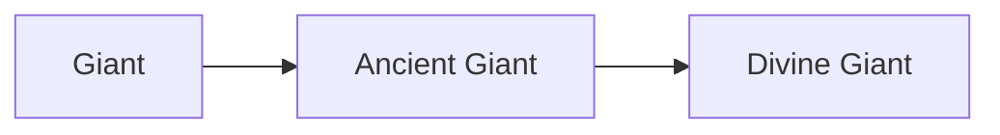

# Giant

<small>[Tensura: Reincarnated](../index.md) &rsaquo; [Races](index.md)</small>

| | |
|---|---|
| **ID** | `tensura:giant` |
| **Stage** | Starting |
| **Difficulty** | Easy |
| **Alignment** | Majin |
| **Aura** | 4,000 - 6,000 |
| **Magicule** | 6,000 - 8,000 |
| **Health bonus** | 30 |
| **Spiritual health bonus** | 140 |
| **Attack damage bonus** | 5 |
| **Movement speed bonus** | 0 |

> A race of powerful Majin most notable for their incredible physical capabilities and Magic Resistance.

## Evolution

- **Evolves into:** [Ancient Giant](ancient-giant.md)
- **Default evolution:** [Ancient Giant](ancient-giant.md)
- **On awakening (True Demon Lord / True Hero):** [Ancient Giant](ancient-giant.md)

### Evolution tree

## Intrinsic skills

Granted automatically when you become this race.

-  [Giantification](../abilities/intrinsic-skills/giantification.md)
-  [Steel Strength](../abilities/extra-skills/steel-strength.md)
-  [Strengthen Body](../abilities/extra-skills/strengthen-body.md)
-  [Magic Resistance](../abilities/resistance-skills/magic-resistance.md)

## Attribute modifiers

| Attribute | Amount | Operation |
|---|---|---|
| Scale | 0.5 | add |
| Max Health | 30 | add |
| Max Spiritual Health | 140 | add |
| Attack Damage | 5 | add |
| Attack Speed | -0.5 | add |
| Knockback Resistance | 0.4 | add |
| Movement Speed | 0 | add |
| Swim Speed Multiplier | 0 | add |

## Stats (config defaults)

Set in [`config/tensura/race/giant_config.toml`](../configs/config-tensura-race-giant-config.md).

| Option | Default | Description |
|---|---|---|
| `Giant.minAura` | 4,000 | Minimal aura. |
| `Giant.maxAura` | 6,000 | Maximum aura. |
| `Giant.minMagicule` | 6,000 | Minimal magicule. |
| `Giant.maxMagicule` | 8,000 | Maximum magicule. |
| `Giant.size` | 0.5 | Bonus Size. |
| `Giant.maxHealth` | 30 | Bonus Max Health. |
| `Giant.maxSpiritualHealth` | 140 | Bonus Max Spiritual Health. |
| `Giant.attack` | 5 | Bonus Attack Damage. |
| `Giant.attackSpeed` | -0.5 | Bonus Attack Speed. |
| `Giant.knockbackResistance` | 0.4 | Bonus Knockback Resistance. |
| `Giant.movementSpeed` | 0 | Bonus Movement Speed. |
| `Giant.swimSpeed` | 0 | Bonus Swimming Speed Multiplier. |
