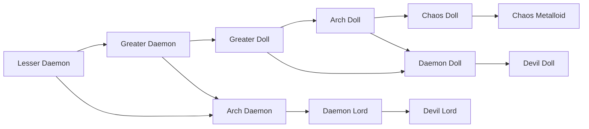

# Greater Daemon

<small>[Tensura: Reincarnated](../index.md) &rsaquo; [Races](index.md)</small>

| | |
|---|---|
| **ID** | `tensura:greater_daemon` |
| **Difficulty** | Easy |
| **Alignment** | Majin |
| **Aura** | 10,000 - 20,000 |
| **Magicule** | 10,000 - 30,000 |
| **Health bonus** | 60 |
| **Spiritual health bonus** | 200 |
| **Attack damage bonus** | 1 |
| **Movement speed bonus** | 0 |
| **EP to evolve into** | 20,000 |

> The daemon race that lesser daemons evolve to when they develop their ego and accumulate enough power.

## Evolution

- **Evolves from:** [Lesser Daemon](lesser-daemon.md)
- **Evolves into:** [Arch Daemon](arch-daemon.md)
- **Default evolution:** [Arch Daemon](arch-daemon.md)
- **On awakening (True Demon Lord / True Hero):** [Arch Daemon](arch-daemon.md)
- **During the Harvest Festival:** [Arch Daemon](arch-daemon.md)

### Requirements to evolve into Greater Daemon

Each requirement adds its weight to the evolution progress bar; you can evolve at 100%.

| Requirement | Weight |
|---|---|
| Reach Existence Points of 20,000 | 100% |

### Evolution tree

## Intrinsic skills

Granted automatically when you become this race.

-  [Magic Resistance](../abilities/resistance-skills/magic-resistance.md)
-  [Possession](../abilities/intrinsic-skills/possession.md)

## Traits

- Daemon
- EP is limited in the central world
- Has creative-style flight
- Spawns as a spiritual lifeform

## Attribute modifiers

| Attribute | Amount | Operation |
|---|---|---|
| Scale | 0.25 | add |
| Max Health | 60 | add |
| Max Spiritual Health | 200 | add |
| Attack Damage | 1 | add |
| Attack Speed | 0 | add |
| Knockback Resistance | 0.2 | add |
| Movement Speed | 0 | add |
| Swim Speed Multiplier | 0 | add |

## Stats (config defaults)

Set in [`config/tensura/race/daemon_config.toml`](../configs/config-tensura-race-daemon-config.md).

| Option | Default | Description |
|---|---|---|
| `GreaterDaemon.epRequirement` | 20,000 | EP requirement to evolve into Greater Daemon. |
| `GreaterDaemon.minAura` | 10,000 | Minimal aura. |
| `GreaterDaemon.maxAura` | 20,000 | Maximum aura. |
| `GreaterDaemon.minMagicule` | 10,000 | Minimal magicule. |
| `GreaterDaemon.maxMagicule` | 30,000 | Maximum magicule. |
| `GreaterDaemon.size` | 0.25 | Bonus Size. |
| `GreaterDaemon.maxHealth` | 60 | Bonus Max Health. |
| `GreaterDaemon.maxSpiritualHealth` | 200 | Bonus Max Spiritual Health. |
| `GreaterDaemon.attack` | 1 | Bonus Attack Damage. |
| `GreaterDaemon.attackSpeed` | 0 | Bonus Attack Speed. |
| `GreaterDaemon.knockbackResistance` | 0.2 | Bonus Knockback Resistance. |
| `GreaterDaemon.movementSpeed` | 0 | Bonus Movement Speed. |
| `GreaterDaemon.swimSpeed` | 0 | Bonus Swimming Speed Multiplier. |
| `GreaterDaemon.learnableMagics` | "tensura:mud_hand", "tensura:earth_wall", "tensura:fire_lance", "tensura:fire_wall", "tensura:icicle_lance", "tensura:ice_wall", "tensura:thunder", "tensura:thunder_lance", "tensura:spatial_storage", "tensura:wind_cutter", "tensura:sleep_mist", "tensura:water_cutter_aspectual", "tensura:wind_protection", "tensura:float", "tensura:healing", "tensura:flame_wall", "tensura:agility", "tensura:reinforcement", "tensura:strength_aspectual", "tensura:magic_wall" | List of Magics that players automatically get as learnable. |
| `LesserDaemon.minAura` | 2,000 | Minimal aura. |
| `LesserDaemon.maxAura` | 3,000 | Maximum aura. |
| `LesserDaemon.minMagicule` | 5,000 | Minimal magicule. |
| `LesserDaemon.maxMagicule` | 6,000 | Maximum magicule. |
| `LesserDaemon.size` | 0.5 | Bonus Size. |
| `LesserDaemon.maxHealth` | 20 | Bonus Max Health. |
| `LesserDaemon.maxSpiritualHealth` | 90 | Bonus Max Spiritual Health. |
| `LesserDaemon.attack` | 0.4 | Bonus Attack Damage. |
| `LesserDaemon.attackSpeed` | -0.5 | Bonus Attack Speed. |
| `LesserDaemon.knockbackResistance` | 0.1 | Bonus Knockback Resistance. |
| `LesserDaemon.movementSpeed` | 0 | Bonus Movement Speed. |
| `LesserDaemon.swimSpeed` | 0 | Bonus Swimming Speed Multiplier. |
| `LesserDaemon.learnableMagics` | "tensura:earth_lock", "tensura:liquidize", "tensura:fire_aspectual", "tensura:water_aspectual", "tensura:drainage", "tensura:wind_gust", "tensura:escape", "tensura:freeze" | List of Magics that players automatically get as learnable. |

## Tags

`tensura:races/daemon`, `tensura:races/has_creative_flight`, `tensura:races/limited_ep_in_central`, `tensura:races/spawn_as_spiritual`
