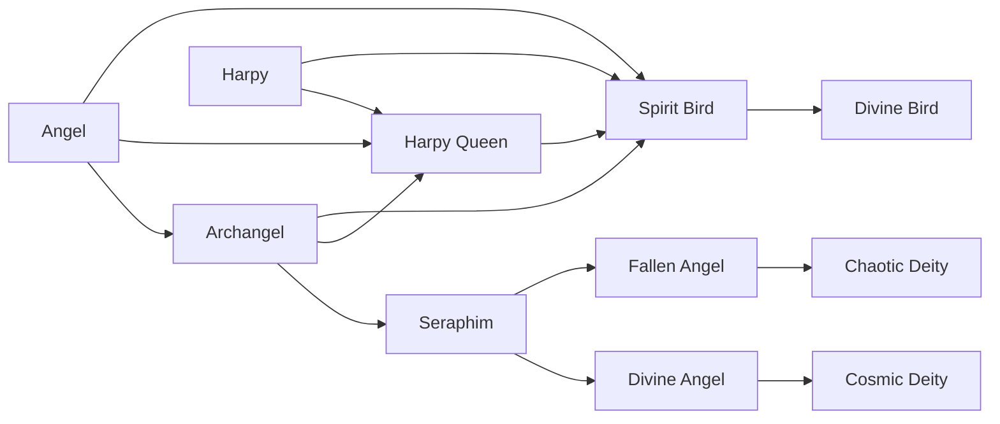

# Harpy

<small>[Tensura: Reincarnated](../index.md) &rsaquo; [Races](index.md)</small>

| | |
|---|---|
| **ID** | `tensura:harpy` |
| **Difficulty** | Easy |
| **Alignment** | Majin |
| **Aura** | 300 - 600 |
| **Magicule** | 1,500 - 2,500 |
| **Health bonus** | 10 |
| **Spiritual health bonus** | 5 |
| **Attack damage bonus** | 0 |
| **Movement speed bonus** | 0 |

> A race of winged Majin with capability to cancel out flight spell and are often referred to as the rulers of the skies.

## Evolution

- **Evolves into:** [Harpy Queen](harpy-queen.md)
- **Default evolution:** [Harpy Queen](harpy-queen.md)
- **On awakening (True Demon Lord / True Hero):** [Spirit Bird](spirit-bird.md)
- **During the Harvest Festival:** [Harpy Queen](harpy-queen.md)

### Evolution tree

## Intrinsic skills

Granted automatically when you become this race.

-  [Magic Jamming](../abilities/extra-skills/magic-jamming.md)

## Traits

- Can glide

## Attribute modifiers

| Attribute | Amount | Operation |
|---|---|---|
| Safe Fall Distance | 3 | add |
| Scale | 0 | add |
| Max Health | 10 | add |
| Max Spiritual Health | 5 | add |
| Attack Damage | 0 | add |
| Attack Speed | 0 | add |
| Knockback Resistance | 0 | add |
| Movement Speed | 0 | add |
| Swim Speed Multiplier | 0 | add |

## Stats (config defaults)

Set in [`config/tensura/race/harpy_config.toml`](../configs/config-tensura-race-harpy-config.md).

| Option | Default | Description |
|---|---|---|
| `Harpy.safeFalling` | 3 | Bonus Safe Falling distance. |
| `Harpy.minAura` | 300 | Minimal aura. |
| `Harpy.maxAura` | 600 | Maximum aura. |
| `Harpy.minMagicule` | 1,500 | Minimal magicule. |
| `Harpy.maxMagicule` | 2,500 | Maximum magicule. |
| `Harpy.size` | 0 | Bonus Size. |
| `Harpy.maxHealth` | 10 | Bonus Max Health. |
| `Harpy.maxSpiritualHealth` | 5 | Bonus Max Spiritual Health. |
| `Harpy.attack` | 0 | Bonus Attack Damage. |
| `Harpy.attackSpeed` | 0 | Bonus Attack Speed. |
| `Harpy.knockbackResistance` | 0 | Bonus Knockback Resistance. |
| `Harpy.movementSpeed` | 0 | Bonus Movement Speed. |
| `Harpy.swimSpeed` | 0 | Bonus Swimming Speed Multiplier. |
| `Harpy.safeFalling` | 3 | Bonus Safe Falling distance. |
| `Harpy.flightBoost` | 0.75 | Flight Upward Boost Power. |
| `Harpy.flightCooldown` | 3 | Flight Boost Cooldown. |

## Tags

`tensura:races/can_glide`
