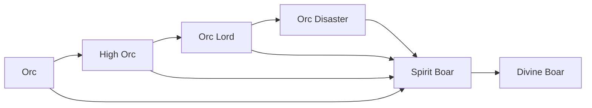

# High Orc

<small>[Tensura: Reincarnated](../index.md) &rsaquo; [Races](index.md)</small>

| | |
|---|---|
| **ID** | `tensura:high_orc` |
| **Difficulty** | Easy |
| **Alignment** | Default |
| **Aura** | 2,000 - 2,000 |
| **Magicule** | 1,000 - 1,000 |
| **Health bonus** | 12 |
| **Spiritual health bonus** | 100 |
| **Attack damage bonus** | 1.5 |
| **Movement speed bonus** | 0 |
| **EP to evolve into** | 5,000 |

> The evolved form of Orcs. They are smarter than Orcs while preserving the Orc race's special characteristics, with appearance virtually identical to regular Orcs.

## Evolution

- **Evolves from:** [Orc](orc.md)
- **Evolves into:** [Spirit Boar](spirit-boar.md), [Orc Lord](orc-lord.md)
- **Default evolution:** [Spirit Boar](spirit-boar.md)
- **On awakening (True Demon Lord / True Hero):** [Spirit Boar](spirit-boar.md)

### Requirements to evolve into High Orc

Each requirement adds its weight to the evolution progress bar; you can evolve at 100%.

| Requirement | Weight |
|---|---|
| Reach Existence Points of 5,000 | 100% |

### Evolution tree

## Attribute modifiers

| Attribute | Amount | Operation |
|---|---|---|
| Scale | 0.5 | add |
| Max Health | 12 | add |
| Max Spiritual Health | 100 | add |
| Attack Damage | 1.5 | add |
| Attack Speed | -0.25 | add |
| Knockback Resistance | 0.3 | add |
| Movement Speed | 0 | add |
| Swim Speed Multiplier | 0 | add |

## Stats (config defaults)

Set in [`config/tensura/race/orc_config.toml`](../configs/config-tensura-race-orc-config.md).

| Option | Default | Description |
|---|---|---|
| `HighOrc.epRequirement` | 5,000 | EP requirement to evolve into High Orc. |
| `HighOrc.minAura` | 2,000 | Minimal aura. |
| `HighOrc.maxAura` | 2,000 | Maximum aura. |
| `HighOrc.minMagicule` | 1,000 | Minimal magicule. |
| `HighOrc.maxMagicule` | 1,000 | Maximum magicule. |
| `HighOrc.size` | 0.5 | Bonus Size. |
| `HighOrc.maxHealth` | 12 | Bonus Max Health. |
| `HighOrc.maxSpiritualHealth` | 100 | Bonus Max Spiritual Health. |
| `HighOrc.attack` | 1.5 | Bonus Attack Damage. |
| `HighOrc.attackSpeed` | -0.25 | Bonus Attack Speed. |
| `HighOrc.knockbackResistance` | 0.3 | Bonus Knockback Resistance. |
| `HighOrc.movementSpeed` | 0 | Bonus Movement Speed. |
| `HighOrc.swimSpeed` | 0 | Bonus Swimming Speed Multiplier. |
| `Orc.minAura` | 400 | Minimal aura. |
| `Orc.maxAura` | 600 | Maximum aura. |
| `Orc.minMagicule` | 50 | Minimal magicule. |
| `Orc.maxMagicule` | 100 | Maximum magicule. |
| `Orc.size` | 0.5 | Bonus Size. |
| `Orc.maxHealth` | 8 | Bonus Max Health. |
| `Orc.maxSpiritualHealth` | 16 | Bonus Max Spiritual Health. |
| `Orc.attack` | 0.5 | Bonus Attack Damage. |
| `Orc.attackSpeed` | -0.5 | Bonus Attack Speed. |
| `Orc.knockbackResistance` | 0.2 | Bonus Knockback Resistance. |
| `Orc.movementSpeed` | -0.02 | Bonus Movement Speed. |
| `Orc.swimSpeed` | -0.2 | Bonus Swimming Speed Multiplier. |
