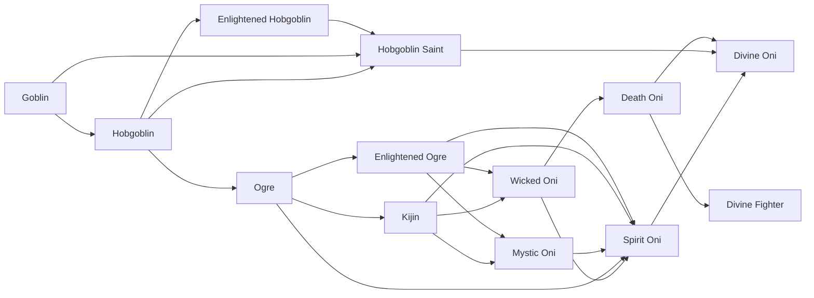

# Hobgoblin Saint

<small>[Tensura: Reincarnated](../index.md) &rsaquo; [Races](index.md)</small>

| | |
|---|---|
| **ID** | `tensura:hobgoblin_saint` |
| **Stage** | In-between |
| **Difficulty** | Easy |
| **Alignment** | Holy |
| **Aura** | 400,000 - 400,000 |
| **Magicule** | 400,000 - 400,000 |
| **Health bonus** | 460 |
| **Spiritual health bonus** | 3,140 |
| **Attack damage bonus** | 2 |
| **Movement speed bonus** | 0.05 |
| **EP to evolve into** | 400,000 |

> Hobgoblin that has "evolved the correct way" and became a Spiritual Lifeform.

## Evolution

- **Evolves from:** [Enlightened Hobgoblin](enlightened-hobgoblin.md), [Goblin](goblin.md), [Hobgoblin](hobgoblin.md)
- **Evolves into:** [Divine Oni](divine-oni.md)
- **Default evolution:** [Divine Oni](divine-oni.md)
- **On awakening (True Demon Lord / True Hero):** [Divine Oni](divine-oni.md)

### Requirements to evolve into Hobgoblin Saint

Each requirement adds its weight to the evolution progress bar; you can evolve at 100%.

| Requirement | Weight |
|---|---|
| Reach Existence Points of 400,000 | 50% |
| Kill 4 bosses | 50% |

### Evolution tree

## Traits

- Spiritual lifeform

## Attribute modifiers

| Attribute | Amount | Operation |
|---|---|---|
| Scale | 0 | add |
| Max Health | 460 | add |
| Max Spiritual Health | 3,140 | add |
| Attack Damage | 2 | add |
| Attack Speed | 0.5 | add |
| Knockback Resistance | 0.1 | add |
| Movement Speed | 0.05 | add |
| Swim Speed Multiplier | 0.5 | add |

## Stats (config defaults)

Set in [`config/tensura/race/goblin_config.toml`](../configs/config-tensura-race-goblin-config.md).

| Option | Default | Description |
|---|---|---|
| `HobgoblinSaint.epRequirement` | 400,000 | EP requirement to evolve into Hobgoblin Saint. |
| `HobgoblinSaint.bossRequirement` | 4 | The number of Bosses defeated to evolve into Hobgoblin Saint. |
| `HobgoblinSaint.minAura` | 400,000 | Minimal aura. |
| `HobgoblinSaint.maxAura` | 400,000 | Maximum aura. |
| `HobgoblinSaint.minMagicule` | 400,000 | Minimal magicule. |
| `HobgoblinSaint.maxMagicule` | 400,000 | Maximum magicule. |
| `HobgoblinSaint.size` | 0 | Bonus Size. |
| `HobgoblinSaint.maxHealth` | 460 | Bonus Max Health. |
| `HobgoblinSaint.maxSpiritualHealth` | 3,140 | Bonus Max Spiritual Health. |
| `HobgoblinSaint.attack` | 2 | Bonus Attack Damage. |
| `HobgoblinSaint.attackSpeed` | 0.5 | Bonus Attack Speed. |
| `HobgoblinSaint.knockbackResistance` | 0.1 | Bonus Knockback Resistance. |
| `HobgoblinSaint.movementSpeed` | 0.05 | Bonus Movement Speed. |
| `HobgoblinSaint.swimSpeed` | 0.5 | Bonus Swimming Speed Multiplier. |
| `EnlightenedHobgoblin.epRequirement` | 100,000 | EP requirement to evolve into Enlightened Hobgoblin. |
| `EnlightenedHobgoblin.minAura` | 100,000 | Minimal aura. |
| `EnlightenedHobgoblin.maxAura` | 100,000 | Maximum aura. |
| `EnlightenedHobgoblin.minMagicule` | 100,000 | Minimal magicule. |
| `EnlightenedHobgoblin.maxMagicule` | 100,000 | Maximum magicule. |
| `EnlightenedHobgoblin.size` | 0 | Bonus Size. |
| `EnlightenedHobgoblin.maxHealth` | 90 | Bonus Max Health. |
| `EnlightenedHobgoblin.maxSpiritualHealth` | 300 | Bonus Max Spiritual Health. |
| `EnlightenedHobgoblin.attack` | 1 | Bonus Attack Damage. |
| `EnlightenedHobgoblin.attackSpeed` | 0.3 | Bonus Attack Speed. |
| `EnlightenedHobgoblin.knockbackResistance` | 0.05 | Bonus Knockback Resistance. |
| `EnlightenedHobgoblin.movementSpeed` | 0.01 | Bonus Movement Speed. |
| `EnlightenedHobgoblin.swimSpeed` | 0.1 | Bonus Swimming Speed Multiplier. |
| `Hobgoblin.epRequirement` | 2,000 | EP requirement to evolve into Hobgoblin. |
| `Hobgoblin.minAura` | 1,400 | Minimal aura. |
| `Hobgoblin.maxAura` | 1,400 | Maximum aura. |
| `Hobgoblin.minMagicule` | 1,400 | Minimal magicule. |
| `Hobgoblin.maxMagicule` | 1,400 | Maximum magicule. |
| `Hobgoblin.size` | 0 | Bonus Size. |
| `Hobgoblin.maxHealth` | 4 | Bonus Max Health. |
| `Hobgoblin.maxSpiritualHealth` | 10 | Bonus Max Spiritual Health. |
| `Hobgoblin.attack` | 0 | Bonus Attack Damage. |
| `Hobgoblin.attackSpeed` | 0 | Bonus Attack Speed. |
| `Hobgoblin.knockbackResistance` | 0 | Bonus Knockback Resistance. |
| `Hobgoblin.movementSpeed` | 0 | Bonus Movement Speed. |
| `Hobgoblin.swimSpeed` | 0 | Bonus Swimming Speed Multiplier. |
| `Goblin.minAura` | 300 | Minimal aura. |
| `Goblin.maxAura` | 300 | Maximum aura. |
| `Goblin.minMagicule` | 700 | Minimal magicule. |
| `Goblin.maxMagicule` | 700 | Maximum magicule. |
| `Goblin.size` | -0.25 | Bonus Size. |
| `Goblin.maxHealth` | -8 | Bonus Max Health. |
| `Goblin.maxSpiritualHealth` | -16 | Bonus Max Spiritual Health. |
| `Goblin.attack` | -0.5 | Bonus Attack Damage. |
| `Goblin.attackSpeed` | -0.5 | Bonus Attack Speed. |
| `Goblin.knockbackResistance` | 0 | Bonus Knockback Resistance. |
| `Goblin.movementSpeed` | -0.02 | Bonus Movement Speed. |
| `Goblin.swimSpeed` | -0.2 | Bonus Swimming Speed Multiplier. |

## Tags

`tensura:races/spiritual`
