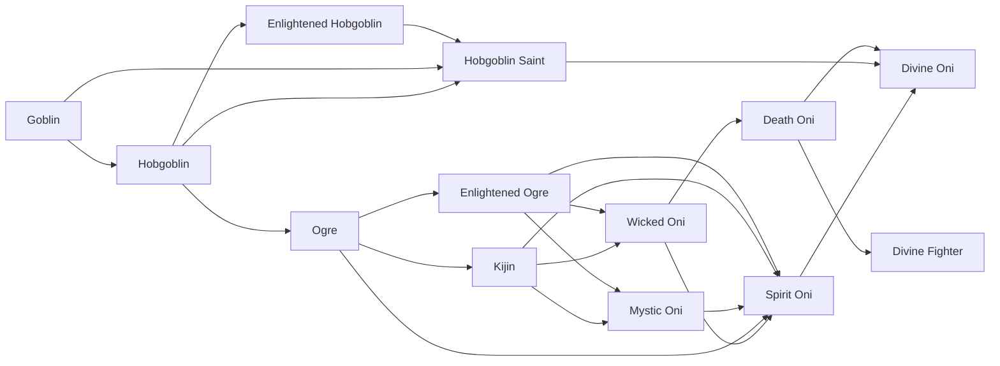

# Hobgoblin

<small>[Tensura: Reincarnated](../index.md) &rsaquo; [Races](index.md)</small>

| | |
|---|---|
| **ID** | `tensura:hobgoblin` |
| **Difficulty** | Easy |
| **Alignment** | Default |
| **Aura** | 1,400 - 1,400 |
| **Magicule** | 1,400 - 1,400 |
| **Health bonus** | 4 |
| **Spiritual health bonus** | 10 |
| **Attack damage bonus** | 0 |
| **Movement speed bonus** | 0 |
| **EP to evolve into** | 2,000 |

> The evolved form of male Goblins that is ranked D on average.

## Evolution

- **Evolves from:** [Goblin](goblin.md)
- **Evolves into:** [Enlightened Hobgoblin](enlightened-hobgoblin.md), [Ogre](ogre.md)
- **Default evolution:** [Enlightened Hobgoblin](enlightened-hobgoblin.md)
- **On awakening (True Demon Lord / True Hero):** [Hobgoblin Saint](hobgoblin-saint.md)
- **During the Harvest Festival:** [Enlightened Hobgoblin](enlightened-hobgoblin.md)

### Requirements to evolve into Hobgoblin

Each requirement adds its weight to the evolution progress bar; you can evolve at 100%.

| Requirement | Weight |
|---|---|
| Reach Existence Points of 2,000 | 100% |

### Evolution tree

## Attribute modifiers

| Attribute | Amount | Operation |
|---|---|---|
| Scale | 0 | add |
| Max Health | 4 | add |
| Max Spiritual Health | 10 | add |
| Attack Damage | 0 | add |
| Attack Speed | 0 | add |
| Knockback Resistance | 0 | add |
| Movement Speed | 0 | add |
| Swim Speed Multiplier | 0 | add |

## Stats (config defaults)

Set in [`config/tensura/race/goblin_config.toml`](../configs/config-tensura-race-goblin-config.md).

| Option | Default | Description |
|---|---|---|
| `Hobgoblin.epRequirement` | 2,000 | EP requirement to evolve into Hobgoblin. |
| `Hobgoblin.minAura` | 1,400 | Minimal aura. |
| `Hobgoblin.maxAura` | 1,400 | Maximum aura. |
| `Hobgoblin.minMagicule` | 1,400 | Minimal magicule. |
| `Hobgoblin.maxMagicule` | 1,400 | Maximum magicule. |
| `Hobgoblin.size` | 0 | Bonus Size. |
| `Hobgoblin.maxHealth` | 4 | Bonus Max Health. |
| `Hobgoblin.maxSpiritualHealth` | 10 | Bonus Max Spiritual Health. |
| `Hobgoblin.attack` | 0 | Bonus Attack Damage. |
| `Hobgoblin.attackSpeed` | 0 | Bonus Attack Speed. |
| `Hobgoblin.knockbackResistance` | 0 | Bonus Knockback Resistance. |
| `Hobgoblin.movementSpeed` | 0 | Bonus Movement Speed. |
| `Hobgoblin.swimSpeed` | 0 | Bonus Swimming Speed Multiplier. |
| `Goblin.minAura` | 300 | Minimal aura. |
| `Goblin.maxAura` | 300 | Maximum aura. |
| `Goblin.minMagicule` | 700 | Minimal magicule. |
| `Goblin.maxMagicule` | 700 | Maximum magicule. |
| `Goblin.size` | -0.25 | Bonus Size. |
| `Goblin.maxHealth` | -8 | Bonus Max Health. |
| `Goblin.maxSpiritualHealth` | -16 | Bonus Max Spiritual Health. |
| `Goblin.attack` | -0.5 | Bonus Attack Damage. |
| `Goblin.attackSpeed` | -0.5 | Bonus Attack Speed. |
| `Goblin.knockbackResistance` | 0 | Bonus Knockback Resistance. |
| `Goblin.movementSpeed` | -0.02 | Bonus Movement Speed. |
| `Goblin.swimSpeed` | -0.2 | Bonus Swimming Speed Multiplier. |
