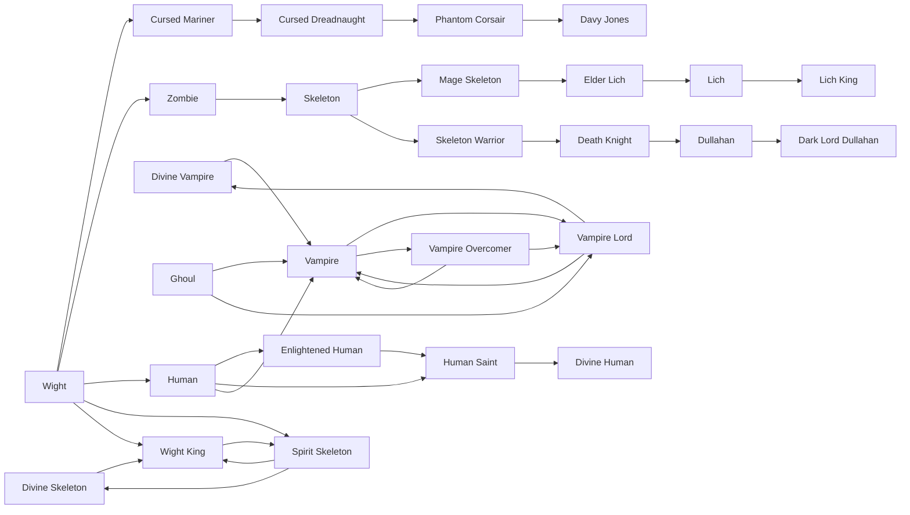

# Human

<small>[Tensura: Reincarnated](../index.md) &rsaquo; [Races](index.md)</small>

| | |
|---|---|
| **ID** | `tensura:human` |
| **Stage** | In-between |
| **Difficulty** | Hard |
| **Alignment** | Default |
| **Aura** | 760 - 1,140 |
| **Magicule** | 50 - 70 |
| **Health bonus** | 0 |
| **Spiritual health bonus** | 0 |
| **Attack damage bonus** | 0 |
| **Movement speed bonus** | 0 |

> A weak but populous race that relies more on technology and numbers than brute force. Their low magicule count makes skills and magic users a rarity among them, instead favouring battlewill.

## Evolution

- **Evolves from:** [Wight](wight.md)
- **Evolves into:** [Enlightened Human](enlightened-human.md), [Vampire](vampire.md)
- **Default evolution:** [Enlightened Human](enlightened-human.md)
- **On awakening (True Demon Lord / True Hero):** [Human Saint](human-saint.md)
- **During the Harvest Festival:** [Enlightened Human](enlightened-human.md)

### Requirements to evolve into Human

Each requirement adds its weight to the evolution progress bar; you can evolve at 100%.

| Requirement | Weight |
|---|---|
| Get cured with Weakness and Enchanted Golden Apple | 100% |

### Evolution tree

## Traits

- Human-like

## Attribute modifiers

| Attribute | Amount | Operation |
|---|---|---|
| Scale | 0 | add |
| Max Health | 0 | add |
| Max Spiritual Health | 0 | add |
| Attack Damage | 0 | add |
| Attack Speed | 0 | add |
| Knockback Resistance | 0 | add |
| Movement Speed | 0 | add |
| Swim Speed Multiplier | 0 | add |

## Stats (config defaults)

Set in [`config/tensura/race/human_config.toml`](../configs/config-tensura-race-human-config.md).

| Option | Default | Description |
|---|---|---|
| `Human.minAura` | 760 | Minimal aura. |
| `Human.maxAura` | 1,140 | Maximum aura. |
| `Human.minMagicule` | 50 | Minimal magicule. |
| `Human.maxMagicule` | 70 | Maximum magicule. |
| `Human.size` | 0 | Bonus Size. |
| `Human.maxHealth` | 0 | Bonus Max Health. |
| `Human.maxSpiritualHealth` | 0 | Bonus Max Spiritual Health. |
| `Human.attack` | 0 | Bonus Attack Damage. |
| `Human.attackSpeed` | 0 | Bonus Attack Speed. |
| `Human.knockbackResistance` | 0 | Bonus Knockback Resistance. |
| `Human.movementSpeed` | 0 | Bonus Movement Speed. |
| `Human.swimSpeed` | 0 | Bonus Swimming Speed Multiplier. |

## Tags

`tensura:races/human_like`
