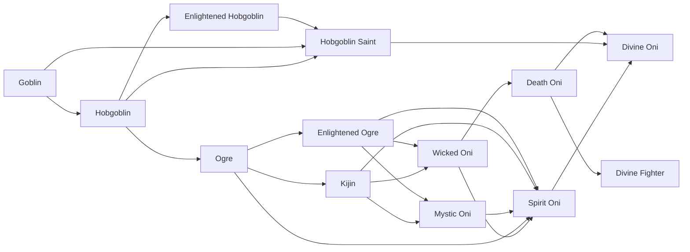
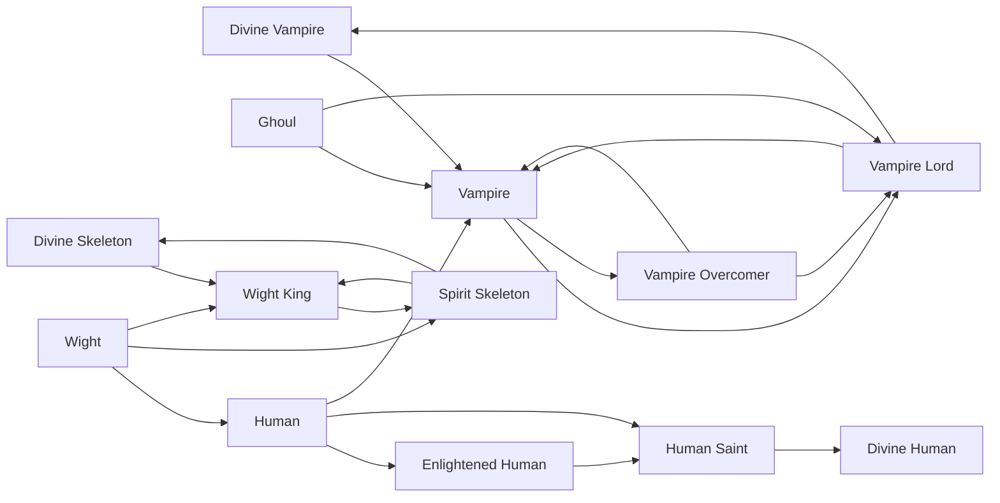
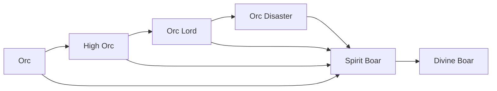
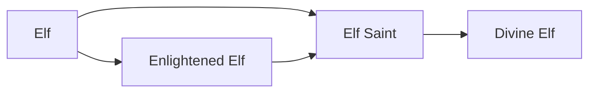
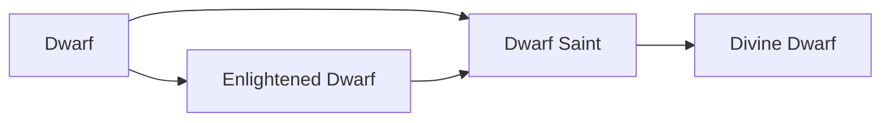

# Races

<small>[Tensura: Reincarnated](../index.md)</small>

Tensura: Reincarnated adds **68** races: **13** starting, **42** in-between and **13** final.

- **Starting:** the first race of its evolution line. Nothing evolves into it, so you get it by reincarnating into it or through a special item, skill or event.
- **In-between:** reached by evolving, and can evolve further.
- **Final:** the last step of its line. It does not evolve any further.

Races that link to other mods' races (for example an addon race that evolves from a Tensura race) are placed using the whole pack's evolution trees.

| Race | Stage | Difficulty | Alignment | Evolves from | Evolves into |
|---|---|---|---|---|---|
| [Ancient Giant](ancient-giant.md) | In-between | Easy | Majin | [Giant](giant.md) | [Divine Giant](divine-giant.md) |
| [Arch Daemon](arch-daemon.md) | In-between | Easy | Majin | [Lesser Daemon](lesser-daemon.md), [Greater Daemon](greater-daemon.md) | [Daemon Lord](daemon-lord.md) |
| [Beast Lord](beast-lord.md) | In-between | Easy | Default | [Beastfolk](beastfolk.md) | [Spirit Beast](spirit-beast.md) |
| [Beastfolk](beastfolk.md) | Starting | Easy | Default |  | [Beast Lord](beast-lord.md), [Spirit Beast](spirit-beast.md) |
| [Daemon Lord](daemon-lord.md) | In-between | Easy | Majin | [Arch Daemon](arch-daemon.md) | [Devil Lord](devil-lord.md) |
| [Death Oni](death-oni.md) | In-between | Easy | Majin | [Wicked Oni](wicked-oni.md) | [Divine Oni](divine-oni.md), [Divine Fighter](divine-fighter.md) |
| [Demon Slime](demon-slime.md) | In-between | Easy | Majin | [Slime](slime.md), [Metal Slime](metal-slime.md) | [God Slime](god-slime.md) |
| [Devil Lord](devil-lord.md) | Final | Easy | Majin | [Daemon Lord](daemon-lord.md) |  |
| [Divine Beast](divine-beast.md) | Final | Easy | Holy | [Spirit Beast](spirit-beast.md) |  |
| [Divine Bird](divine-bird.md) | Final | Easy | Majin | [Spirit Bird](spirit-bird.md) |  |
| [Divine Boar](divine-boar.md) | Final | Easy | Holy | [Spirit Boar](spirit-boar.md) |  |
| [Divine Dragon](divine-dragon.md) | Final | Easy | Holy | [True Dragonewt](true-dragonewt.md) |  |
| [Divine Dwarf](divine-dwarf.md) | Final | Easy | Holy | [Dwarf Saint](dwarf-saint.md) |  |
| [Divine Elf](divine-elf.md) | Final | Easy | Holy | [Elf Saint](elf-saint.md) |  |
| [Divine Fighter](divine-fighter.md) | Final | Easy | Majin | [Death Oni](death-oni.md) |  |
| [Divine Fish](divine-fish.md) | Final | Easy | Holy | [Merfolk Saint](merfolk-saint.md) |  |
| [Divine Giant](divine-giant.md) | Final | Easy | Majin | [Ancient Giant](ancient-giant.md) |  |
| [Divine Human](divine-human.md) | Final | Easy | Holy | [Human Saint](human-saint.md) |  |
| [Divine Oni](divine-oni.md) | Final | Easy | Holy | [Spirit Oni](spirit-oni.md), [Death Oni](death-oni.md), [Hobgoblin Saint](hobgoblin-saint.md) |  |
| [Divine Skeleton](divine-skeleton.md) | In-between | Easy | Majin | [Spirit Skeleton](spirit-skeleton.md) | [Wight King](wight-king.md) |
| [Divine Vampire](divine-vampire.md) | In-between | Easy | Majin | [Vampire Lord](vampire-lord.md) | [Vampire](vampire.md) |
| [Dragonewt](dragonewt.md) | In-between | Easy | Default | [Lizardman](lizardman.md) | [True Dragonewt](true-dragonewt.md), [Corrupted Dragonkin](../../ascension/races/corrupted-dragonkin.md), [Ender Dragonewt](../../ascension/races/ender-dragonewt.md) |
| [Dwarf](dwarf.md) | Starting | Hard | Default |  | [Enlightened Dwarf](enlightened-dwarf.md), [Dwarf Saint](dwarf-saint.md) |
| [Dwarf Saint](dwarf-saint.md) | In-between | Easy | Holy | [Dwarf](dwarf.md), [Enlightened Dwarf](enlightened-dwarf.md) | [Divine Dwarf](divine-dwarf.md) |
| [Elf](elf.md) | Starting | Hard | Default |  | [Enlightened Elf](enlightened-elf.md), [Elf Saint](elf-saint.md) |
| [Elf Saint](elf-saint.md) | In-between | Easy | Holy | [Elf](elf.md), [Enlightened Elf](enlightened-elf.md) | [Divine Elf](divine-elf.md) |
| [Enlightened Dwarf](enlightened-dwarf.md) | In-between | Easy | Default | [Dwarf](dwarf.md) | [Dwarf Saint](dwarf-saint.md) |
| [Enlightened Elf](enlightened-elf.md) | In-between | Easy | Default | [Elf](elf.md) | [Elf Saint](elf-saint.md) |
| [Enlightened Hobgoblin](enlightened-hobgoblin.md) | In-between | Easy | Default | [Hobgoblin](hobgoblin.md) | [Hobgoblin Saint](hobgoblin-saint.md) |
| [Enlightened Human](enlightened-human.md) | In-between | Easy | Default | [Human](human.md) | [Human Saint](human-saint.md) |
| [Enlightened Merfolk](enlightened-merfolk.md) | In-between | Easy | Default | [Merfolk](merfolk.md) | [Merfolk Saint](merfolk-saint.md) |
| [Enlightened Ogre](enlightened-ogre.md) | In-between | Easy | Default | [Ogre](ogre.md) | [Mystic Oni](mystic-oni.md), [Wicked Oni](wicked-oni.md), [Spirit Oni](spirit-oni.md) |
| [Ghoul](ghoul.md) | Starting | Hard | Majin |  | [Vampire](vampire.md), [Vampire Lord](vampire-lord.md) |
| [Giant](giant.md) | Starting | Easy | Majin |  | [Ancient Giant](ancient-giant.md) |
| [Goblin](goblin.md) | Starting | Hard | Default |  | [Hobgoblin](hobgoblin.md), [Hobgoblin Saint](hobgoblin-saint.md) |
| [God Slime](god-slime.md) | Final | Easy | Majin | [Demon Slime](demon-slime.md) |  |
| [Greater Daemon](greater-daemon.md) | In-between | Easy | Majin | [Lesser Daemon](lesser-daemon.md) | [Arch Daemon](arch-daemon.md), [Greater Doll](../../tensura-mysticism/races/greater-doll.md) |
| [Harpy](harpy.md) | Starting | Easy | Majin |  | [Harpy Queen](harpy-queen.md), [Spirit Bird](spirit-bird.md) |
| [Harpy Queen](harpy-queen.md) | In-between | Easy | Majin | [Harpy](harpy.md), [Angel](../../ascension/races/angel.md), [Archangel](../../ascension/races/archangel.md) | [Spirit Bird](spirit-bird.md) |
| [High Orc](high-orc.md) | In-between | Easy | Default | [Orc](orc.md) | [Spirit Boar](spirit-boar.md), [Orc Lord](orc-lord.md) |
| [Hobgoblin](hobgoblin.md) | In-between | Easy | Default | [Goblin](goblin.md) | [Enlightened Hobgoblin](enlightened-hobgoblin.md), [Ogre](ogre.md), [Hobgoblin Saint](hobgoblin-saint.md) |
| [Hobgoblin Saint](hobgoblin-saint.md) | In-between | Easy | Holy | [Goblin](goblin.md), [Hobgoblin](hobgoblin.md), [Enlightened Hobgoblin](enlightened-hobgoblin.md) | [Divine Oni](divine-oni.md) |
| [Human](human.md) | In-between | Hard | Default | [Wight](wight.md) | [Enlightened Human](enlightened-human.md), [Vampire](vampire.md), [Human Saint](human-saint.md) |
| [Human Saint](human-saint.md) | In-between | Easy | Holy | [Human](human.md), [Enlightened Human](enlightened-human.md) | [Divine Human](divine-human.md) |
| [Kijin](kijin.md) | In-between | Easy | Default | [Ogre](ogre.md) | [Mystic Oni](mystic-oni.md), [Wicked Oni](wicked-oni.md), [Spirit Oni](spirit-oni.md) |
| [Lesser Daemon](lesser-daemon.md) | Starting | Intermediate | Majin |  | [Greater Daemon](greater-daemon.md), [Arch Daemon](arch-daemon.md) |
| [Lizardman](lizardman.md) | Starting | Hard | Default |  | [Dragonewt](dragonewt.md), [True Dragonewt](true-dragonewt.md) |
| [Merfolk](merfolk.md) | Starting | Hard | Default |  | [Enlightened Merfolk](enlightened-merfolk.md), [Merfolk Saint](merfolk-saint.md) |
| [Merfolk Saint](merfolk-saint.md) | In-between | Easy | Holy | [Merfolk](merfolk.md), [Enlightened Merfolk](enlightened-merfolk.md) | [Divine Fish](divine-fish.md) |
| [Metal Slime](metal-slime.md) | In-between | Easy | Majin | [Slime](slime.md) | [Demon Slime](demon-slime.md) |
| [Mystic Oni](mystic-oni.md) | In-between | Easy | Default | [Kijin](kijin.md), [Enlightened Ogre](enlightened-ogre.md) | [Spirit Oni](spirit-oni.md) |
| [Ogre](ogre.md) | In-between | Easy | Default | [Hobgoblin](hobgoblin.md) | [Enlightened Ogre](enlightened-ogre.md), [Kijin](kijin.md), [Spirit Oni](spirit-oni.md) |
| [Orc](orc.md) | Starting | Intermediate | Default |  | [High Orc](high-orc.md), [Spirit Boar](spirit-boar.md) |
| [Orc Disaster](orc-disaster.md) | In-between | Easy | Majin | [Orc Lord](orc-lord.md) | [Spirit Boar](spirit-boar.md) |
| [Orc Lord](orc-lord.md) | In-between | Easy | Majin | [High Orc](high-orc.md) | [Orc Disaster](orc-disaster.md), [Spirit Boar](spirit-boar.md) |
| [Slime](slime.md) | Starting | Extreme | Majin |  | [Demon Slime](demon-slime.md), [Metal Slime](metal-slime.md) |
| [Spirit Beast](spirit-beast.md) | In-between | Easy | Holy | [Beastfolk](beastfolk.md), [Beast Lord](beast-lord.md) | [Divine Beast](divine-beast.md) |
| [Spirit Bird](spirit-bird.md) | In-between | Easy | Majin | [Harpy](harpy.md), [Harpy Queen](harpy-queen.md), [Angel](../../ascension/races/angel.md), [Archangel](../../ascension/races/archangel.md) | [Divine Bird](divine-bird.md) |
| [Spirit Boar](spirit-boar.md) | In-between | Easy | Holy | [Orc](orc.md), [High Orc](high-orc.md), [Orc Disaster](orc-disaster.md), [Orc Lord](orc-lord.md) | [Divine Boar](divine-boar.md) |
| [Spirit Oni](spirit-oni.md) | In-between | Easy | Holy | [Ogre](ogre.md), [Kijin](kijin.md), [Enlightened Ogre](enlightened-ogre.md), [Mystic Oni](mystic-oni.md), [Wicked Oni](wicked-oni.md) | [Divine Oni](divine-oni.md) |
| [Spirit Skeleton](spirit-skeleton.md) | In-between | Easy | Majin | [Wight](wight.md), [Wight King](wight-king.md) | [Divine Skeleton](divine-skeleton.md), [Wight King](wight-king.md) |
| [True Dragonewt](true-dragonewt.md) | In-between | Easy | Holy | [Lizardman](lizardman.md), [Dragonewt](dragonewt.md) | [Divine Dragon](divine-dragon.md) |
| [Vampire](vampire.md) | In-between | Easy | Majin | [Human](human.md), [Ghoul](ghoul.md), [Vampire Overcomer](vampire-overcomer.md), [Vampire Lord](vampire-lord.md), [Divine Vampire](divine-vampire.md) | [Vampire Overcomer](vampire-overcomer.md), [Vampire Lord](vampire-lord.md) |
| [Vampire Lord](vampire-lord.md) | In-between | Easy | Majin | [Ghoul](ghoul.md), [Vampire](vampire.md), [Vampire Overcomer](vampire-overcomer.md) | [Divine Vampire](divine-vampire.md), [Vampire](vampire.md) |
| [Vampire Overcomer](vampire-overcomer.md) | In-between | Easy | Majin | [Vampire](vampire.md) | [Vampire Lord](vampire-lord.md), [Vampire](vampire.md) |
| [Wicked Oni](wicked-oni.md) | In-between | Easy | Majin | [Kijin](kijin.md), [Enlightened Ogre](enlightened-ogre.md) | [Death Oni](death-oni.md), [Spirit Oni](spirit-oni.md) |
| [Wight](wight.md) | Starting | Hard | Majin |  | [Human](human.md), [Wight King](wight-king.md), [Spirit Skeleton](spirit-skeleton.md), [Cursed Mariner](../../ascension/races/cursed-mariner.md), [Zombie](../../ascension/races/zombie.md) |
| [Wight King](wight-king.md) | In-between | Easy | Majin | [Wight](wight.md), [Spirit Skeleton](spirit-skeleton.md), [Divine Skeleton](divine-skeleton.md) | [Spirit Skeleton](spirit-skeleton.md) |

## Evolution trees

### Goblin line

### Ghoul line

### Orc line

### Lesser Daemon line

### Beastfolk line

### Harpy line

### Lizardman line

### Merfolk line

### Elf line

### Dwarf line

### Slime line

### Giant line

