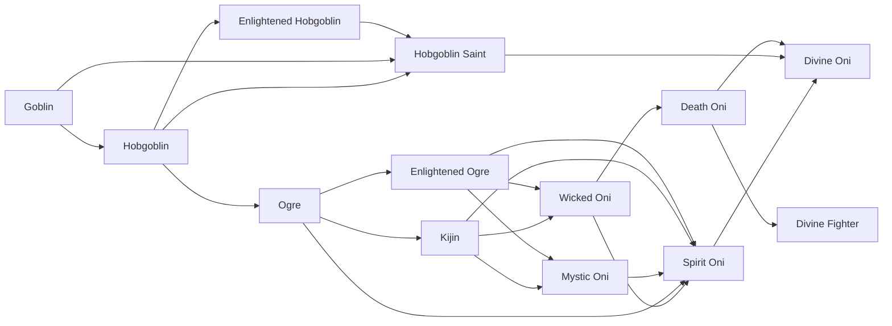
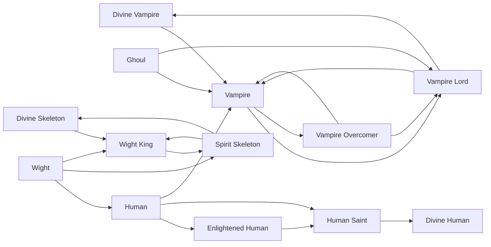
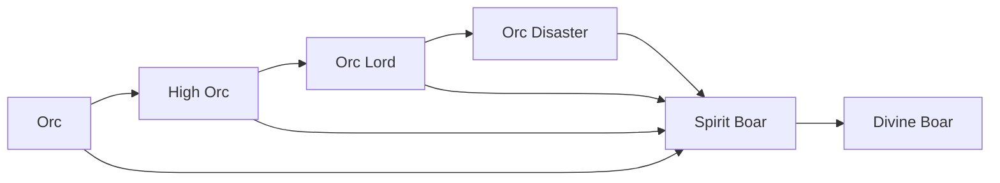
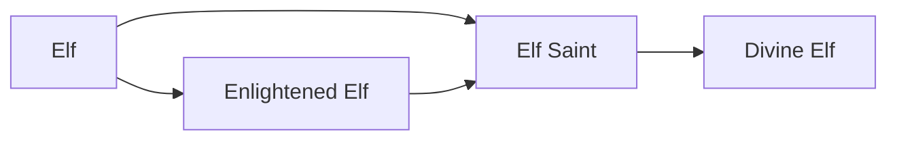
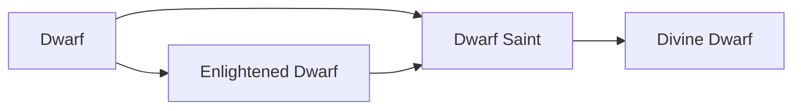

# Races

<small>[Tensura: Reincarnated](../index.md)</small>

Tensura: Reincarnated adds **68** races. Starting races can be chosen or rolled when you reincarnate; the rest are reached by evolving.

| Race | Difficulty | Alignment | Evolves into |
|---|---|---|---|
| [Ancient Giant](ancient-giant.md) | Easy | Majin | [Divine Giant](divine-giant.md) |
| [Arch Daemon](arch-daemon.md) | Easy | Majin | [Daemon Lord](daemon-lord.md) |
| [Beast Lord](beast-lord.md) | Easy | Default | [Spirit Beast](spirit-beast.md) |
| [Beastfolk](beastfolk.md) | Easy | Default | [Beast Lord](beast-lord.md) |
| [Daemon Lord](daemon-lord.md) | Easy | Majin | [Devil Lord](devil-lord.md) |
| [Death Oni](death-oni.md) | Easy | Majin | [Divine Oni](divine-oni.md), [Divine Fighter](divine-fighter.md) |
| [Demon Slime](demon-slime.md) | Easy | Majin | [God Slime](god-slime.md) |
| [Devil Lord](devil-lord.md) | Easy | Majin |  |
| [Divine Beast](divine-beast.md) | Easy | Holy |  |
| [Divine Bird](divine-bird.md) | Easy | Majin |  |
| [Divine Boar](divine-boar.md) | Easy | Holy |  |
| [Divine Dragon](divine-dragon.md) | Easy | Holy |  |
| [Divine Dwarf](divine-dwarf.md) | Easy | Holy |  |
| [Divine Elf](divine-elf.md) | Easy | Holy |  |
| [Divine Fighter](divine-fighter.md) | Easy | Majin |  |
| [Divine Fish](divine-fish.md) | Easy | Holy |  |
| [Divine Giant](divine-giant.md) | Easy | Majin |  |
| [Divine Human](divine-human.md) | Easy | Holy |  |
| [Divine Oni](divine-oni.md) | Easy | Holy |  |
| [Divine Skeleton](divine-skeleton.md) | Easy | Majin |  |
| [Divine Vampire](divine-vampire.md) | Easy | Majin |  |
| [Dragonewt](dragonewt.md) | Easy | Default | [True Dragonewt](true-dragonewt.md) |
| [Dwarf](dwarf.md) | Hard | Default | [Enlightened Dwarf](enlightened-dwarf.md) |
| [Dwarf Saint](dwarf-saint.md) | Easy | Holy | [Divine Dwarf](divine-dwarf.md) |
| [Elf](elf.md) | Hard | Default | [Enlightened Elf](enlightened-elf.md) |
| [Elf Saint](elf-saint.md) | Easy | Holy | [Divine Elf](divine-elf.md) |
| [Enlightened Dwarf](enlightened-dwarf.md) | Easy | Default | [Dwarf Saint](dwarf-saint.md) |
| [Enlightened Elf](enlightened-elf.md) | Easy | Default | [Elf Saint](elf-saint.md) |
| [Enlightened Hobgoblin](enlightened-hobgoblin.md) | Easy | Default | [Hobgoblin Saint](hobgoblin-saint.md) |
| [Enlightened Human](enlightened-human.md) | Easy | Default | [Human Saint](human-saint.md) |
| [Enlightened Merfolk](enlightened-merfolk.md) | Easy | Default | [Merfolk Saint](merfolk-saint.md) |
| [Enlightened Ogre](enlightened-ogre.md) | Easy | Default | [Mystic Oni](mystic-oni.md), [Wicked Oni](wicked-oni.md) |
| [Ghoul](ghoul.md) | Hard | Majin | [Vampire](vampire.md) |
| [Giant](giant.md) | Easy | Majin | [Ancient Giant](ancient-giant.md) |
| [Goblin](goblin.md) | Hard | Default | [Hobgoblin](hobgoblin.md) |
| [God Slime](god-slime.md) | Easy | Majin |  |
| [Greater Daemon](greater-daemon.md) | Easy | Majin | [Arch Daemon](arch-daemon.md) |
| [Harpy](harpy.md) | Easy | Majin | [Harpy Queen](harpy-queen.md) |
| [Harpy Queen](harpy-queen.md) | Easy | Majin | [Spirit Bird](spirit-bird.md) |
| [High Orc](high-orc.md) | Easy | Default | [Spirit Boar](spirit-boar.md), [Orc Lord](orc-lord.md) |
| [Hobgoblin](hobgoblin.md) | Easy | Default | [Enlightened Hobgoblin](enlightened-hobgoblin.md), [Ogre](ogre.md) |
| [Hobgoblin Saint](hobgoblin-saint.md) | Easy | Holy | [Divine Oni](divine-oni.md) |
| [Human](human.md) | Hard | Default | [Enlightened Human](enlightened-human.md), [Vampire](vampire.md) |
| [Human Saint](human-saint.md) | Easy | Holy | [Divine Human](divine-human.md) |
| [Kijin](kijin.md) | Easy | Default | [Mystic Oni](mystic-oni.md), [Wicked Oni](wicked-oni.md) |
| [Lesser Daemon](lesser-daemon.md) | Intermediate | Majin | [Greater Daemon](greater-daemon.md) |
| [Lizardman](lizardman.md) | Hard | Default | [Dragonewt](dragonewt.md) |
| [Merfolk](merfolk.md) | Hard | Default | [Enlightened Merfolk](enlightened-merfolk.md) |
| [Merfolk Saint](merfolk-saint.md) | Easy | Holy | [Divine Fish](divine-fish.md) |
| [Metal Slime](metal-slime.md) | Easy | Majin | [Demon Slime](demon-slime.md) |
| [Mystic Oni](mystic-oni.md) | Easy | Default | [Spirit Oni](spirit-oni.md) |
| [Ogre](ogre.md) | Easy | Default | [Enlightened Ogre](enlightened-ogre.md), [Kijin](kijin.md) |
| [Orc](orc.md) | Intermediate | Default | [High Orc](high-orc.md) |
| [Orc Disaster](orc-disaster.md) | Easy | Majin | [Spirit Boar](spirit-boar.md) |
| [Orc Lord](orc-lord.md) | Easy | Majin | [Orc Disaster](orc-disaster.md) |
| [Slime](slime.md) | Extreme | Majin | [Demon Slime](demon-slime.md), [Metal Slime](metal-slime.md) |
| [Spirit Beast](spirit-beast.md) | Easy | Holy | [Divine Beast](divine-beast.md) |
| [Spirit Bird](spirit-bird.md) | Easy | Majin | [Divine Bird](divine-bird.md) |
| [Spirit Boar](spirit-boar.md) | Easy | Holy | [Divine Boar](divine-boar.md) |
| [Spirit Oni](spirit-oni.md) | Easy | Holy | [Divine Oni](divine-oni.md) |
| [Spirit Skeleton](spirit-skeleton.md) | Easy | Majin | [Divine Skeleton](divine-skeleton.md) |
| [True Dragonewt](true-dragonewt.md) | Easy | Holy | [Divine Dragon](divine-dragon.md) |
| [Vampire](vampire.md) | Easy | Majin | [Vampire Overcomer](vampire-overcomer.md) |
| [Vampire Lord](vampire-lord.md) | Easy | Majin | [Divine Vampire](divine-vampire.md) |
| [Vampire Overcomer](vampire-overcomer.md) | Easy | Majin | [Vampire Lord](vampire-lord.md) |
| [Wicked Oni](wicked-oni.md) | Easy | Majin | [Death Oni](death-oni.md) |
| [Wight](wight.md) | Hard | Majin | [Human](human.md), [Wight King](wight-king.md) |
| [Wight King](wight-king.md) | Easy | Majin | [Spirit Skeleton](spirit-skeleton.md) |

## Evolution trees

### Goblin line

### Ghoul line

### Orc line

### Lesser Daemon line

### Beastfolk line

### Harpy line

### Lizardman line

### Merfolk line

### Elf line

### Dwarf line

### Slime line

### Giant line

