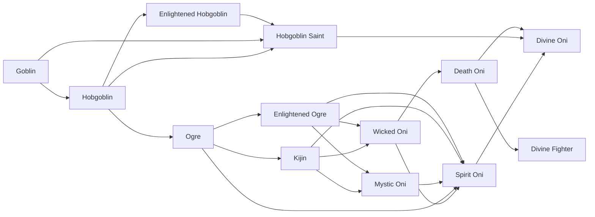

# Kijin

<small>[Tensura: Reincarnated](../index.md) &rsaquo; [Races](index.md)</small>

| | |
|---|---|
| **ID** | `tensura:kijin` |
| **Difficulty** | Easy |
| **Alignment** | Default |
| **Aura** | 5,000 - 5,000 |
| **Magicule** | 5,000 - 5,000 |
| **Health bonus** | 10 |
| **Spiritual health bonus** | 100 |
| **Attack damage bonus** | 3 |
| **Movement speed bonus** | 0.02 |

> A race of Sprite Demi-Humans descended from Fire Elementals. They have an average lifespan of over a thousand years

## Evolution

- **Evolves from:** [Ogre](ogre.md)
- **Evolves into:** [Mystic Oni](mystic-oni.md), [Wicked Oni](wicked-oni.md)
- **Default evolution:** [Mystic Oni](mystic-oni.md)
- **On awakening (True Demon Lord / True Hero):** [Spirit Oni](spirit-oni.md)
- **During the Harvest Festival:** [Mystic Oni](mystic-oni.md)

### Requirements to evolve into Kijin

Each requirement adds its weight to the evolution progress bar; you can evolve at 100%.

| Requirement | Weight |
|---|---|
| Obtain a Spirit | 100% |

### Evolution tree

## Intrinsic skills

Granted automatically when you become this race.

-  [Strength](../abilities/common-skills/strength.md)

## Attribute modifiers

| Attribute | Amount | Operation |
|---|---|---|
| Scale | 0 | add |
| Max Health | 10 | add |
| Max Spiritual Health | 100 | add |
| Attack Damage | 3 | add |
| Attack Speed | 0.2 | add |
| Knockback Resistance | 0.2 | add |
| Movement Speed | 0.02 | add |
| Swim Speed Multiplier | 0.2 | add |

## Stats (config defaults)

Set in [`config/tensura/race/ogre_config.toml`](../configs/config-tensura-race-ogre-config.md).

| Option | Default | Description |
|---|---|---|
| `Kijin.spiritRequirement` | 1 | The number of Spirits obtained to evolve into Kijin. |
| `Kijin.minAura` | 5,000 | Minimal aura. |
| `Kijin.maxAura` | 5,000 | Maximum aura. |
| `Kijin.minMagicule` | 5,000 | Minimal magicule. |
| `Kijin.maxMagicule` | 5,000 | Maximum magicule. |
| `Kijin.size` | 0 | Bonus Size. |
| `Kijin.maxHealth` | 10 | Bonus Max Health. |
| `Kijin.maxSpiritualHealth` | 100 | Bonus Max Spiritual Health. |
| `Kijin.attack` | 3 | Bonus Attack Damage. |
| `Kijin.attackSpeed` | 0.2 | Bonus Attack Speed. |
| `Kijin.knockbackResistance` | 0.2 | Bonus Knockback Resistance. |
| `Kijin.movementSpeed` | 0.02 | Bonus Movement Speed. |
| `Kijin.swimSpeed` | 0.2 | Bonus Swimming Speed Multiplier. |
| `Ogre.minAura` | 1,500 | Minimal aura. |
| `Ogre.maxAura` | 2,500 | Maximum aura. |
| `Ogre.minMagicule` | 300 | Minimal magicule. |
| `Ogre.maxMagicule` | 600 | Maximum magicule. |
| `Ogre.size` | 0 | Bonus Size. |
| `Ogre.maxHealth` | 6 | Bonus Max Health. |
| `Ogre.maxSpiritualHealth` | 15 | Bonus Max Spiritual Health. |
| `Ogre.attack` | 1 | Bonus Attack Damage. |
| `Ogre.attackSpeed` | 0.1 | Bonus Attack Speed. |
| `Ogre.knockbackResistance` | 0.1 | Bonus Knockback Resistance. |
| `Ogre.movementSpeed` | 0.01 | Bonus Movement Speed. |
| `Ogre.swimSpeed` | 0.1 | Bonus Swimming Speed Multiplier. |
