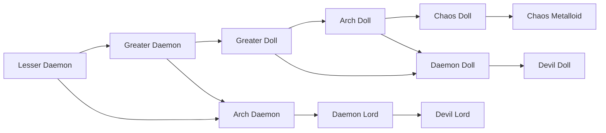

# Lesser Daemon

<small>[Tensura: Reincarnated](../index.md) &rsaquo; [Races](index.md)</small>

| | |
|---|---|
| **ID** | `tensura:lesser_daemon` |
| **Stage** | Starting |
| **Difficulty** | Intermediate |
| **Alignment** | Majin |
| **Aura** | 2,000 - 3,000 |
| **Magicule** | 5,000 - 6,000 |
| **Health bonus** | 20 |
| **Spiritual health bonus** | 90 |
| **Attack damage bonus** | 0.4 |
| **Movement speed bonus** | 0 |

> The lowest level of the daemon race. They spontaneously come into existence within the Daemon Realm where they slowly accumulate experience from fighting and being summoned before eventually evolving into greater daemons.

## Evolution

- **Evolves into:** [Greater Daemon](greater-daemon.md)
- **Default evolution:** [Greater Daemon](greater-daemon.md)
- **On awakening (True Demon Lord / True Hero):** [Arch Daemon](arch-daemon.md)
- **During the Harvest Festival:** [Greater Daemon](greater-daemon.md)

### Evolution tree

## Intrinsic skills

Granted automatically when you become this race.

-  [Magic Resistance](../abilities/resistance-skills/magic-resistance.md)
-  [Possession](../abilities/intrinsic-skills/possession.md)

## Traits

- Daemon
- EP is limited in the central world
- Has creative-style flight
- Spawns as a spiritual lifeform

## Attribute modifiers

| Attribute | Amount | Operation |
|---|---|---|
| Scale | 0.5 | add |
| Max Health | 20 | add |
| Max Spiritual Health | 90 | add |
| Attack Damage | 0.4 | add |
| Attack Speed | -0.5 | add |
| Knockback Resistance | 0.1 | add |
| Movement Speed | 0 | add |
| Swim Speed Multiplier | 0 | add |

## Stats (config defaults)

Set in [`config/tensura/race/daemon_config.toml`](../configs/config-tensura-race-daemon-config.md).

| Option | Default | Description |
|---|---|---|
| `LesserDaemon.minAura` | 2,000 | Minimal aura. |
| `LesserDaemon.maxAura` | 3,000 | Maximum aura. |
| `LesserDaemon.minMagicule` | 5,000 | Minimal magicule. |
| `LesserDaemon.maxMagicule` | 6,000 | Maximum magicule. |
| `LesserDaemon.size` | 0.5 | Bonus Size. |
| `LesserDaemon.maxHealth` | 20 | Bonus Max Health. |
| `LesserDaemon.maxSpiritualHealth` | 90 | Bonus Max Spiritual Health. |
| `LesserDaemon.attack` | 0.4 | Bonus Attack Damage. |
| `LesserDaemon.attackSpeed` | -0.5 | Bonus Attack Speed. |
| `LesserDaemon.knockbackResistance` | 0.1 | Bonus Knockback Resistance. |
| `LesserDaemon.movementSpeed` | 0 | Bonus Movement Speed. |
| `LesserDaemon.swimSpeed` | 0 | Bonus Swimming Speed Multiplier. |
| `LesserDaemon.learnableMagics` | "tensura:earth_lock", "tensura:liquidize", "tensura:fire_aspectual", "tensura:water_aspectual", "tensura:drainage", "tensura:wind_gust", "tensura:escape", "tensura:freeze" | List of Magics that players automatically get as learnable. |

## Tags

`tensura:races/daemon`, `tensura:races/has_creative_flight`, `tensura:races/limited_ep_in_central`, `tensura:races/spawn_as_spiritual`
