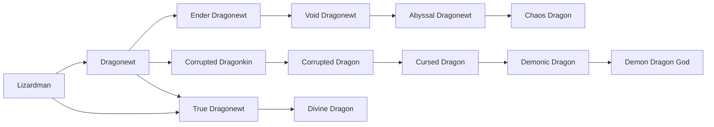

# Lizardman

<small>[Tensura: Reincarnated](../index.md) &rsaquo; [Races](index.md)</small>

| | |
|---|---|
| **ID** | `tensura:lizardman` |
| **Difficulty** | Hard |
| **Alignment** | Default |
| **Aura** | 600 - 800 |
| **Magicule** | 100 - 200 |
| **Health bonus** | 4 |
| **Spiritual health bonus** | 8 |
| **Attack damage bonus** | 0.5 |
| **Movement speed bonus** | 0.01 |

> A race of scaled people descended from dragons. Their webbed feet give them an advantage in wet terrain.

## Evolution

- **Evolves into:** [Dragonewt](dragonewt.md)
- **Default evolution:** [Dragonewt](dragonewt.md)
- **On awakening (True Demon Lord / True Hero):** [True Dragonewt](true-dragonewt.md)
- **During the Harvest Festival:** [Dragonewt](dragonewt.md)

### Evolution tree

## Intrinsic skills

Granted automatically when you become this race.

-  [Scale Armor](../abilities/intrinsic-skills/scale-armor.md)

## Traits

- Cold-blooded

## Attribute modifiers

| Attribute | Amount | Operation |
|---|---|---|
| Scale | 0 | add |
| Max Health | 4 | add |
| Max Spiritual Health | 8 | add |
| Attack Damage | 0.5 | add |
| Attack Speed | 0.1 | add |
| Knockback Resistance | 0 | add |
| Movement Speed | 0.01 | add |
| Swim Speed Multiplier | 0.1 | add |

## Stats (config defaults)

Set in [`config/tensura/race/lizardman_config.toml`](../configs/config-tensura-race-lizardman-config.md).

| Option | Default | Description |
|---|---|---|
| `Lizardman.minAura` | 600 | Minimal aura. |
| `Lizardman.maxAura` | 800 | Maximum aura. |
| `Lizardman.minMagicule` | 100 | Minimal magicule. |
| `Lizardman.maxMagicule` | 200 | Maximum magicule. |
| `Lizardman.size` | 0 | Bonus Size. |
| `Lizardman.maxHealth` | 4 | Bonus Max Health. |
| `Lizardman.maxSpiritualHealth` | 8 | Bonus Max Spiritual Health. |
| `Lizardman.attack` | 0.5 | Bonus Attack Damage. |
| `Lizardman.attackSpeed` | 0.1 | Bonus Attack Speed. |
| `Lizardman.knockbackResistance` | 0 | Bonus Knockback Resistance. |
| `Lizardman.movementSpeed` | 0.01 | Bonus Movement Speed. |
| `Lizardman.swimSpeed` | 0.1 | Bonus Swimming Speed Multiplier. |

## Tags

`tensura:races/cold_blooded`
