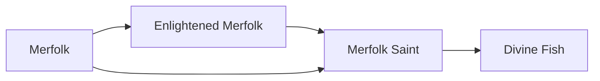

# Merfolk

<small>[Tensura: Reincarnated](../index.md) &rsaquo; [Races](index.md)</small>

| | |
|---|---|
| **ID** | `tensura:merfolk` |
| **Stage** | Starting |
| **Difficulty** | Hard |
| **Alignment** | Default |
| **Aura** | 400 - 600 |
| **Magicule** | 500 - 600 |
| **Health bonus** | 4 |
| **Spiritual health bonus** | 20 |
| **Attack damage bonus** | 0 |
| **Movement speed bonus** | -0.01 |

> A sprite race descended from water elementals. Their fish-like bodies give them an insurmountable advantage in water.

## Evolution

- **Evolves into:** [Enlightened Merfolk](enlightened-merfolk.md)
- **Default evolution:** [Enlightened Merfolk](enlightened-merfolk.md)
- **On awakening (True Demon Lord / True Hero):** [Merfolk Saint](merfolk-saint.md)
- **During the Harvest Festival:** [Enlightened Merfolk](enlightened-merfolk.md)

### Evolution tree

## Intrinsic skills

Granted automatically when you become this race.

-  [Water Breathing](../abilities/intrinsic-skills/water-breathing.md)
-  [Hydraulic Propulsion](../abilities/common-skills/hydraulic-propulsion.md)

## Traits

- Can breathe underwater
- Human-like
- Needs moisture

## Attribute modifiers

| Attribute | Amount | Operation |
|---|---|---|
| Submerged Mining Speed | 0.4 | add |
| Scale | 0 | add |
| Max Health | 4 | add |
| Max Spiritual Health | 20 | add |
| Attack Damage | 0 | add |
| Attack Speed | 0 | add |
| Knockback Resistance | 0 | add |
| Movement Speed | -0.01 | add |
| Swim Speed Multiplier | 0.5 | add |

## Stats (config defaults)

Set in [`config/tensura/race/merfolk_config.toml`](../configs/config-tensura-race-merfolk-config.md).

| Option | Default | Description |
|---|---|---|
| `Merfolk.submergedMiningSpeed` | 0.4 | Bonus Submerged Mining Speed. |
| `Merfolk.minAura` | 400 | Minimal aura. |
| `Merfolk.maxAura` | 600 | Maximum aura. |
| `Merfolk.minMagicule` | 500 | Minimal magicule. |
| `Merfolk.maxMagicule` | 600 | Maximum magicule. |
| `Merfolk.size` | 0 | Bonus Size. |
| `Merfolk.maxHealth` | 4 | Bonus Max Health. |
| `Merfolk.maxSpiritualHealth` | 20 | Bonus Max Spiritual Health. |
| `Merfolk.attack` | 0 | Bonus Attack Damage. |
| `Merfolk.attackSpeed` | 0 | Bonus Attack Speed. |
| `Merfolk.knockbackResistance` | 0 | Bonus Knockback Resistance. |
| `Merfolk.movementSpeed` | -0.01 | Bonus Movement Speed. |
| `Merfolk.swimSpeed` | 0.5 | Bonus Swimming Speed Multiplier. |
| `Merfolk.submergedMiningSpeed` | 0.4 | Bonus Submerged Mining Speed. |

## Tags

`tensura:races/can_breath_water`, `tensura:races/human_like`, `tensura:races/need_moist`
