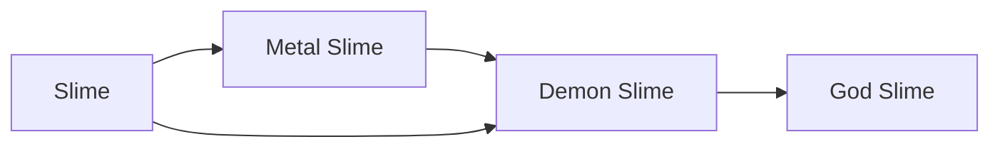

# Metal Slime

<small>[Tensura: Reincarnated](../index.md) &rsaquo; [Races](index.md)</small>

| | |
|---|---|
| **ID** | `tensura:metal_slime` |
| **Stage** | In-between |
| **Difficulty** | Easy |
| **Alignment** | Majin |
| **Aura** | 3,000 - 3,000 |
| **Magicule** | 7,000 - 7,000 |
| **Health bonus** | 80 |
| **Spiritual health bonus** | 260 |
| **Attack damage bonus** | 1 |
| **Movement speed bonus** | 0 |

> A slime that has taken in large quantities of Magic Ore. The dissolved ore inside of it provides a strong resistance towards most forms of damage.

## Evolution

- **Evolves from:** [Slime](slime.md)
- **Evolves into:** [Demon Slime](demon-slime.md)
- **Default evolution:** [Demon Slime](demon-slime.md)
- **On awakening (True Demon Lord / True Hero):** [Demon Slime](demon-slime.md)

### Requirements to evolve into Metal Slime

Each requirement adds its weight to the evolution progress bar; you can evolve at 100%.

| Requirement | Weight |
|---|---|
| Consume 100 of [Magic Ore](../items/materials/magic-ore-shard.md) | 100% |

### Evolution tree

## Intrinsic skills

Granted automatically when you become this race.

-  [Body Armor](../abilities/intrinsic-skills/body-armor.md)
-  [Physical Attack Resistance](../abilities/resistance-skills/physical-attack-resistance.md)
-  [Cold Resistance](../abilities/resistance-skills/cold-resistance.md)
-  [Corrosion Resistance](../abilities/resistance-skills/corrosion-resistance.md)
-  [Darkness Attack Resistance](../abilities/resistance-skills/darkness-attack-resistance.md)
-  [Earth Attack Resistance](../abilities/resistance-skills/earth-attack-resistance.md)
-  [Electricity Resistance](../abilities/resistance-skills/electricity-resistance.md)
-  [Gravity Attack Resistance](../abilities/resistance-skills/gravity-attack-resistance.md)
-  [Heat Resistance](../abilities/resistance-skills/heat-resistance.md)
-  [Light Attack Resistance](../abilities/resistance-skills/light-attack-resistance.md)
-  [Spatial Attack Resistance](../abilities/resistance-skills/spatial-attack-resistance.md)
-  [Water Attack Resistance](../abilities/resistance-skills/water-attack-resistance.md)
-  [Wind Attack Resistance](../abilities/resistance-skills/wind-attack-resistance.md)
-  [Absorb &amp; Dissolve](../abilities/intrinsic-skills/absorb-and-dissolve.md)

## Traits

- Cold-blooded
- Has no blood
- Slime

## Attribute modifiers

| Attribute | Amount | Operation |
|---|---|---|
| Jump Strength | 0.5 | add |
| Safe Fall Distance | 1 | add x base |
| Fall Damage Multiplier | -0.5 | add |
| Width Multiplier | 3 | add |
| Jump Strength | 0.4 | add |
| Safe Fall Distance | 0.8 | add x base |
| Scale | -0.725 | add |
| Max Health | 80 | add |
| Max Spiritual Health | 260 | add |
| Attack Damage | 1 | add |
| Attack Speed | 0.2 | add |
| Knockback Resistance | 0.4 | add |
| Movement Speed | 0 | add |
| Swim Speed Multiplier | 0 | add |

## Stats (config defaults)

Set in [`config/tensura/race/slime_config.toml`](../configs/config-tensura-race-slime-config.md).

| Option | Default | Description |
|---|---|---|
| `MetalSlime.oreRequirement` | 100 | The number of Magic Ore consumed to evolve into Metal Slime. |
| `MetalSlime.minAura` | 3,000 | Minimal aura. |
| `MetalSlime.maxAura` | 3,000 | Maximum aura. |
| `MetalSlime.minMagicule` | 7,000 | Minimal magicule. |
| `MetalSlime.maxMagicule` | 7,000 | Maximum magicule. |
| `MetalSlime.size` | -0.725 | Bonus Size. |
| `MetalSlime.maxHealth` | 80 | Bonus Max Health. |
| `MetalSlime.maxSpiritualHealth` | 260 | Bonus Max Spiritual Health. |
| `MetalSlime.attack` | 1 | Bonus Attack Damage. |
| `MetalSlime.attackSpeed` | 0.2 | Bonus Attack Speed. |
| `MetalSlime.knockbackResistance` | 0.4 | Bonus Knockback Resistance. |
| `MetalSlime.movementSpeed` | 0 | Bonus Movement Speed. |
| `MetalSlime.swimSpeed` | 0 | Bonus Swimming Speed Multiplier. |
| `MetalSlime.jumpStrength` | 0.5 | Bonus Jump Strength. |
| `MetalSlime.fallDamage` | -0.5 | Fall Damage Multiplier. |
| `MetalSlime.maxChargeTick` | 50 | Get Max Jump Charge tick. |
| `MetalSlime.width` | 4 | Hitbox width multiplier. |
| `Slime.minAura` | 200 | Minimal aura. |
| `Slime.maxAura` | 500 | Maximum aura. |
| `Slime.minMagicule` | 200 | Minimal magicule. |
| `Slime.maxMagicule` | 500 | Maximum magicule. |
| `Slime.size` | -0.75 | Bonus Size. |
| `Slime.maxHealth` | -10 | Bonus Max Health. |
| `Slime.maxSpiritualHealth` | 15 | Bonus Max Spiritual Health. |
| `Slime.attack` | -0.7 | Bonus Attack Damage. |
| `Slime.attackSpeed` | 0 | Bonus Attack Speed. |
| `Slime.knockbackResistance` | 0 | Bonus Knockback Resistance. |
| `Slime.movementSpeed` | -0.03 | Bonus Movement Speed. |
| `Slime.swimSpeed` | -0.3 | Bonus Swimming Speed Multiplier. |
| `Slime.jumpStrength` | 0.4 | Bonus Jump Strength. |
| `Slime.fallDamage` | -0.5 | Fall Damage Multiplier. |
| `Slime.maxChargeTick` | 40 | Get Max Jump Charge tick. |
| `Slime.width` | 4 | Hitbox width multiplier. |
| `physicalInput` | 0.5 | The physical damage input multiplier taken by this race. |

## Tags

`tensura:races/cold_blooded`, `tensura:races/no_blood`, `tensura:races/slime`
