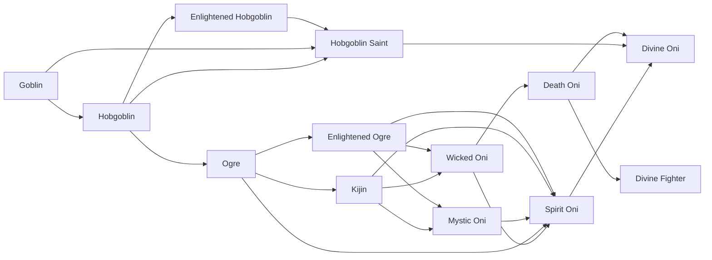

# Ogre

<small>[Tensura: Reincarnated](../index.md) &rsaquo; [Races](index.md)</small>

| | |
|---|---|
| **ID** | `tensura:ogre` |
| **Stage** | In-between |
| **Difficulty** | Easy |
| **Alignment** | Default |
| **Aura** | 1,500 - 2,500 |
| **Magicule** | 300 - 600 |
| **Health bonus** | 6 |
| **Spiritual health bonus** | 15 |
| **Attack damage bonus** | 1 |
| **Movement speed bonus** | 0.01 |

> A sprite race descended from fire elementals. They possess immense physical capabilities and a strong Japanese lineage.

## Evolution

- **Evolves from:** [Hobgoblin](hobgoblin.md)
- **Evolves into:** [Enlightened Ogre](enlightened-ogre.md), [Kijin](kijin.md)
- **Default evolution:** [Enlightened Ogre](enlightened-ogre.md)
- **On awakening (True Demon Lord / True Hero):** [Spirit Oni](spirit-oni.md)
- **During the Harvest Festival:** [Kijin](kijin.md)

### Requirements to evolve into Ogre

Each requirement adds its weight to the evolution progress bar; you can evolve at 100%.

| Requirement | Weight |
|---|---|
| Battle [Elemental Colossus](../mobs/elemental-colossus.md)(-s) | 100% |

### Evolution tree

## Intrinsic skills

Granted automatically when you become this race.

-  [Strength](../abilities/common-skills/strength.md)

## Attribute modifiers

| Attribute | Amount | Operation |
|---|---|---|
| Scale | 0 | add |
| Max Health | 6 | add |
| Max Spiritual Health | 15 | add |
| Attack Damage | 1 | add |
| Attack Speed | 0.1 | add |
| Knockback Resistance | 0.1 | add |
| Movement Speed | 0.01 | add |
| Swim Speed Multiplier | 0.1 | add |

## Stats (config defaults)

Set in [`config/tensura/race/ogre_config.toml`](../configs/config-tensura-race-ogre-config.md).

| Option | Default | Description |
|---|---|---|
| `Ogre.minAura` | 1,500 | Minimal aura. |
| `Ogre.maxAura` | 2,500 | Maximum aura. |
| `Ogre.minMagicule` | 300 | Minimal magicule. |
| `Ogre.maxMagicule` | 600 | Maximum magicule. |
| `Ogre.size` | 0 | Bonus Size. |
| `Ogre.maxHealth` | 6 | Bonus Max Health. |
| `Ogre.maxSpiritualHealth` | 15 | Bonus Max Spiritual Health. |
| `Ogre.attack` | 1 | Bonus Attack Damage. |
| `Ogre.attackSpeed` | 0.1 | Bonus Attack Speed. |
| `Ogre.knockbackResistance` | 0.1 | Bonus Knockback Resistance. |
| `Ogre.movementSpeed` | 0.01 | Bonus Movement Speed. |
| `Ogre.swimSpeed` | 0.1 | Bonus Swimming Speed Multiplier. |
