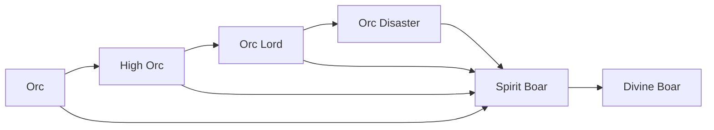

# Orc

<small>[Tensura: Reincarnated](../index.md) &rsaquo; [Races](index.md)</small>

| | |
|---|---|
| **ID** | `tensura:orc` |
| **Difficulty** | Intermediate |
| **Alignment** | Default |
| **Aura** | 400 - 600 |
| **Magicule** | 50 - 100 |
| **Health bonus** | 8 |
| **Spiritual health bonus** | 16 |
| **Attack damage bonus** | 0.5 |
| **Movement speed bonus** | -0.02 |

> A race of beastfolk who lost the ability to shift between man and beast, resulting in a permanent mix of the two. Their physical strength is greater than average but pails in comparison to their original strength as beastfolk.

## Evolution

- **Evolves into:** [High Orc](high-orc.md)
- **Default evolution:** [High Orc](high-orc.md)
- **On awakening (True Demon Lord / True Hero):** [Spirit Boar](spirit-boar.md)
- **During the Harvest Festival:** [High Orc](high-orc.md)

### Evolution tree

## Attribute modifiers

| Attribute | Amount | Operation |
|---|---|---|
| Scale | 0.5 | add |
| Max Health | 8 | add |
| Max Spiritual Health | 16 | add |
| Attack Damage | 0.5 | add |
| Attack Speed | -0.5 | add |
| Knockback Resistance | 0.2 | add |
| Movement Speed | -0.02 | add |
| Swim Speed Multiplier | -0.2 | add |

## Stats (config defaults)

Set in [`config/tensura/race/orc_config.toml`](../configs/config-tensura-race-orc-config.md).

| Option | Default | Description |
|---|---|---|
| `Orc.minAura` | 400 | Minimal aura. |
| `Orc.maxAura` | 600 | Maximum aura. |
| `Orc.minMagicule` | 50 | Minimal magicule. |
| `Orc.maxMagicule` | 100 | Maximum magicule. |
| `Orc.size` | 0.5 | Bonus Size. |
| `Orc.maxHealth` | 8 | Bonus Max Health. |
| `Orc.maxSpiritualHealth` | 16 | Bonus Max Spiritual Health. |
| `Orc.attack` | 0.5 | Bonus Attack Damage. |
| `Orc.attackSpeed` | -0.5 | Bonus Attack Speed. |
| `Orc.knockbackResistance` | 0.2 | Bonus Knockback Resistance. |
| `Orc.movementSpeed` | -0.02 | Bonus Movement Speed. |
| `Orc.swimSpeed` | -0.2 | Bonus Swimming Speed Multiplier. |
