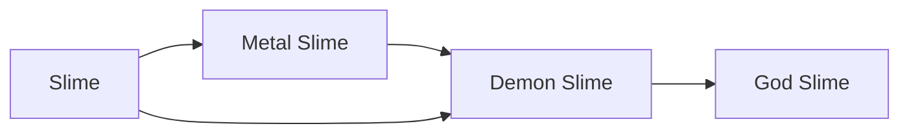

# Slime

<small>[Tensura: Reincarnated](../index.md) &rsaquo; [Races](index.md)</small>

| | |
|---|---|
| **ID** | `tensura:slime` |
| **Difficulty** | Extreme |
| **Alignment** | Majin |
| **Aura** | 200 - 500 |
| **Magicule** | 200 - 500 |
| **Health bonus** | -10 |
| **Spiritual health bonus** | 15 |
| **Attack damage bonus** | -0.7 |
| **Movement speed bonus** | -0.03 |

> A Spectral race of monster that lacks intelligence and ambition. They’re usually passive but are incredibly ruthless once provoked.

## Evolution

- **Evolves into:** [Demon Slime](demon-slime.md), [Metal Slime](metal-slime.md)
- **Default evolution:** [Demon Slime](demon-slime.md)
- **On awakening (True Demon Lord / True Hero):** [Demon Slime](demon-slime.md)

### Evolution tree

## Intrinsic skills

Granted automatically when you become this race.

-  [Absorb &amp; Dissolve](../abilities/intrinsic-skills/absorb-and-dissolve.md)

## Traits

- Cold-blooded
- Has no blood
- Slime

## Attribute modifiers

| Attribute | Amount | Operation |
|---|---|---|
| Jump Strength | 0.4 | add |
| Safe Fall Distance | 0.8 | add x base |
| Fall Damage Multiplier | -0.5 | add |
| Width Multiplier | 3 | add |
| Scale | -0.75 | add |
| Max Health | -10 | add |
| Max Spiritual Health | 15 | add |
| Attack Damage | -0.7 | add |
| Attack Speed | 0 | add |
| Knockback Resistance | 0 | add |
| Movement Speed | -0.03 | add |
| Swim Speed Multiplier | -0.3 | add |

## Stats (config defaults)

Set in [`config/tensura/race/slime_config.toml`](../configs/config-tensura-race-slime-config.md).

| Option | Default | Description |
|---|---|---|
| `Slime.minAura` | 200 | Minimal aura. |
| `Slime.maxAura` | 500 | Maximum aura. |
| `Slime.minMagicule` | 200 | Minimal magicule. |
| `Slime.maxMagicule` | 500 | Maximum magicule. |
| `Slime.size` | -0.75 | Bonus Size. |
| `Slime.maxHealth` | -10 | Bonus Max Health. |
| `Slime.maxSpiritualHealth` | 15 | Bonus Max Spiritual Health. |
| `Slime.attack` | -0.7 | Bonus Attack Damage. |
| `Slime.attackSpeed` | 0 | Bonus Attack Speed. |
| `Slime.knockbackResistance` | 0 | Bonus Knockback Resistance. |
| `Slime.movementSpeed` | -0.03 | Bonus Movement Speed. |
| `Slime.swimSpeed` | -0.3 | Bonus Swimming Speed Multiplier. |
| `Slime.jumpStrength` | 0.4 | Bonus Jump Strength. |
| `Slime.fallDamage` | -0.5 | Fall Damage Multiplier. |
| `Slime.maxChargeTick` | 40 | Get Max Jump Charge tick. |
| `Slime.width` | 4 | Hitbox width multiplier. |
| `physicalInput` | 0.5 | The physical damage input multiplier taken by this race. |

## Tags

`tensura:races/cold_blooded`, `tensura:races/no_blood`, `tensura:races/slime`
