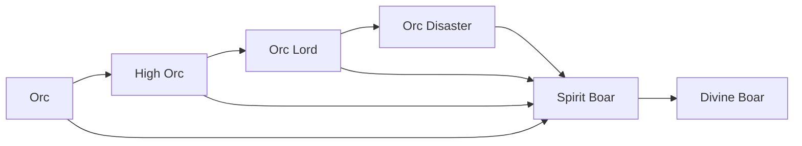

# Spirit Boar

<small>[Tensura: Reincarnated](../index.md) &rsaquo; [Races](index.md)</small>

| | |
|---|---|
| **ID** | `tensura:spirit_boar` |
| **Difficulty** | Easy |
| **Alignment** | Holy |
| **Aura** | 400,000 - 400,000 |
| **Magicule** | 400,000 - 400,000 |
| **Health bonus** | 580 |
| **Spiritual health bonus** | 3,340 |
| **Attack damage bonus** | 2.5 |
| **Movement speed bonus** | 0.03 |
| **EP to evolve into** | 400,000 |

> Orc that has "evolved the correct way" and became a Spiritual Lifeform.

## Evolution

- **Evolves from:** [High Orc](high-orc.md), [Orc Disaster](orc-disaster.md), [Orc](orc.md), [Orc Lord](orc-lord.md)
- **Evolves into:** [Divine Boar](divine-boar.md)
- **Default evolution:** [Divine Boar](divine-boar.md)
- **On awakening (True Demon Lord / True Hero):** [Divine Boar](divine-boar.md)

### Requirements to evolve into Spirit Boar

Each requirement adds its weight to the evolution progress bar; you can evolve at 100%.

| Requirement | Weight |
|---|---|
| Reach Existence Points of 400,000 | 100% |

### Evolution tree

## Traits

- Spiritual lifeform

## Attribute modifiers

| Attribute | Amount | Operation |
|---|---|---|
| Scale | 0.5 | add |
| Max Health | 580 | add |
| Max Spiritual Health | 3,340 | add |
| Attack Damage | 2.5 | add |
| Attack Speed | 0.3 | add |
| Knockback Resistance | 0.6 | add |
| Movement Speed | 0.03 | add |
| Swim Speed Multiplier | 0.3 | add |

## Stats (config defaults)

Set in [`config/tensura/race/orc_config.toml`](../configs/config-tensura-race-orc-config.md).

| Option | Default | Description |
|---|---|---|
| `SpiritBoar.epRequirement` | 400,000 | EP requirement to evolve into Spirit Boar. |
| `SpiritBoar.minAura` | 400,000 | Minimal aura. |
| `SpiritBoar.maxAura` | 400,000 | Maximum aura. |
| `SpiritBoar.minMagicule` | 400,000 | Minimal magicule. |
| `SpiritBoar.maxMagicule` | 400,000 | Maximum magicule. |
| `SpiritBoar.size` | 0.5 | Bonus Size. |
| `SpiritBoar.maxHealth` | 580 | Bonus Max Health. |
| `SpiritBoar.maxSpiritualHealth` | 3,340 | Bonus Max Spiritual Health. |
| `SpiritBoar.attack` | 2.5 | Bonus Attack Damage. |
| `SpiritBoar.attackSpeed` | 0.3 | Bonus Attack Speed. |
| `SpiritBoar.knockbackResistance` | 0.6 | Bonus Knockback Resistance. |
| `SpiritBoar.movementSpeed` | 0.03 | Bonus Movement Speed. |
| `SpiritBoar.swimSpeed` | 0.3 | Bonus Swimming Speed Multiplier. |
| `HighOrc.epRequirement` | 5,000 | EP requirement to evolve into High Orc. |
| `HighOrc.minAura` | 2,000 | Minimal aura. |
| `HighOrc.maxAura` | 2,000 | Maximum aura. |
| `HighOrc.minMagicule` | 1,000 | Minimal magicule. |
| `HighOrc.maxMagicule` | 1,000 | Maximum magicule. |
| `HighOrc.size` | 0.5 | Bonus Size. |
| `HighOrc.maxHealth` | 12 | Bonus Max Health. |
| `HighOrc.maxSpiritualHealth` | 100 | Bonus Max Spiritual Health. |
| `HighOrc.attack` | 1.5 | Bonus Attack Damage. |
| `HighOrc.attackSpeed` | -0.25 | Bonus Attack Speed. |
| `HighOrc.knockbackResistance` | 0.3 | Bonus Knockback Resistance. |
| `HighOrc.movementSpeed` | 0 | Bonus Movement Speed. |
| `HighOrc.swimSpeed` | 0 | Bonus Swimming Speed Multiplier. |
| `Orc.minAura` | 400 | Minimal aura. |
| `Orc.maxAura` | 600 | Maximum aura. |
| `Orc.minMagicule` | 50 | Minimal magicule. |
| `Orc.maxMagicule` | 100 | Maximum magicule. |
| `Orc.size` | 0.5 | Bonus Size. |
| `Orc.maxHealth` | 8 | Bonus Max Health. |
| `Orc.maxSpiritualHealth` | 16 | Bonus Max Spiritual Health. |
| `Orc.attack` | 0.5 | Bonus Attack Damage. |
| `Orc.attackSpeed` | -0.5 | Bonus Attack Speed. |
| `Orc.knockbackResistance` | 0.2 | Bonus Knockback Resistance. |
| `Orc.movementSpeed` | -0.02 | Bonus Movement Speed. |
| `Orc.swimSpeed` | -0.2 | Bonus Swimming Speed Multiplier. |

## Tags

`tensura:races/spiritual`
