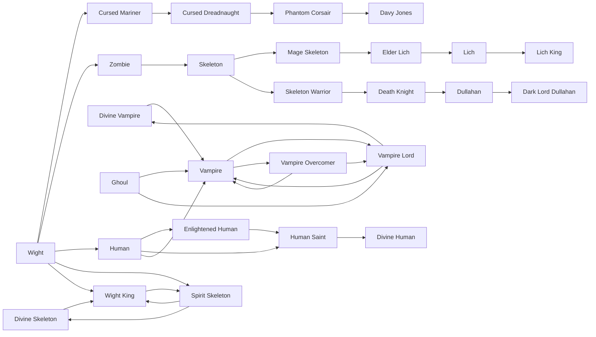

# Vampire Lord

<small>[Tensura: Reincarnated](../index.md) &rsaquo; [Races](index.md)</small>

| | |
|---|---|
| **ID** | `tensura:vampire_lord` |
| **Stage** | In-between |
| **Difficulty** | Easy |
| **Alignment** | Majin |
| **Aura** | 250,000 - 250,000 |
| **Magicule** | 250,000 - 250,000 |
| **Health bonus** | 320 |
| **Spiritual health bonus** | 2,940 |
| **Attack damage bonus** | 5 |
| **Movement speed bonus** | 0.03 |
| **EP to evolve into** | 400,000 |

> A vampire among the loftiest levels of power, comparable to a Demon Lord.

## Evolution

- **Evolves from:** [Vampire Overcomer](vampire-overcomer.md), [Ghoul](ghoul.md), [Vampire](vampire.md)
- **Evolves into:** [Divine Vampire](divine-vampire.md)
- **Default evolution:** [Divine Vampire](divine-vampire.md)
- **On awakening (True Demon Lord / True Hero):** [Divine Vampire](divine-vampire.md)
- **During the Harvest Festival:** [Vampire](vampire.md)

### Requirements to evolve into Vampire Lord

Each requirement adds its weight to the evolution progress bar; you can evolve at 100%.

| Requirement | Weight |
|---|---|
| Reach Existence Points of 400,000 | 100% |

### Evolution tree

## Intrinsic skills

Granted automatically when you become this race.

-  [Ultraspeed Regeneration](../abilities/extra-skills/ultraspeed-regeneration.md)
-  [Blood Mist](../abilities/intrinsic-skills/blood-mist.md)
-  [Steel Strength](../abilities/extra-skills/steel-strength.md)
-  [Shadow Motion](../abilities/extra-skills/shadow-motion.md)
-  [Coercion](../abilities/common-skills/coercion.md)
-  [Strength](../abilities/common-skills/strength.md)
-  [Charm](../abilities/intrinsic-skills/charm.md)

## Traits

- Cannot heal by eating
- Spiritual lifeform

## Attribute modifiers

| Attribute | Amount | Operation |
|---|---|---|
| Scale | 0 | add |
| Max Health | 320 | add |
| Max Spiritual Health | 2,940 | add |
| Attack Damage | 5 | add |
| Attack Speed | 0.5 | add |
| Knockback Resistance | 0.5 | add |
| Movement Speed | 0.03 | add |
| Swim Speed Multiplier | 0.3 | add |

## Stats (config defaults)

Set in [`config/tensura/race/vampire_config.toml`](../configs/config-tensura-race-vampire-config.md).

| Option | Default | Description |
|---|---|---|
| `VampireLord.epRequirement` | 400,000 | EP requirement to evolve into Vampire Lord. |
| `VampireLord.minAura` | 250,000 | Minimal aura. |
| `VampireLord.maxAura` | 250,000 | Maximum aura. |
| `VampireLord.minMagicule` | 250,000 | Minimal magicule. |
| `VampireLord.maxMagicule` | 250,000 | Maximum magicule. |
| `VampireLord.size` | 0 | Bonus Size. |
| `VampireLord.maxHealth` | 320 | Bonus Max Health. |
| `VampireLord.maxSpiritualHealth` | 2,940 | Bonus Max Spiritual Health. |
| `VampireLord.attack` | 5 | Bonus Attack Damage. |
| `VampireLord.attackSpeed` | 0.5 | Bonus Attack Speed. |
| `VampireLord.knockbackResistance` | 0.5 | Bonus Knockback Resistance. |
| `VampireLord.movementSpeed` | 0.03 | Bonus Movement Speed. |
| `VampireLord.swimSpeed` | 0.3 | Bonus Swimming Speed Multiplier. |
| `VampireOvercomer.epRequirement` | 150,000 | EP requirement to evolve into Vampire Overcomer. |
| `VampireOvercomer.minAura` | 50,000 | Minimal aura. |
| `VampireOvercomer.maxAura` | 70,000 | Maximum aura. |
| `VampireOvercomer.minMagicule` | 100,000 | Minimal magicule. |
| `VampireOvercomer.maxMagicule` | 120,000 | Maximum magicule. |
| `VampireOvercomer.size` | 0 | Bonus Size. |
| `VampireOvercomer.maxHealth` | 80 | Bonus Max Health. |
| `VampireOvercomer.maxSpiritualHealth` | 300 | Bonus Max Spiritual Health. |
| `VampireOvercomer.attack` | 3 | Bonus Attack Damage. |
| `VampireOvercomer.attackSpeed` | 0.2 | Bonus Attack Speed. |
| `VampireOvercomer.knockbackResistance` | 0.3 | Bonus Knockback Resistance. |
| `VampireOvercomer.movementSpeed` | 0.01 | Bonus Movement Speed. |
| `VampireOvercomer.swimSpeed` | 0.1 | Bonus Swimming Speed Multiplier. |
| `Vampire.bloodRequirement` | 1 | The amount of Zane Blood consumed to evolve into Vampire from Ghoul. |
| `Vampire.bloodRequirementHuman` | 5 | The amount of Zane Blood consumed to evolve into Vampire from Human. |
| `Vampire.minAura` | 3,000 | Minimal aura. |
| `Vampire.maxAura` | 5,000 | Maximum aura. |
| `Vampire.minMagicule` | 5,000 | Minimal magicule. |
| `Vampire.maxMagicule` | 7,000 | Maximum magicule. |
| `Vampire.size` | 0 | Bonus Size. |
| `Vampire.maxHealth` | 10 | Bonus Max Health. |
| `Vampire.maxSpiritualHealth` | 0 | Bonus Max Spiritual Health. |
| `Vampire.attack` | 3 | Bonus Attack Damage. |
| `Vampire.attackSpeed` | 0 | Bonus Attack Speed. |
| `Vampire.knockbackResistance` | 0.2 | Bonus Knockback Resistance. |
| `Vampire.movementSpeed` | 0 | Bonus Movement Speed. |
| `Vampire.swimSpeed` | 0 | Bonus Swimming Speed Multiplier. |
| `Ghoul.minAura` | 1,000 | Minimal aura. |
| `Ghoul.maxAura` | 2,000 | Maximum aura. |
| `Ghoul.minMagicule` | 2,000 | Minimal magicule. |
| `Ghoul.maxMagicule` | 3,000 | Maximum magicule. |
| `Ghoul.size` | 0 | Bonus Size. |
| `Ghoul.maxHealth` | -6 | Bonus Max Health. |
| `Ghoul.maxSpiritualHealth` | -20 | Bonus Max Spiritual Health. |
| `Ghoul.attack` | 0 | Bonus Attack Damage. |
| `Ghoul.attackSpeed` | -0.5 | Bonus Attack Speed. |
| `Ghoul.knockbackResistance` | 0 | Bonus Knockback Resistance. |
| `Ghoul.movementSpeed` | -0.02 | Bonus Movement Speed. |
| `Ghoul.swimSpeed` | -0.2 | Bonus Swimming Speed Multiplier. |

## Tags

`tensura:races/spiritual`, `tensura:races/unable_to_heal_with_food`
