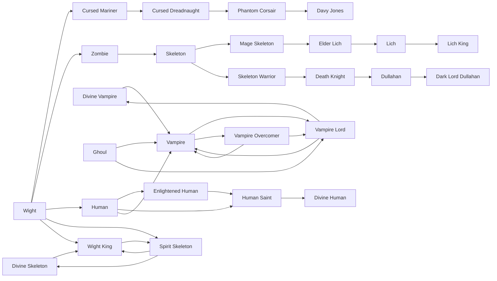

# Wight King

<small>[Tensura: Reincarnated](../index.md) &rsaquo; [Races](index.md)</small>

| | |
|---|---|
| **ID** | `tensura:wight_king` |
| **Stage** | In-between |
| **Difficulty** | Easy |
| **Alignment** | Majin |
| **Aura** | 100,000 - 100,000 |
| **Magicule** | 300,000 - 300,000 |
| **Health bonus** | 100 |
| **Spiritual health bonus** | 515 |
| **Attack damage bonus** | 1 |
| **Movement speed bonus** | 0.01 |
| **EP to evolve into** | 200,000 |

> A type of Undead Monster and an evolution of Wights. They possess fearsome power comparable to that of Demon Lord Seeds.

## Evolution

- **Evolves from:** [Wight](wight.md), [Spirit Skeleton](spirit-skeleton.md), [Divine Skeleton](divine-skeleton.md)
- **Evolves into:** [Spirit Skeleton](spirit-skeleton.md)
- **Default evolution:** [Spirit Skeleton](spirit-skeleton.md)
- **On awakening (True Demon Lord / True Hero):** [Spirit Skeleton](spirit-skeleton.md)

### Requirements to evolve into Wight King

Each requirement adds its weight to the evolution progress bar; you can evolve at 100%.

| Requirement | Weight |
|---|---|
| Reach Existence Points of 200,000 | 100% |

### Evolution tree

## Intrinsic skills

Granted automatically when you become this race.

-  [Create Lesser Undead](../abilities/spiritual-magic/create-lesser-undead.md)
-  [Physical Attack Resistance](../abilities/resistance-skills/physical-attack-resistance.md)
-  [Pain Nullification](../abilities/resistance-skills/pain-nullification.md)

## Traits

- Necromancer
- Undead

## Attribute modifiers

| Attribute | Amount | Operation |
|---|---|---|
| Scale | 0 | add |
| Max Health | 100 | add |
| Max Spiritual Health | 515 | add |
| Attack Damage | 1 | add |
| Attack Speed | 0.1 | add |
| Knockback Resistance | 0 | add |
| Movement Speed | 0.01 | add |
| Swim Speed Multiplier | 0.1 | add |

## Stats (config defaults)

Set in [`config/tensura/race/wight_config.toml`](../configs/config-tensura-race-wight-config.md).

| Option | Default | Description |
|---|---|---|
| `WightKing.epRequirement` | 200,000 | EP requirement to evolve into Wight King. |
| `WightKing.minAura` | 100,000 | Minimal aura. |
| `WightKing.maxAura` | 100,000 | Maximum aura. |
| `WightKing.minMagicule` | 300,000 | Minimal magicule. |
| `WightKing.maxMagicule` | 300,000 | Maximum magicule. |
| `WightKing.size` | 0 | Bonus Size. |
| `WightKing.maxHealth` | 100 | Bonus Max Health. |
| `WightKing.maxSpiritualHealth` | 515 | Bonus Max Spiritual Health. |
| `WightKing.attack` | 1 | Bonus Attack Damage. |
| `WightKing.attackSpeed` | 0.1 | Bonus Attack Speed. |
| `WightKing.knockbackResistance` | 0 | Bonus Knockback Resistance. |
| `WightKing.movementSpeed` | 0.01 | Bonus Movement Speed. |
| `WightKing.swimSpeed` | 0.1 | Bonus Swimming Speed Multiplier. |
| `Wight.minAura` | 100 | Minimal aura. |
| `Wight.maxAura` | 500 | Maximum aura. |
| `Wight.minMagicule` | 2,000 | Minimal magicule. |
| `Wight.maxMagicule` | 3,000 | Maximum magicule. |
| `Wight.size` | 0 | Bonus Size. |
| `Wight.maxHealth` | 0 | Bonus Max Health. |
| `Wight.maxSpiritualHealth` | 0 | Bonus Max Spiritual Health. |
| `Wight.attack` | 0 | Bonus Attack Damage. |
| `Wight.attackSpeed` | -0.2 | Bonus Attack Speed. |
| `Wight.knockbackResistance` | 0 | Bonus Knockback Resistance. |
| `Wight.movementSpeed` | 0 | Bonus Movement Speed. |
| `Wight.swimSpeed` | 0 | Bonus Swimming Speed Multiplier. |

## Tags

`tensura:races/necromancer`, `tensura:races/undead`
