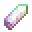
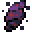
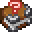

# Sand Ruin

<small>[Tensura: Reincarnated](../index.md) &rsaquo; [Structures](index.md)</small>

| | |
|---|---|
| **ID** | `tensura:hell/sand_ruin` |
| **Type** | `tensura:jigsaw_min_height` |
| **Biomes** | Underworld Sands |
| **Generation step** | surface_structures |
| **Spacing / separation** | 5 / 4 chunks |
| **Terrain adaptation** | beard_thin |
| **Size (jigsaw depth)** | 1 |

## What it does

Generates in Underworld Sands, about one every 5 chunks (at least 4 chunks apart).

## Loot

### `tensura:chests/hell_ruins`

| Item | Count | Chance | Notes |
|---|---|---|---|
|  [Bone](https://minecraft.wiki/w/Bone) | 1 | 100% |  |
|  [Bone Block](https://minecraft.wiki/w/Bone_Block) | 1 | 81% |  |
|  [Skeleton Skull](https://minecraft.wiki/w/Skeleton_Skull) | 1 | 55% |  |
|  [Spruce Log](https://minecraft.wiki/w/Spruce_Log) | 1 | 93% |  |
|  [Netherite Scrap](https://minecraft.wiki/w/Netherite_Scrap) | 1 | 33% |  |
|  [Magic Ore](../items/materials/magic-ore-shard.md) | 1 | 17% |  |
|  [Daemon Essence](../items/materials/daemon-essence.md) | 1 | 17% |  |
|  [Magic Tome](../items/books-scrolls/magic-tome.md) | 1 | 17% |  |
|  [Map](https://minecraft.wiki/w/Map) | 1 | 17% |  |
|  [Skull Pottery Sherd](https://minecraft.wiki/w/Skull_Pottery_Sherd) | 1 | 49% |  |
|  [Danger Pottery Sherd](https://minecraft.wiki/w/Danger_Pottery_Sherd) | 1 | 49% |  |
|  [Copper Ingot](https://minecraft.wiki/w/Copper_Ingot) | 1 | 49% |  |
|  [Air](https://minecraft.wiki/w/Air) | 1 | 78% |  |
|  [Suspicious Stew](https://minecraft.wiki/w/Suspicious_Stew) | 1 | 58% |  |
|  [Feather](https://minecraft.wiki/w/Feather) | 1 | 58% |  |
|  [Red Sand](https://minecraft.wiki/w/Red_Sand) | 1 | 58% |  |
|  [Red Sandstone](https://minecraft.wiki/w/Red_Sandstone) | 1 | 58% |  |
|  [Air](https://minecraft.wiki/w/Air) | 1 | 79% |  |
