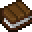
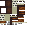
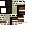
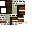

# Plains Warp Pad

<small>[Tensura: Reincarnated](../index.md) &rsaquo; [Structures](index.md)</small>

| | |
|---|---|
| **ID** | `tensura:ruin/warp/plains_warp_pad` |
| **Type** | `minecraft:jigsaw` |
| **Biomes** | Is Forest, Is Plains, Ancient Forest |
| **Generation step** | surface_structures |
| **Spacing / separation** | 50 / 20 chunks |
| **Size (jigsaw depth)** | 1 |

## What it does

Generates in Is Forest, Is Plains, Ancient Forest, about one every 50 chunks (at least 20 chunks apart).

## Loot

### `tensura:chests/hell_ruins`

| Item | Count | Chance | Notes |
|---|---|---|---|
|  [Bone](https://minecraft.wiki/w/Bone) | 1 | 100% |  |
|  [Bone Block](https://minecraft.wiki/w/Bone_Block) | 1 | 81% |  |
|  [Skeleton Skull](https://minecraft.wiki/w/Skeleton_Skull) | 1 | 55% |  |
|  [Spruce Log](https://minecraft.wiki/w/Spruce_Log) | 1 | 93% |  |
|  [Netherite Scrap](https://minecraft.wiki/w/Netherite_Scrap) | 1 | 33% |  |
|  [Magic Ore](../items/materials/magic-ore-shard.md) | 1 | 17% |  |
|  [Daemon Essence](../items/materials/daemon-essence.md) | 1 | 17% |  |
|  [Magic Tome](../items/books-scrolls/magic-tome.md) | 1 | 17% |  |
|  [Map](https://minecraft.wiki/w/Map) | 1 | 17% |  |
|  [Skull Pottery Sherd](https://minecraft.wiki/w/Skull_Pottery_Sherd) | 1 | 49% |  |
|  [Danger Pottery Sherd](https://minecraft.wiki/w/Danger_Pottery_Sherd) | 1 | 49% |  |
|  [Copper Ingot](https://minecraft.wiki/w/Copper_Ingot) | 1 | 49% |  |
|  [Air](https://minecraft.wiki/w/Air) | 1 | 78% |  |
|  [Suspicious Stew](https://minecraft.wiki/w/Suspicious_Stew) | 1 | 58% |  |
|  [Feather](https://minecraft.wiki/w/Feather) | 1 | 58% |  |
|  [Red Sand](https://minecraft.wiki/w/Red_Sand) | 1 | 58% |  |
|  [Red Sandstone](https://minecraft.wiki/w/Red_Sandstone) | 1 | 58% |  |
|  [Air](https://minecraft.wiki/w/Air) | 1 | 79% |  |

### `tensura:chests/ruined_wizard_tower`

| Item | Count | Chance | Notes |
|---|---|---|---|
|  [Magic Stone](../items/materials/magic-stone.md) | 1 | 80% |  |
|  [Book](https://minecraft.wiki/w/Book) | 1 | 80% |  |
|  [Paper](https://minecraft.wiki/w/Paper) | 1 | 80% |  |
|  [Writable Book](https://minecraft.wiki/w/Writable_Book) | 1 | 47% |  |
|  [Book](https://minecraft.wiki/w/Book) | 1 | 74% |  |
|  [Magic Tome](../items/books-scrolls/magic-tome.md) | 1 | 83% |  |
|  [Magic Tome](../items/books-scrolls/magic-tome.md) | 1 | 44% |  |
|  [Magic Tome](../items/books-scrolls/magic-tome.md) | 1 | 16% |  |
|  [Magic Tome](../items/books-scrolls/magic-tome.md) | 1 | 5.0% |  |
|  [Unbound Tome](../items/books-scrolls/unbound-tome.md) | 1 | 8.3% |  |
|  [Unbound Tome](../items/books-scrolls/unbound-tome.md) | 1 | 4.2% |  |
|  [Grimoire (D)](../items/miscellaneous/grimoire-d.md) | 1 | 35% |  |
|  [Grimoire (C)](../items/miscellaneous/grimoire-c.md) | 1 | 13% |  |
|  [Grimoire (B)](../items/miscellaneous/grimoire-b.md) | 1 | 4.2% |  |
|  [Grimoire (A)](../items/miscellaneous/grimoire-a.md) | 1 | 0.41% |  |
|  [Amethyst Shard](https://minecraft.wiki/w/Amethyst_Shard) | 1 | 67% |  |
|  [Green Candle](https://minecraft.wiki/w/Green_Candle) | 1 | 41% |  |
|  [White Candle](https://minecraft.wiki/w/White_Candle) | 1 | 41% |  |
|  [Lapis Lazuli](https://minecraft.wiki/w/Lapis_Lazuli) | 1 | 67% |  |
|  [Redstone](https://minecraft.wiki/w/Redstone) | 1 | 67% |  |
|  [Glowstone](https://minecraft.wiki/w/Glowstone) | 1 | 67% |  |
