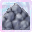

# Earth Blessing

<small>[TR: Nightmares](../../index.md) &rsaquo; [Abilities](../index.md) &rsaquo; [Extra Skills](index.md)</small>

| | |
|---|---|
| **Type** | Extra Skill |
| **ID** | `trnightmare:earth_blessing` |
| **Activation** | Passive |

> Steadfast and unyielding, this blessing reinforces your defense and grants a deep connection to nature’s strength.

## How it works

- Has a continuous (per-tick) effect
- Triggers when you damage a target
- Triggers when you take damage
- Does something when first learned

## Obtaining

- Listed in the `allowedSkills` config option (config/nightmare/ability/skill/nightmare_unique.toml): Permitted Laguna Skills.
- Listed in the `skillTheftBlacklist` config option (config/nightmare/ability/skill/nightmare_ult.toml): Skill IDs that Mammon cannot copy or steal.
- Listed in the `allowedBlessings` config option (config/nightmare/ability/skill/nightmare_ult.toml): Permitted Divine Protection skills for Astraea menus and sub-skill creation.

## Related

- **Related skills:** [Earth Manipulation](../../../tensura-reincarnated/abilities/extra-skills/earth-manipulation.md)

## Tags

`tensura:skills/no_plundering`
