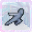

# Wind Evasion

<small>[TR: Nightmares](../../index.md) &rsaquo; [Abilities](../index.md) &rsaquo; [Extra Skills](index.md)</small>

| | |
|---|---|
| **Type** | Extra Skill |
| **ID** | `trnightmare:wind_evasion` |
| **Activation** | Toggle |

> Harnesses wind currents to instinctively avoid attacks. Movement becomes reactive and unpredictable.

## How it works

- Can be toggled on and off
- Triggers when you are attacked
- Triggers when a projectile hits you

## Obtaining

- Listed in the `allowedSkills` config option (config/nightmare/ability/skill/nightmare_unique.toml): Permitted Laguna Skills.
- Listed in the `skillTheftBlacklist` config option (config/nightmare/ability/skill/nightmare_ult.toml): Skill IDs that Mammon cannot copy or steal.
- Listed in the `allowedBlessings` config option (config/nightmare/ability/skill/nightmare_ult.toml): Permitted Divine Protection skills for Astraea menus and sub-skill creation.
