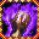

# Calamity Chi

<small>[TR: Nightmares](../../index.md) &rsaquo; [Abilities](../index.md) &rsaquo; [Intrinsic Skills](index.md)</small>

| | |
|---|---|
| **Type** | Intrinsic Skill |
| **ID** | `trnightmare:calamity_chi` |
| **Activation** | Toggle |

> An unstable, catastrophic energy born from destruction and chaos, devastating all in its path.

## How it works

- Can be toggled on and off
- Has a continuous (per-tick) effect
- Triggers when you damage a target

### Attribute changes

| Attribute | Amount | Operation |
|---|---|---|
| attr | bonus | add |

## Stats (config defaults)

Set in [`config/nightmare/ability/skill/nightmare_intrinsic.toml`](../../configs/config-nightmare-ability-skill-nightmare-intrinsic.md).

| Option | Default | Description |
|---|---|---|
| `CalamityChiRelease.attackFromAuraFractionNormal` | 0.01 | Attack bonus from aura fraction when not mastered. |
| `CalamityChiRelease.attackFromAuraFractionMastered` | 0.02 | Attack bonus from aura fraction when mastered. |
| `CalamityChiRelease.auraDrainNormal` | 2 | Aura drain per tick when not mastered. |
| `CalamityChiRelease.auraDrainMastered` | 1 | Aura drain per tick when mastered. |
| `CalamityChiRelease.onDamageHealAuraFractionNormal` | 0.02 | Heal on damage dealt: aura \* this when not mastered. |
| `CalamityChiRelease.onDamageHealAuraFractionMastered` | 0.04 | Heal on damage dealt when mastered. |
| `CalamityChiRelease.masteryTickInterval` | 6 | Mastery tick interval. |
