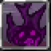

# Hellblaze

<small>[TR: Nightmares](../../index.md) &rsaquo; [Abilities](../index.md) &rsaquo; [Intrinsic Skills](index.md)</small>

| | |
|---|---|
| **Type** | Intrinsic Skill |
| **ID** | `trnightmare:hellblaze` |
| **Modes** | 4 |
| **Activation** | Toggle, Press, Hold |

> Hellblaze is a special Destruction-Class Intrinsic Skill of the Demon Clan.

> [!NOTE]
> **Pack note:** this pack changes the defaults below.
> - `Sunshine.Roar.magiculeCost` is **50** (mod default: 35)
> - `Sunshine.Roar.cooldownTicks` is **100** (mod default: 3)
> - `Sunshine.Sun.magiculeCost` is **80** (mod default: 60)
> - `Sunshine.Sun.cooldownTicks` is **160** (mod default: 5)
> - `Sunshine.FireStorm.magiculeCost` is **100** (mod default: 75)
> - `Sunshine.FireStorm.cooldownTicks` is **200** (mod default: 8)
> - `Sunshine.Spiral.magiculeCost` is **150** (mod default: 110)
> - `Sunshine.Spiral.cooldownTicks` is **800** (mod default: 25)

## Modes

| # | Mode |
|---|---|
| 1 | Ash Dragon |
| 2 | Sky Burner |
| 3 | Flare Burst |
| 4 | Prominence Burst |

## How it works

- Can be toggled on and off
- Activated by pressing the skill key
- Charged or channelled by holding the skill key
- Triggers when you damage a target
- Triggers on melee contact

## Related

- **Effects:** [Black Burn](../../../tensura-reincarnated/effects/black-burn.md)

## Stats (config defaults)

Set in [`config/nightmare/ability/skill/nightmare_intrinsic.toml`](../../configs/config-nightmare-ability-skill-nightmare-intrinsic.md).

| Option | Default | Description |
|---|---|---|
| `Hellblaze.epAcquirement` | 1,000 | EP / magicule obtainment cost to learn Hellblaze. |
| `Hellblaze.toggleOnHitMagiculeCost` | 5 | Magicule cost per black-burn proc while toggled (on hit). |
| `Hellblaze.blackBurnDurationTicks` | 200 | Black burn duration on hit (ticks). |
| `Hellblaze.blackBurnLevel` | 0 | Black burn amplifier when not mastered. |
| `Hellblaze.blackBurnLevelMastered` | 1 | Black burn amplifier when mastered. |
| `Hellblaze.hellFlareLearnThreshold` | 100 | Learn point threshold for Hell Flare mode. |
| `Hellblaze.hellFlareMasteryThreshold` | 200 | Mastery point threshold for Hell Flare. |
| `Hellblaze.hellFlareLearnCooldownTicks` | 10 | Cooldown (ticks) while gaining learn points on Hell Flare. |
| `Hellblaze.hellFlareSpamCooldownTicks` | 1 | Cooldown (ticks) between Hell Flare casts while building mastery. |
| `Hellblaze.limitedHellFlareCooldownTicks` | 2 | Cooldown (ticks) for Limited Hell Flare. |
| `breath.magiculeCost` | 50 | Current MP (magicule) cost to use this mode or segment. |
| `breath.durationTicks` | 0 | Duration in ticks (effects, zones, projectiles) when applicable. |
| `breath.level` | 0 | Effect amplifier level (0 = I) when applicable. |
| `breath.cooldownTicks` | 0 | Cooldown in ticks after this mode activates. |
| `breath.damage` | 10 | Primary damage when this mode deals damage. |
| `breath.damageMastered` | 20 | Damage when mastered; if 0, 'damage' is used for both. |
| `breath.scalar` | 0 | Extra scalar: explosion radius, AoE radius, etc. when applicable. |
| `breath.scalar2` | 0 | Second scalar (e.g. secondary radius) when applicable. |
| `ball.magiculeCost` | 100 | Current MP (magicule) cost to use this mode or segment. |
| `ball.durationTicks` | 0 | Duration in ticks (effects, zones, projectiles) when applicable. |
| `ball.level` | 0 | Effect amplifier level (0 = I) when applicable. |
| `ball.cooldownTicks` | 0 | Cooldown in ticks after this mode activates. |
| `ball.damage` | 50 | Primary damage when this mode deals damage. |
| `ball.damageMastered` | 0 | Damage when mastered; if 0, 'damage' is used for both. |
| `ball.scalar` | 1 | Extra scalar: explosion radius, AoE radius, etc. when applicable. |
| `ball.scalar2` | 0 | Second scalar (e.g. secondary radius) when applicable. |
| `hellFlareArea.magiculeCost` | 0 | Current MP (magicule) cost to use this mode or segment. |
| `hellFlareArea.durationTicks` | 60 | Duration in ticks (effects, zones, projectiles) when applicable. |
| `hellFlareArea.level` | 0 | Effect amplifier level (0 = I) when applicable. |
| `hellFlareArea.cooldownTicks` | 0 | Cooldown in ticks after this mode activates. |
| `hellFlareArea.damage` | 750 | Primary damage when this mode deals damage. |
| `hellFlareArea.damageMastered` | 0 | Damage when mastered; if 0, 'damage' is used for both. |
| `hellFlareArea.scalar` | 15 | Extra scalar: explosion radius, AoE radius, etc. when applicable. |
| `hellFlareArea.scalar2` | 0 | Second scalar (e.g. secondary radius) when applicable. |
| `limitedHellFlare.magiculeCost` | 0 | Current MP (magicule) cost to use this mode or segment. |
| `limitedHellFlare.durationTicks` | 60 | Duration in ticks (effects, zones, projectiles) when applicable. |
| `limitedHellFlare.level` | 0 | Effect amplifier level (0 = I) when applicable. |
| `limitedHellFlare.cooldownTicks` | 0 | Cooldown in ticks after this mode activates. |
| `limitedHellFlare.damage` | 2,500 | Primary damage when this mode deals damage. |
| `limitedHellFlare.damageMastered` | 0 | Damage when mastered; if 0, 'damage' is used for both. |
| `limitedHellFlare.scalar` | 2.5 | Extra scalar: explosion radius, AoE radius, etc. when applicable. |
| `limitedHellFlare.scalar2` | 0 | Second scalar (e.g. secondary radius) when applicable. |
| `hellFlarePlasma.magiculeCost` | 0 | Current MP (magicule) cost to use this mode or segment. |
| `hellFlarePlasma.durationTicks` | 0 | Duration in ticks (effects, zones, projectiles) when applicable. |
| `hellFlarePlasma.level` | 0 | Effect amplifier level (0 = I) when applicable. |
| `hellFlarePlasma.cooldownTicks` | 0 | Cooldown in ticks after this mode activates. |
| `hellFlarePlasma.damage` | 50 | Primary damage when this mode deals damage. |
| `hellFlarePlasma.damageMastered` | 125 | Damage when mastered; if 0, 'damage' is used for both. |
| `hellFlarePlasma.scalar` | 0 | Extra scalar: explosion radius, AoE radius, etc. when applicable. |
| `hellFlarePlasma.scalar2` | 0 | Second scalar (e.g. secondary radius) when applicable. |

Set in [`config/nightmare/ability/skill/nightmare_unique.toml`](../../configs/config-nightmare-ability-skill-nightmare-unique.md).

| Option | Default | This pack | Description |
|---|---|---|---|
| `Roar.magiculeCost` | 35 | 50 | Current MP (magicule) cost to use this mode or segment. |
| `Roar.durationTicks` | 0 | | Duration in ticks (effects, zones, projectiles) when applicable. |
| `Roar.level` | 0 | | Effect amplifier level (0 = I) when applicable. |
| `Roar.cooldownTicks` | 3 | 100 | Cooldown in ticks after this mode activates. |
| `Roar.damage` | 20 | | Primary damage when this mode deals damage. |
| `Roar.damageMastered` | 0 | | Damage when mastered; if 0, 'damage' is used for both. |
| `Roar.scalar` | 2 | | Extra scalar: explosion radius, AoE radius, etc. when applicable. |
| `Roar.scalar2` | 0 | | Second scalar (e.g. secondary radius) when applicable. |
| `Sun.magiculeCost` | 60 | 80 | Current MP (magicule) cost to use this mode or segment. |
| `Sun.durationTicks` | 0 | | Duration in ticks (effects, zones, projectiles) when applicable. |
| `Sun.level` | 0 | | Effect amplifier level (0 = I) when applicable. |
| `Sun.cooldownTicks` | 5 | 160 | Cooldown in ticks after this mode activates. |
| `Sun.damage` | 40 | | Primary damage when this mode deals damage. |
| `Sun.damageMastered` | 0 | | Damage when mastered; if 0, 'damage' is used for both. |
| `Sun.scalar` | 5 | | Extra scalar: explosion radius, AoE radius, etc. when applicable. |
| `Sun.scalar2` | 0 | | Second scalar (e.g. secondary radius) when applicable. |
| `FireStorm.magiculeCost` | 75 | 100 | Current MP (magicule) cost to use this mode or segment. |
| `FireStorm.durationTicks` | 200 | | Duration in ticks (effects, zones, projectiles) when applicable. |
| `FireStorm.level` | 0 | | Effect amplifier level (0 = I) when applicable. |
| `FireStorm.cooldownTicks` | 8 | 200 | Cooldown in ticks after this mode activates. |
| `FireStorm.damage` | 20 | | Primary damage when this mode deals damage. |
| `FireStorm.damageMastered` | 0 | | Damage when mastered; if 0, 'damage' is used for both. |
| `FireStorm.scalar` | 6 | | Extra scalar: explosion radius, AoE radius, etc. when applicable. |
| `FireStorm.scalar2` | 8 | | Second scalar (e.g. secondary radius) when applicable. |
| `Spiral.magiculeCost` | 110 | 150 | Current MP (magicule) cost to use this mode or segment. |
| `Spiral.durationTicks` | 0 | | Duration in ticks (effects, zones, projectiles) when applicable. |
| `Spiral.level` | 0 | | Effect amplifier level (0 = I) when applicable. |
| `Spiral.cooldownTicks` | 25 | 800 | Cooldown in ticks after this mode activates. |
| `Spiral.damage` | 200 | | Primary damage when this mode deals damage. |
| `Spiral.damageMastered` | 0 | | Damage when mastered; if 0, 'damage' is used for both. |
| `Spiral.scalar` | 4.5 | | Extra scalar: explosion radius, AoE radius, etc. when applicable. |
| `Spiral.scalar2` | 0 | | Second scalar (e.g. secondary radius) when applicable. |
