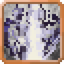
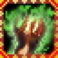
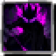

# Intrinsic Skills

<small>[TR: Nightmares](../../index.md) &rsaquo; [Abilities](../index.md)</small>

Skills that come with a race.

| | Ability | Description |
|---|---|---|
|  | [Aquatic Regeneration](aquatic-regeneration.md) | An intrinsic skill that rapidly restores health while in or near water. |
|  | [Assault Mode](assault-mode.md) | Assault Mode is an native power to the Royals of the Demon Clan that allow them to thrive in combat, This ability releases their surpressed Demonic Power in... |
|  | [Avalon](avalon.md) | Blessed by the Fae, you often avoid getting hit by attacks |
|  | [Beast Domination](beast-domination.md) | Dominate your beastly clones and empower them with inspiration while this skill remains active. |
|  | [Beast Unification](beast-unification.md) | Summon and command your beastly tails, then unite or recall them as needed. |
|  | [Black Flame Thunder](black-flame-thunder.md) | Black Flame Thunder is the fused skill of Black Flame's Coating applied with the properties of Black Lightning to produce a greater Offensive Threat. |
|  | [Calamity Chi](calamity-chi.md) | An unstable, catastrophic energy born from destruction and chaos, devastating all in its path. |
|  | [Choas Strikes](chaos-strikes.md) | Your attacks are chaotic infused |
|  | [CNPC Lock](lock2.md) | This is a modified version of the Lock Skill for CNPCs. |
|  | [Conceptual Existence](conceptual-existence.md) | A Body Double-line intrinsic that borrows weaker bodies, binds itself to player hosts, studies their skills, and channels energy into them. |
|  | [Dark Chi](dark-chi.md) | A corrupted force that empowers curses, decay, and soul erosion. |
|  | [Dark Magic Release](dark-magic-release.md) | An intrinsic release skill that unlocks and amplifies dark-element spell output. |
|  | [Demonic Power](demonic-power.md) | Darken my soul, for it is power I crave. |
|  | [Divine Wisdom Core](divine-wisdom-core.md) | A Manas core that can unite with weaker bodies, manage its host, loan skills, and still awaken deeper ego routes. |
|  | [Dragon Factor Haki](dragon-factor-haki.md) | An elemental draconic haki. Toggle Elemental Boon for damage, keep it in-slot for Elemental Guard, and hold it to release Dragon Haki. Gain an element on... |
|  | [Dragon's Possession](dragon-possession.md) | Take control of a target's body while preserving your own physical statistics and core identity. |
|  | [Eye Of Balor](magical-eye.md) | The Magical Eye is a specialized magical ability that allows one to see the rhythm of ones soul. |
|  | [Fire Dragon Armor](fire-dragon-armor.md) | An intrinsic armor skill that cloaks the user in blazing draconic protection. |
|  | [Fire Ki Release](fire-ki-release.md) | An intrinsic release skill that channels fire-aligned ki for explosive attacks. |
|  | [Giant Dance](giant-dance.md) | An intrinsic giant-line skill that increases rhythm-based mobility and combat flow. |
|  | [Goddess hIncarnation](goddess-incarnation.md) | An intrinsic skill that manifests divine traits and sacred power within the user. |
|  | [Heavy METAL!](heavy-metal.md) | An intrinsic skill that hardens the body and massively increases physical durability. |
|  | [Hellblaze](hellblaze.md) | Hellblaze is a special Destruction-Class Intrinsic Skill of the Demon Clan. |
|  | [Hidden Void](hidden-void.md) | Wrap yourself in a blanket of void to hide |
|  | [Holy Magic Release](holy-magic-release.md) | An intrinsic release skill that unlocks and strengthens holy magic output. |
|  | [Ideal](ideal.md) | After refining your craft for so long, you have finally reached an ideal, your attacks will always land. |
|  | [Lock](lock.md) | This skill prevents your skills from being taken via Skill Plundering. |
|  | [Material Creation](material-creation.md) | Daemon intrinsic — Understanding researches EMC-valued matter into transmutation knowledge; Transmutation opens the transmutation table. EMC values are prices... |
|  | [Poison Dragon Armor](poison-dragon-armor.md) | An intrinsic armor skill that coats the user in toxic draconic defenses. |
|  | [Poison Ki Release](poison-ki-release.md) | An intrinsic release skill that channels venomous ki into attacks. |
|  | [Restoration](magic-regeneration.md) | Calm thou self. Center thou soul. The rhythm of the sea and sky shall become synchronized. |
|  | [Saint Chi](saint-chi.md) | An intrinsic chi-release skill that invokes sanctified martial energy. |
|  | [Size Condense](size-condense.md) | An intrinsic Giant Clan and Dragon Race skill that condenses the user's body to a smaller combat form. |
|  | [Spirit Dragon Haki](axolotl-haki.md) | An intrinsic combat aura skill of the axolotl line that reinforces offense and defense. |
|  | [Steel Dragon Armor](steel-dragon-armor.md) | Summons an armor forged from the essence of a steel dragon, drastically enhancing durability and turning the user into a walking fortress. |
|  | [Steel Ki Release](steel-ki-release.md) | Unleashes concentrated metallic Ki throughout the body, hardening muscles and boosting offensive and defensive power with unbreakable resolve. |
|  | [Water Dragon Armor](water-dragon-armor.md) | An intrinsic armor skill that surrounds the user with fluid draconic protection. |
|  | [Water Ki Release](water-ki-release.md) | An intrinsic release skill that channels water-aligned ki for adaptive combat. |
