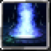

# Restoration

<small>[TR: Nightmares](../../index.md) &rsaquo; [Abilities](../index.md) &rsaquo; [Intrinsic Skills](index.md)</small>

| | |
|---|---|
| **Type** | Intrinsic Skill |
| **ID** | `trnightmare:magic_regeneration` |
| **Activation** | Press |

> Calm thou self. Center thou soul. The rhythm of the sea and sky shall become synchronized.

## How it works

- Activated by pressing the skill key

## Related

- **Summons / entities:** Tensura

## Stats (config defaults)

Set in [`config/nightmare/ability/skill/nightmare_intrinsic.toml`](../../configs/config-nightmare-ability-skill-nightmare-intrinsic.md).

| Option | Default | Description |
|---|---|---|
| `MagicRegeneration.epAcquirement` | 30 | Learning cost. |
| `MagicRegeneration.meetEpThreshold` | 20,000 | Minimum EP for requirement. |
| `MagicRegeneration.regenAmount` | 10,000,000 | Magicule restored when not mastered. |
| `MagicRegeneration.regenAmountMastered` | 500,000,000 | Magicule restored when mastered. |
| `MagicRegeneration.cooldownTicks` | 1,800 | Cooldown (ticks) after use. |
