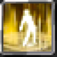

# Steel Dragon Armor

<small>[TR: Nightmares](../../index.md) &rsaquo; [Abilities](../index.md) &rsaquo; [Intrinsic Skills](index.md)</small>

| | |
|---|---|
| **Type** | Intrinsic Skill |
| **ID** | `trnightmare:steel_dragon_armor` |
| **Activation** | Toggle |

> Summons an armor forged from the essence of a steel dragon, drastically enhancing durability and turning the user into a walking fortress.

## How it works

- Can be toggled on and off
- Has a continuous (per-tick) effect

### Attribute changes

| Attribute | Amount | Operation |
|---|---|---|
| armor | ulate armor | add |
| toughness | ulate toughness | add |

## Obtaining

- Listed in the `intrinsicSkills` config option (config/nightmare/race/axolotl/axolotl_config.toml): List of skills obtained by this race.

## Stats (config defaults)

Set in [`config/nightmare/ability/skill/nightmare_intrinsic.toml`](../../configs/config-nightmare-ability-skill-nightmare-intrinsic.md).

| Option | Default | Description |
|---|---|---|
| `SteelDragonArmor.armorNormal` | 50 | Armor bonus when not mastered. |
| `SteelDragonArmor.armorMastered` | 100 | Armor bonus when mastered. |
| `SteelDragonArmor.toughnessNormal` | 8 | Toughness when not mastered. |
| `SteelDragonArmor.toughnessMastered` | 16 | Toughness when mastered. |
| `SteelDragonArmor.masteryTickInterval` | 10 | Mastery tick interval while toggled. |
