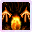
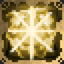
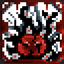

# Ultimate Skills

<small>[TR: Nightmares](../../index.md) &rsaquo; [Abilities](../index.md)</small>

The most powerful tier of skills. Many are one-of-a-kind and evolve from Unique skills.

| | Ability | Description |
|---|---|---|
|  | [Acnologia Lord Of Ancient Times](acnologia-lord-of-ancient-times.md) |  |
|  | [Azrael, Lord of Salvation](azrael.md) | A saving authority that turns mercy into execution, sanctifies the hunted, and shields its bearer behind quiet absolution. |
|  | [Death God](death-god.md) | A legacy ultimate-adjacent skill representing authority over deathly principles. |
|  | [Envy Manas](envy-manas.md) |  |
|  | [Gilgamesh King Of Uruk](gilgamesh-king-of-uruk.md) |  |
|  | [Gilgamesh Lord Of Treasures](gilgamesh-lord-of-treasures.md) |  |
|  | [Gluttony Manas](gluttony-manas.md) |  |
|  | [Greedy Manas](greedy-manas.md) |  |
|  | [Hive King](hive-king.md) |  |
|  | [Hopeful Manas](hopeful-manas.md) |  |
|  | [Joyful Manas](joyful-manas.md) |  |
|  | [Justice Manas](justice-manas.md) |  |
|  | [Lust Manas](lust-manas.md) |  |
|  | [Nun Manas](nun-manas.md) |  |
|  | [Paladin Manas](paladin-manas.md) |  |
|  | [Patient Manas](patient-manas.md) |  |
|  | [Phoenix](phoenix.md) | A unique skill centered on rebirth, resilience, and restorative flame. |
|  | [Phoenix Next](phoenix-next.md) | A legacy skill representing the next-stage awakening of phoenix authority. |
|  | [Pride Manas](pride-manas.md) |  |
|  | [Raziel, Lord of Secrets](raziel.md) | A hidden authority that erases names, seals secrets, and turns forbidden knowledge into veiled dominion. |
|  | [Secretive Manas](secretive-manas.md) | Raziel's awakened ego, weaving sacrificed skills into memorial submodes while stripping named manas of their identity. |
|  | [Sloth Manas](sloth-manas.md) |  |
|  | [Sword Saint](sword-saint.md) | A unique skill that refines sword mastery to saint-level precision. |
|  | [Ultimate Arroganz](ultimate-arroganz.md) | Powerful toolkit for Arroganz-related skill creation, duplication and storage. |
|  | [Wise Manas](wise-manas.md) |  |
|  | [Wrath Manas](wrath-manas.md) |  |
|  | [｢ Abaddon, King of Destruction ｣](abaddon.md) | A King-class ultimate skill that embodies total destruction and catastrophic force. |
|  | [｢ Agni, Lord of Blaze ｣](agni.md) | Ultimate blaze charity — Flame Authority, Blast Blow, Blazeball, Maximum Blazeball, and Blaze Wave. |
|  | [｢ Akashic Records, God of Origin ｣](akashic-records.md) | A God-class ultimate skill tied to the origin of knowledge and universal records. |
|  | [｢ Alternative, Proxy Rights ｣](alternative.md) | Proxy rights granted under Michael. Seven modes of absolute superiority. |
|  | [｢ Amaterasu, Lord of Shimmering Flames ｣](amaterasu.md) | Fine mastery over mixing Light, heat, and energy in all forms into every movement, accelerating to light speed. |
|  | [｢ Amatsumara, Lord of Crafts ｣](amatsumara.md) | Ultimate craftsmanship. Requires mastered Godly Craftsman, Law Manipulation, and 100 unique item types engraved through Godly Craftsman. In-slot Precision... |
|  | [｢ Artist, Authentic Writer ｣](artist.md) | The ultimate evolution of Imitator. Act any target including ultimates, battlewills, and magics. Imprint disguise onto stage crew. Open the Gallery to acquire... |
|  | [｢ Asmodeus, Lord of Lust ｣](asmodeus.md) | Asmodeus, Lord Of Lust is a powerful Ultimate Skill capable of bending the rules of Life and Death |
|  | [｢ Astaroth, King of Fallen ｣](astaroth.md) | A King-class ultimate skill associated with fallen authority and corrupt dominion. |
|  | [｢ Astarte, Lord of Heaven ｣](astarte.md) | An ultimate skill that governs heavenly authority and divine administration. |
|  | [｢ Astraea, Lord of Gifts ｣](astraea.md) | The full unfettered potential of the Sword Saint's bloodline, descendant from the first Von Astraea |
|  | [｢ Astral Light, Lord of Creation ｣](astral-light.md) | An ultimate skill of creation-based light and celestial manifestation. |
|  | [｢ Azathoth, God of The Void ｣](azathoth.md) | God-class void sovereign. Commands imaginary space, void predation, multidimensional barriers, True Dragon nucleation, and nihility. |
|  | [｢ Azazel, Lord of Temptation ｣](azazel.md) | Ultimate temptation — Tempt Control, All of Creation, Solicitation, Charm Domination, Severed Realm, and collapse arts. |
|  | [｢ Beelzebub, Lord of Gourmet ｣](beelzebub.md) | Devour all in your path — corrosion, spatial storage, food chain, chaos control, and gourmet mist. |
|  | [｢ Beelzebuth, Lord of Gluttony ｣](beelzebuth.md) | Beelzebuth, Lord of Gluttony is the ultimate evolved Skill of Gluttony. Devour all in your path |
|  | [｢ Belial, Lord of The Dead ｣](belial.md) | Ultimate underworld flame: All of Creation, spacetime, soul bank, nihilistic world, white flare, and nihility. |
|  | [｢ Belphegor, Lord of Sloth ｣](belphegor.md) | An ultimate skill tied to slothful control, suppression, and overwhelming lethargy. |
|  | [｢ Cthugha, King of Divine Flame ｣](cthugha.md) | Ultimate flame charity — Spacetime Manipulation, stronger Amplification, Encore, Stockpile, Parallel Existence, Cardinal Acceleration, Multidimensional... |
|  | [｢ Cthulhu, King of Divine Ice ｣](cthulhu.md) | Fusion of Gabriel and Leviathan. Serpent's Jealousy siphons magicule on hit while in-slot; toggle Envious Fortune for luck and effect purge. Command ice,... |
|  | [｢ Faust, Lord of Investigation ｣](faust.md) | Curiosity has always been your strong suit, learning came easy, and teaching just as much. You find yourself able to see and touch the information of the... |
|  | [｢ Gabriel, Lord of Patience ｣](gabriel.md) | Ultimate fixation and stillness. Status Quo prevents max health reduction; toggle Render Stillness to walk on liquids. Command time, unleash Heat Death,... |
|  | [｢ Galatine, Sword of the Sun ｣](galatine.md) | An Ultimate Enchantment granted by the world for true heroism. Its power waxes and wanes with the sun — Pinnacle of Creation, Sun Cleaver, Cruel Sun, Solar... |
|  | [｢ Gilgamesh, God of Myth ｣](gilgamesh-god-of-myth.md) | Parallel law. Infinite storehouse. Judgment without equal. |
|  | [｢ Grimoire, Book of Magic ｣](grimoire.md) | Grimoire is the Book of Magic, an Ultimate Gift which allows one the access to truly master all of Magic |
|  | [｢ Hamiel, King of Splendour ｣](hamiel.md) | Your journey for glory is over... You have succeeded. While all that you hurt, only receives half, so shall you. |
|  | [｢ Haniel, Lord of Glory ｣](haniel.md) | The Great Archangel of health blesses you with energy, you may not be able to fight, but you shall take no damage regardless. |
|  | [｢ Hastur, Lord of Starwind ｣](hastur.md) | Ultimate authority over wind, sound, and star tempest. Toggle Thought Acceleration; sonic/wind domination while slotted; turbulence black wind; Uriel-style... |
|  | [｢ Leviathan, Lord of Envy ｣](leviathan.md) | Leviathan, Lord Of Envy is capable of absorbing the strength of all enemies, stealing their power to enhance itself, crippling foes with devastating effects,... |
|  | [｢ Lilith, Lord of Heresy ｣](lilith.md) | An ultimate heresy authority that turns barrier points into a battlefield-shaping domain of reflection, restoration, and inverted defense. |
|  | [｢ Livyatan, Lord of Floods ｣](livyatan.md) | An ultimate flood authority that warps the battlefield with water, clones, weather, and oppressive suppression. |
|  | [｢ Lucifer, Lord of Pride ｣](lucifer.md) | Lucifer, Lord Of Pride is capable of perfectly anything, with the ability of any skill that the user is able to see and then analyze. This is known as Perfect... |
|  | [｢ Mammon, Lord of Greed ｣](mammon.md) | Mammon, Lord of Greed is the ultimate evolved Skill of Greed. This powerful skill is capable of stealing even the Life from its victims. This is truly the... |
|  | [｢ Metatron, Lord of Purity ｣](metatron.md) | The Domination of Pure Energy, Separation of Concepts, and the Prevention of Interference. |
|  | [｢ Michael, Lord of Justice ｣](michael.md) | Ascend the Heavenly Throne. Erase chaos, dominate minds, and execute absolute justice. You alone control the circuits, you alone are to be God! Isn't that... |
|  | [｢ Mood Maker, Lord of Psychology ｣](mood-maker.md) | Manipulate the moods and fate of yourself and others — twist luck, defy death, and amplify your spirit. |
|  | [｢ Necronomicon, Book of Magic ｣](necronomicon.md) | The Necronomicon is a forbidden tome of godlike duality and psychic ruin. The final evolution of Holy Demonic Inversion. |
|  | [｢ Nodens, God of Abyss ｣](nodens.md) | Born from the collapse of Pride, forged in the void between soul and thought, Nodens is the incarnation of pure abyssal thought. This God-Class Ultimate Skill... |
|  | [｢ Nyarlathotep, King of Chaos ｣](nyarlathotep.md) | When you control the chances of anything happening, nothing goes without your say, but no one can predict what that say is. |
|  | [｢ Pazuzu, Lord of Mischief ｣](pazuzu.md) | The ultimate evolution of Deal Maker — forge contracts that bind even ultimates, crystallize skills, and enter the minds of those bound to you. |
|  | [｢ Raguel, Lord of Charity ｣](raguel.md) | Ultimate charity — upgraded Encore and Stockpile, Parallel Existence, optional Cardinal Acceleration, and Amplification with Thought Acceleration... |
|  | [｢ Raphael, Lord of Knowledge ｣](raphael-knowledge.md) | The awakened pinnacle of cognition: infinite analysis, imitation, synthesis of skills, communion with Raphael's psyche, alteration of destinies, and absolute... |
|  | [｢ Raphael, Lord of Wisdom ｣](raphael-wisdom.md) | The evolved Raphael. Knowledge converges into wisdom: enhanced synthesis, advanced refinement, protected cognition, and complete tactical execution through... |
|  | [｢ Samael, Lord of Deadly Poison ｣](samael.md) | The ultimate evolution of Deadly Poison — Death World, nihility, and absolute barrier control. |
|  | [｢ Sandalphon, Lord of Judgement ｣](sandalphon-judgment.md) | Ultimate executioner. Toggle for silent movement; slot Remove, Dispel, Eraser, Necrosis, and Judgement in-slot actives. |
|  | [｢ Sandalphon, Lord of Punishment ｣](sandalphon-punishment.md) | Ascended Sandalphon — adds existence concealment and the Sure Hit of Assassination. |
|  | [｢ Sariel, Lord of Hope ｣](sariel.md) | Ultimate of Unyielding — hope, backup, fortitude, and life domination. |
|  | [｢ Satanael, Lord of Wrath ｣](satanael.md) | Unleash absolute chaos through controlled destruction. Manipulate your output, ignite your reactor, and push Rampage beyond its limits. |
|  | [｢ Shub-Niggurath, King of Harvest ｣](shub-niggurath.md) | Harvest of every skill you have owned. Store memories, recreate lost arts, craft new ones, duplicate mastered creations, and gift analyzed skills to allies. |
|  | [｢ Surya, King of Brillance ｣](surya.md) | The absolute authority of Holy magic, Spiritron particles, Separation of Laws, and Dictation of Interference. |
|  | [｢ Susanoo, Lord of Tyranny ｣](susanoo.md) | The evolved form of Chaotic Fate. Manipulate destiny, distort dimensions, and counter all harm. |
|  | [｢ Tantalous, King of Evil ｣](tantalus.md) |  |
|  | [｢ Tenebrosum, God of Souls ｣](tenebrosum.md) | Soul dominion over death and transference. In-slot attacks gain spiritual bonus from souls. Toggle Soul Shield to consume souls on fatal damage. Hold Soul... |
|  | [｢ True Hero, King of Champions ｣](true-hero.md) | Ultimate evolution of Chosen One. Toggle the skill on to gather fallen subordinates as Memories in the Banner of the Supreme King. While in your ability slot,... |
|  | [｢ Tsukiyomi, Lord of Moonshadow ｣](tsukiyomi.md) | Striking out from the unknown has always been one of your talents, and now even the laws of the world itself find it hard to see your attacks from the dark... |
|  | [｢ Uriel, Lord of Oaths ｣](uriel-lord-of-oath.md) | Altered covenant authority over prison, barrier, cleansing and law degradation. |
|  | [｢ Uriel, Lord of Vows ｣](uriel-lord-of-vow.md) | True Uriel awakened from Infinity Prison. It grants believer scaling, absolute guard, imprisoning authority, severing force, and a bound Imaginary Space that... |
|  | [｢ Veldora, Lord of Storms ｣](veldora-lord-of-storms.md) | True Dragon of Storms. Storm-type magic while in slot. Hold to summon Veldora's human form. |
|  | [｢ Velgaia, Lord of Earth-Star ｣](velgaia-lord-of-earth.md) | True Dragon of Earth. Earth-type magic while in slot. Human summon Coming Soon — use Pseudo Dragon Body for dragon form. |
|  | [｢ Velgrynd, Lord of Scorch ｣](velgrynd-lord-of-scorch.md) | True Dragon of Scorch. Scorch-type magic while in slot. Hold to summon Velgrynd's human form. |
|  | [｢ Velzard, Lord of Frost ｣](velzard-lord-of-frost.md) | True Dragon of Frost. Frost-type magic while in slot. Hold to summon Velzard's human form. |
|  | [｢ Yog-Sothoth, Lord of Space-Time ｣](yog-sothoth.md) | Ultimate spacetime lord — coating, usurpation, prison, and time itself. |
|  | [｢ Yog-Sotohort, God of Space-Time ｣](yog-sotohort.md) | The ultimate master of space and time — usurp, sever, imprison, stop time, and empower allies. |
|  | [｢ Zehirete, God of Faith ｣](zehirete.md) | Astraea's final holy evolution. Complete the heroic tasks to awaken faith itself and command divine blessings through spiritrons. |
