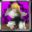

# Coffin of Darkness

<small>[TR: Nightmares](../../index.md) &rsaquo; [Abilities](../index.md) &rsaquo; [Unique Skills](index.md)</small>

| | |
|---|---|
| **Type** | Unique Skill |
| **ID** | `trnightmare:coffin_of_darkness` |
| **Modes** | 4 |
| **Cooldowns (s)** | 1,600, 60 |
| **Activation** | Hold |

> Coffin of Darkness is a terrifyingly powerful Enchantment-Type Unique Skill that draws from the darkest knowledge of the Demon Clan. Its abilities are so dangerous and overwhelming that even high-ranking Goddess-Clan and Demon-Clan consider it forbidden and unstable.

## Modes

| # | Mode |
|---|---|
| 1 | Full Counter! |
| 2 | Dark Prominence! |
| 3 | Divine Slayer! |
| 4 | Mode 4 |

## Costs

| When | Magicule (MP) | Aura (AP) |
|---|---|---|
| Full Counter! | 50,000 |  |
| Divine Slayer! | 5,000 |  |
| other modes | *set by config (base cost)* |  |

## How it works

- Charged or channelled by holding the skill key
- Triggers when the held key is released
- Triggers when you damage a target
- Triggers on melee contact
- Triggers when you are attacked
- Triggers when a projectile hits you
- Triggers when you die
- Does something when mastered

### Attribute changes

| Attribute | Amount | Operation |
|---|---|---|
| Movement Speed | -1 | multiply total |
| Attack Damage | -1 | multiply total |
| Attack Speed | -1 | multiply total |
| Jump Strength | -1 | multiply total |
| Entity Interaction Range | -1 | multiply total |
| Block Interaction Range | -1 | multiply total |
| Swim Speed | -1 | multiply total |

## Obtaining

- Listed in the `astralExtraUniqueSkills` config option (config/nightmare/ability/skill/nightmare_ult.toml): Extra unique skill IDs merged into Astral Light Skill Creation (after Tensura Creator).

## Related

- **Related skills:** [Black Flame](../../../tensura-reincarnated/abilities/extra-skills/black-flame.md)
- **Effects:** [Assault Moded](../../effects/assault-moded.md), [Demon Burned](../../effects/demon-burned.md)

## Stats (config defaults)

Set in [`config/nightmare/ability/skill/nightmare_unique.toml`](../../configs/config-nightmare-ability-skill-nightmare-unique.md).

| Option | Default | Description |
|---|---|---|
| `CoffinOfDarkness.mpAcquirement` | 100,000 | Magicule Acquirement Cost. |
| `CoffinOfDarkness.magiculeCostCounter` | 50,000 | Magicule Cost to activate Full Counter. |
| `CoffinOfDarkness.magiculeCostSlayer` | 5,000 | Magicule Cost to activate Divine Slater. |
| `CoffinOfDarkness.counterCooldown` | 5 | Cooldown for activating Full Counter. |
| `CoffinOfDarkness.slayerCooldown` | 60 | Cooldown for activating Divine Slayer. |
| `CoffinOfDarkness.assaultCooldown` | 1,200 | Cooldown for reviving with Assault Mode. |
| `CoffinOfDarkness.assaultDuration` | 400 | Duration of Assault Mode after revival. |
| `CoffinOfDarkness.reflectMultiplierUnmastered` | 2 | Damage multiplier on reflected attacks when not mastered. |
| `CoffinOfDarkness.reflectMultiplierMastered` | 4 | Damage multiplier on reflected attacks when mastered. |
