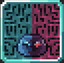

# Devil Host

<small>[TR: Nightmares](../../index.md) &rsaquo; [Abilities](../index.md) &rsaquo; [Unique Skills](index.md)</small>

| | |
|---|---|
| **Type** | Unique Skill |
| **ID** | `trnightmare:devil_host` |
| **Modes** | 4 |
| **Acquisition cost (MP)** | 30,000 |
| **Activation** | Toggle, Press, Hold |

> A placeholder skill for tracking and managing deals as a devil.

## Modes

| # | Mode |
|---|---|
| 1 | Offering |
| 2 | Storage |
| 3 | Borrow |
| 4 | End Deal |

## Costs

| When | Magicule (MP) | Aura (AP) |
|---|---|---|
| Always | 200 |  |

## How it works

- Can be toggled on and off
- Activated by pressing the skill key
- Charged or channelled by holding the skill key
- Triggers when the held key is released
- Has a continuous (per-tick) effect
- Triggers when you are attacked
- Triggers when you die
- Triggers when you respawn

## Obtaining

- Listed in the `skillTheftBlacklist` config option (config/nightmare/ability/skill/nightmare_ult.toml): Skill IDs that Mammon cannot copy or steal.

## Stats (config defaults)

Set in [`config/nightmare/ability/skill/nightmare_unique.toml`](../../configs/config-nightmare-ability-skill-nightmare-unique.md).

| Option | Default | Description |
|---|---|---|
| `devilHost.mpAcquirement` | 30,000 | Magicule cost to acquire Devil Host. |
| `devilHost.magiculeCost` | 200 | Magicule cost to activate. |
| `devilHost.cooldown` | 10 | Cooldown in seconds after activation. |
| `devilHost.endDealHoldTicks` | 1,200 | Ticks required to hold the skill to end a deal (20 ticks = 1 second). |

## In-game messages

Show 8 messages

- You have no active offerings.
- You have no stored deals.
- Hold the skill for 60 seconds to end deal %s...
- Cancelled ending deal.
- Deal ended successfully!
- You cannot end this deal (opt-out not permitted).
- Devil Host has been revoked — you have no active deals.
- Devil Host No Borrows

