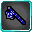

# Handler

<small>[TR: Nightmares](../../index.md) &rsaquo; [Abilities](../index.md) &rsaquo; [Unique Skills](index.md)</small>

| | |
|---|---|
| **Type** | Unique Skill |
| **ID** | `trnightmare:handler` |
| **Modes** | 2 |
| **Cooldowns (s)** | 30 |
| **Activation** | Press |

> You seem to have awakened a tinker skill for your efforts in engineering and technology, handler hmm I wonder what you can optimize.

## Modes

| # | Mode |
|---|---|
| 1 | Skill Optimization |
| 2 | Optimize Attributes |

## Costs

| When | Magicule (MP) | Aura (AP) |
|---|---|---|
| Always | 2,000 or 100 |  |

## How it works

- Activated by pressing the skill key
- Triggers when you die

## Stats (config defaults)

Set in [`config/nightmare/ability/skill/nightmare_unique.toml`](../../configs/config-nightmare-ability-skill-nightmare-unique.md).

| Option | Default | Description |
|---|---|---|
| `Handler.mpAcquirement` | 75,000 | Magicule Acquirement Cost. |
| `Handler.magiculeAttributes` | 100 | Magicule Cost to upgrade attributes. |
| `Handler.magiculeCostUpgrade` | 2,000 | Magicule Cost to upgrade a skill. |
| `Handler.attributeCooldown` | 30 | Cooldown for upgrading attributes. |
| `Handler.upgradeCooldown` | 120 | Cooldown for upgrading a skill mode. |
| `Handler.attributeMultiplier` | 0.5 | Multiplier buff applied to base attributes (0.5 is 1.5x base, 1.5 is 2.5x base). |
| `Handler.allowedSkills` | "tensura:cook", "trnightmare:concentrator", "trnightmare:ideal", "trnightmare:avalon", "tensura:gravity_field", "tensura:water_blade", "tensura:hero_haki" | List of skills Handler is allowed to upgrade. (is every skill it can by default) |
| `Handler.masteryGainMultiplier` | 2 | Mastery gained per skill altered. |
