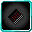

# Lemegeton

<small>[TR: Nightmares](../../index.md) &rsaquo; [Abilities](../index.md) &rsaquo; [Unique Skills](index.md)</small>

| | |
|---|---|
| **Type** | Unique Skill |
| **ID** | `trnightmare:lemegeton` |
| **Modes** | 3 |
| **Cooldowns (s)** | max(0 (cool down), cancel duration) |
| **Activation** | Toggle, Press, Hold |

> The Book of Solomon, also called the Ars Goetia or Lesser Key Grimoire. I am sure you will succeed, now, STUDY.

## Modes

| # | Mode |
|---|---|
| 1 | Demon Seal |
| 2 | Key's Defense |
| 3 | Cancel |

## Costs

| When | Magicule (MP) | Aura (AP) |
|---|---|---|
| Always | *set by config (magicule cost seal)* |  |
| Always | *set by config (magicule start cost key)* |  |
| Always | *set by config (magicule cost cancel)* |  |
| Always | 50 |  |

## How it works

- Can be toggled on and off
- Activated by pressing the skill key
- Charged or channelled by holding the skill key
- Triggers when the held key is released
- Triggers when you damage a target
- Triggers when you are attacked
- Triggers when you take damage
- Does something when first learned

### Attribute changes

| Attribute | Amount | Operation |
|---|---|---|
| Movement Speed | -0.5 | multiply total |

## Related

- **Related skills:** [Concentrator](../extra-skills/concentrator.md)

## Stats (config defaults)

Set in [`config/nightmare/ability/skill/nightmare_unique.toml`](../../configs/config-nightmare-ability-skill-nightmare-unique.md).

| Option | Default | Description |
|---|---|---|
| `Lemegeton.mpAcquirement` | 35,000 | Magicule Acquirement Cost. |
| `Lemegeton.magiculeCostSeal` | 50,000 | Magicule Cost to activate Demon Seal. |
| `Lemegeton.magiculeStartCostKey` | 5,000 | Magicule Cost to activate Key's Defense. |
| `Lemegeton.magiculeCostCancel` | 5,000 | Magicule Cost to activate Magic Cancel. |
| `Lemegeton.magiculeCostKey` | 50 | Magicule Cost multiplier for Key's Defense (eg, 50 magicule for 1 damage). |
| `Lemegeton.sealCooldown` | 300 | Cooldown for activating Demon Seal. |
| `Lemegeton.keyCooldown` | 0 | Cooldown for activating Key's Defense. |
| `Lemegeton.cancelCooldown` | 60 | Cooldown for activating Magic Cancel. |
| `Lemegeton.cancelDuration` | 300 | Duration of cooldown inflicted by Magic Cancel. |
| `Lemegeton.sealMobPercentage` | 80 | What percentage of the user's EP must be greater than the targeted mob for Demon Seal. |
| `Lemegeton.sealPlayerPercentage` | 40 | What percentage of the user's EP must be greater than the targeted player for Demon Seal. |
| `Lemegeton.damageMultiplier` | 2 | How much are Magic and Holy damage multiplied by the toggle. |
| `Lemegeton.learningPoint` | 1,000 | Learning point boost for spells |
| `Lemegeton.masteryPoint` | 1,000 | Mastery point gain for Spells |
