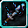

# Robotnic

<small>[TR: Nightmares](../../index.md) &rsaquo; [Abilities](../index.md) &rsaquo; [Unique Skills](index.md)</small>

| | |
|---|---|
| **Type** | Unique Skill |
| **ID** | `trnightmare:robotnic` |
| **Modes** | 2 |
| **Cooldowns (s)** | 30 |
| **Activation** | Press |

> A skill specializing in reverse engineering and robotics. It seems an ego is budding.

## Modes

| # | Mode |
|---|---|
| 1 | Deconstruct: Item |
| 2 | Deconstruct: Data |

## Costs

| When | Magicule (MP) | Aura (AP) |
|---|---|---|
| Always | 0 |  |

## How it works

- Activated by pressing the skill key

## Related

- **Related skills:** [Divine Wisdom Core](../intrinsic-skills/divine-wisdom-core.md)
- **Items:** [Spatial Blade](../../../tensura-reincarnated/items/weapons/spatial-blade.md), [Blade of The End](../../items/weapons/ending-sealed-sword.md), [Blade of The End](../../items/weapons/ending-unsealed-sword.md)

## Stats (config defaults)

Set in [`config/nightmare/ability/skill/nightmare_unique.toml`](../../configs/config-nightmare-ability-skill-nightmare-unique.md).

| Option | Default | Description |
|---|---|---|
| `Robotnic.mpAcquirement` | 65,000 | Magicule Acquirement Cost. |
| `Robotnic.magiculeCostItem` | 100 | Magicule Cost to take apart an item. |
| `Robotnic.magiculeCostData` | 2,000 | Magicule Cost to take apart a skill. |
| `Robotnic.mpGain` | 0.3 | Magicule gain multiplier for deconstructing skills. |
| `Robotnic.mpGainMastered` | 0.5 | Magicule gain multiplier for deconstructing skills on mastery. |
| `Robotnic.apGain` | 0.5 | Aura gain multiplier for deconstructing itemss. |
| `Robotnic.apGainMastered` | 0.75 | Aura gain multiplier for deconstructing items on mastery. |
| `Robotnic.itemCooldown` | 30 | Cooldown for deconstructing Items. |
| `Robotnic.skillCooldown` | 120 | Cooldown for deconstructing skills. |

## In-game messages

Show 1 messages

- Skill failed to deconstruct.

