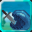

# Scavenger

<small>[TR: Nightmares](../../index.md) &rsaquo; [Abilities](../index.md) &rsaquo; [Unique Skills](index.md)</small>

| | |
|---|---|
| **Type** | Unique Skill |
| **ID** | `trnightmare:scavenger` |
| **Modes** | 3 |
| **Acquisition cost (MP)** | 90,000 |
| **Cooldowns (s)** | 200 |
| **Activation** | Press, Hold |

> This Unique Skill is a Predation ability with further developed capabilities, allowing one to even predate items, armor and gear.

## Modes

| # | Mode |
|---|---|
| 1 | Evil Eater |
| 2 | Stomach |
| 3 | Devour |

## How it works

- Activated by pressing the skill key
- Charged or channelled by holding the skill key
- Adjusted by scrolling while active
- Triggers when a projectile hits you
- Does something when first learned

## Related

- **Items:** [Spatial Blade](../../../tensura-reincarnated/items/weapons/spatial-blade.md), [Blade of The End](../../items/weapons/ending-sealed-sword.md), [Blade of The End](../../items/weapons/ending-unsealed-sword.md)
